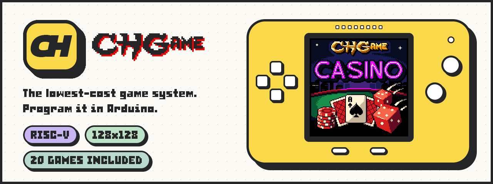
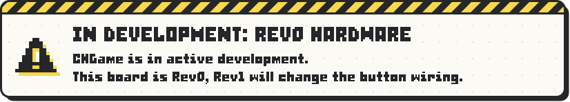
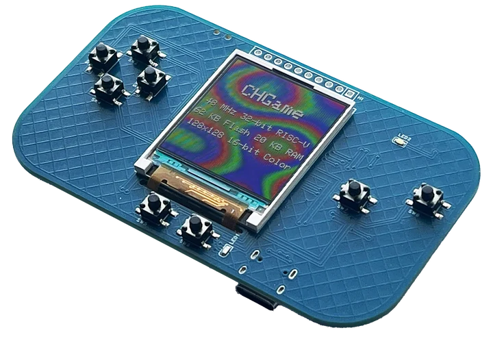
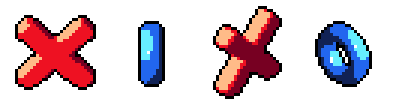

<a id="readme-top"></a>

<div align="center">

<a href="https://chgame.website"></a>

<p>
<a href="https://chgame.website"></a>&nbsp;
<a href="#-get-started"></a>&nbsp;
<a href="https://bateske.github.io/CHGame/"></a>&nbsp;
<a href="https://www.arduboy.com/shop/p/chgame"></a>&nbsp;
<a href="https://community.arduboy.com/c/color/56"></a>
</p>

[](https://github.com/bateske/CHGame/releases/latest)
[](#-get-started)
[](docs/platform.md)
[](https://bateske.github.io/CHGame/)

<br>



<br>

</div>

**CHGame** is a small, open, low-cost handheld that you program in Arduino:
a 48 MHz RISC-V chip, a 128x128 colour screen, eight buttons, a speaker, a
microSD slot and a battery on one bare board. Plug in USB-C and press
Upload: no programmer, no driver, no buttons to hold. This repository is
everything that runs on it: the Arduino board package, the game menu built
into the bootloader, the libraries games are written with, twenty casino
games, and the PC tools (simulator, uploader, card builder).

<details open>
<summary><b>Contents</b></summary>

1. [What it is](#-what-it-is)
2. [Get started](#-get-started): [install](#1-install-the-board-package), [a first sketch](#a-first-sketch), [the game menu](#put-the-game-menu-on-your-board)
3. [The games](#-the-games)
4. [The game menu](#-the-game-menu)
5. [For developers](#-for-developers)
6. [Documentation](#-documentation)
7. [Licences](#-licences)
8. [Credits](#-credits)

</details>

## 🎮 What it is



| Board | CHGame Rev0 |
|---|---|
| **Chip** | 32-bit RISC-V at 48 MHz (WCH CH32X035) |
| **Memory** | 62 KB flash, 20 KB RAM, a microSD slot |
| **Screen** | 128x128 colour LCD, 16 colours of 4,096 |
| **Buttons** | eight: the D-pad, A, B, START, SELECT |
| **Sound** | a piezo speaker, and a status LED |
| **Power** | USB-C and a LiPo battery |

It works like an Arduboy. Install one board package, write a sketch with
one include (`CHGame.h`) and upload it over USB. Switch it on and the
**game menu** in the bootloader lists the games on the SD card: pick one
and play, with no PC.

**What this repository holds**, and the board package delivers:

| | Piece | Where |
|---|---|---|
| 📦 | **The board package**: the core, the RISC-V toolchain, the `chgame-upload` uploader, the bootloaders and the libraries, with the games as examples. One install in the Boards Manager | [`platform/board/`](platform/board/) |
| 🧭 | **The bootloader with the SD game menu**: a list or one picture at a time, and it installs games from the card | [`platform/bootloader/`](platform/bootloader/) |
| 🕹 | **The CHGame library**, `#include <CHGame.h>`: buttons, frame pacing, the house palette, drawing, sound, saving, the debug protocol | [`libraries/CHGame/`](platform/board/arduino/CHGame/libraries/CHGame/) |
| 🖼 | **CHGfx**, the graphics: a 16-colour framebuffer sent to the panel by DMA | [`libraries/CHGfx/`](platform/board/arduino/CHGame/libraries/CHGfx/) |
| 💾 | **CHSd**, the SD card: a read-only FAT16/FAT32 reader | [`libraries/CHSd/`](platform/board/arduino/CHGame/libraries/CHSd/) |
| 🎰 | **Twenty casino games and three apps**, the library's examples | [`examples/`](platform/board/arduino/CHGame/libraries/CHGame/examples/) |
| 📐 | **`.chgame`**, the format games are shared in, and the SD card's layout | [`spec/`](spec/README.md) |
| 🧰 | **The PC tools**: simulator, uploader, packager, card builder, the art toolkit | [`tools/`](tools/README.md) |

### Why one repository

The aim is the Arduboy model, with one repository instead of several:

- **One board package.** Install "CHGame" in the Arduino Boards Manager and
  you have all you need to write for the device: the core, the toolchain,
  the uploader, the bootloaders, the libraries, and the casino games under
  *File > Examples*.
- **One include.** A sketch includes `CHGame.h` and gets the buttons, frame
  pacing, graphics, the house palette and drawing helpers, sound, saving and
  the debug protocol the simulator drives it through, with no per-sketch
  set-up of pins or drivers. The graphics (CHGfx) and SD (CHSd) libraries
  stay as separate layers underneath it.
- **One update.** A bug fix or a feature in any layer reaches everyone with
  the next board package release: core, libraries, bootloader and examples
  move together and are tested together.
- **One place for the PC side.** The tools that talk to the device outside
  Arduino (simulator, uploader, serial and screenshot tools, `.CHG` packager,
  SD card builder) live here too. The ones an Arduino user needs are in
  `chgame-upload`, which the board package installs; the developer tools
  are Python and work from a clone.

**This repository is the source of truth for CHGame.** It replaces the
separate repositories the pieces grew up in (CH32SerialBoot, CHGfx and one
per game); those are frozen. [docs/roadmap.md](docs/roadmap.md) has what is
left to do.

<p align="right"><a href="#readme-top">back to top ↑</a></p>

## 🚀 Get started

### 1. Install the board package

In the Arduino IDE 2.x, add this URL under *File > Preferences >
Additional boards manager URLs*, then install **CHGame** from the Boards
Manager:

```
https://github.com/bateske/CHGame/releases/latest/download/package_chgame_index.json
```

<details>
<summary>The same with <code>arduino-cli</code></summary>

```bash
arduino-cli config add board_manager.additional_urls https://github.com/bateske/CHGame/releases/latest/download/package_chgame_index.json
arduino-cli core update-index
arduino-cli core install CHGame:ch32v
```

</details>

That is everything: the toolchain, the uploader, the bootloaders, the
libraries (nothing else to install) and the games under *File > Examples*.
The release, [v0.3.0](https://github.com/bateske/CHGame/releases/tag/v0.3.0),
also carries every game and app as one cart, `CHGame-Casino-0.3.0.chgame`
([spec/chgame.md](spec/chgame.md)), and that cart's SD card as a zip.
(Boards Manager URLs from before 0.3.0, the CH32SerialBoot repository's,
offer 0.2.4 only.)

### 2. Pick the board

*Tools > Board > CHGame Boards > CHGame Rev0*.

### 3. Upload

Open *File > Examples > CHGame > Hello*, plug the board in and press
**Upload**. It resets itself, flashes in about half a second and starts.
For the games (*File > Examples > CHGame > Games*), set *Tools > USB* to
**Upload only**; *Tools > Optimize* stays at its default, **Smallest +
LTO**, which they need too.

### A first sketch

A new sketch needs only `#include <CHGame.h>`:

```cpp
#include <CHGame.h>

void setup() {
    chgame.boot();                    // buttons; START held 3 s goes back to the menu
    gfx_begin(GFX_DIV2, GFX_12BPP);   // the panel: 128x128, 16 colours on screen
    pal::init();                      // the house colours (INK, WHITE, FELT, GOLD ...)
    chgame.setFrameRate(60);
}

void loop() {
    if (!chgame.nextFrame()) return;  // 60 times a second
    chgame.pollButtons();
    // ... game logic: chgame.pressed(LEFT_BUTTON), chgame.justPressed(A_BUTTON) ...
    pal::tick();

    gfx_wait();                       // the last frame has gone out: draw the next
    pal::commit();
    gfx_clear(FELT);
    text35x2s(10, 9, "HELLO", WHITE);
    gfx_flushAsync();                 // sent by DMA while the next frame's logic runs
}
```

- **Coming from the Arduboy?** [docs/getting-started.md](docs/getting-started.md)
  maps the Arduboy2 calls to CHGame's, explains what happens behind the
  scenes, and walks through a first game.
- **Every call** is in the [API reference](https://bateske.github.io/CHGame/):
  the CHGame, CHGfx and CHSd libraries and the core's SPI, Wire and EEPROM.
  Start with the [CHGame library](https://bateske.github.io/CHGame/group__lib__chgame.html).
- **How a game is put together:** the CHGame library's
  [README](platform/board/arduino/CHGame/libraries/CHGame/README.md).

### Put the game menu on your board

The menu bootloader goes on over USB, through the bootloader the board
already has: no driver, no buttons. *Tools > Bootloader* **SD Text Menu
(Rainbow)** (or **(Static)**), *Tools > Programmer* **CHGame USB**, then
*Tools > Burn Bootloader*. Or pick **SD Graphic Menu**, the
[visual menu](#-the-game-menu), which shows one picture at a time. Without
the IDE:
`chgame uploader selfupdate platform/bootloader/release/chgame_sdboot.bin`
([platform/bootloader](platform/bootloader/README.md#installing-it-on-a-board)).
The WCH driver and the BOOT button are only for
[recovery](platform/board/docs/recovery.md).

**The SD card:** unzip `CHGame-sdcard-<version>.zip` from the
[release page](https://github.com/bateske/CHGame/releases/latest) onto a
FAT32 card, or deploy `CHGame-Casino-<version>.chgame` to it
(`chgame cart deploy ... --card E:\`; [docs/sd-menu.md](docs/sd-menu.md)).
Holding **START** for 3 s in any game goes back to the menu.

<p align="right"><a href="#readme-top">back to top ↑</a></p>

## 🎰 The games

Twenty casino and table games with one look: green felt, gold lettering,
casino chips and a dealer. They are the platform's examples and its test
load (most are within 1 KB of filling the flash), and they all fit on one
SD card behind the game menu. Each one, and each app, has box art for the
visual menu, painted in the manner of early-1990s game boxes:


Each game is a sketch in
`platform/board/arduino/CHGame/libraries/CHGame/examples/Games/<Name>/`
with its own README (rules, controls, design) and NOTES.md (status,
decisions, open items). The image column is the release build's size with
the 0.3.0 package (2026-10-07), against the **50,944 B** the bootloader
leaves for a sketch; up to 50,432 B a game keeps both of its save pages.

<details>
<summary><b>All twenty games</b>: what each one is, and its size</summary>

| Game | What it is | Image |
|---|---|---|
| [CHBackgammon](platform/board/arduino/CHGame/libraries/CHGame/examples/Games/CHBackgammon) | Backgammon on felt with chip checkers, a trained CPU, optional match play and doubling cube | 49,488 B |
| [CHBingo](platform/board/arduino/CHGame/libraries/CHGame/examples/Games/CHBingo) | 75-ball bingo: up to nine cards against a hall of rivals, power-ups and a jackpot | 36,912 B |
| [CHBlackjack](platform/board/arduino/CHGame/libraries/CHGame/examples/Games/CHBlackjack) | Press Play On Tape's Arduboy Blackjack rebuilt in colour: the series' first table | 46,064 B |
| [CHBoardwalk](platform/board/arduino/CHGame/libraries/CHGame/examples/Games/CHBoardwalk) | BOARDWALK, a property-trading board game on an isometric board, with tap auctions | 49,832 B |
| [CHCheckers](platform/board/arduino/CHGame/libraries/CHGame/examples/Games/CHCheckers) | Checkers on CHChess's isometric board, with its own engine and chip pieces | 41,864 B |
| [CHChess](platform/board/arduino/CHGame/libraries/CHGame/examples/Games/CHChess) | Isometric chess with a pointing glove, whip-zoom camera and a CPU of three strengths | 48,480 B |
| [CHCraps](platform/board/arduino/CHGame/libraries/CHGame/examples/Games/CHCraps) | Casino craps with 3D dice and Blackjack's dealer as the stickman | 50,428 B |
| [CHCrossword](platform/board/arduino/CHGame/libraries/CHGame/examples/Games/CHCrossword) | 13x13 crosswords, built in and as packs on the SD card | 50,008 B |
| [CHDominoes](platform/board/arduino/CHGame/libraries/CHGame/examples/Games/CHDominoes) | Dominoes (ALL FIVES and DRAW) with bevelled tiles and a close-up camera | 43,424 B |
| [CHFour](platform/board/arduino/CHGame/libraries/CHGame/examples/Games/CHFour) | FOUR IN A ROW, against the dealer as a friendly coach | 36,456 B |
| [CHMahjong](platform/board/arduino/CHGame/libraries/CHGame/examples/Games/CHMahjong) | Mahjong solitaire with the 144 traditional tiles and a close-up view | 48,776 B |
| [CHPoker](platform/board/arduino/CHGame/libraries/CHGame/examples/Games/CHPoker) | Poker against three CPU players: Hold'em, Five Card Draw, Omaha and Seven Card Stud | 48,952 B |
| [CHRoulette](platform/board/arduino/CHGame/libraries/CHGame/examples/Games/CHRoulette) | Roulette with a physically simulated ball and the dealer as croupier | 49,872 B |
| [CHSlots](platform/board/arduino/CHGame/libraries/CHGame/examples/Games/CHSlots) | Three slot machines on one purse: LUCKY 7, SWEET and DRAGON FORTUNE | 48,076 B |
| [CHSnakes](platform/board/arduino/CHGame/libraries/CHGame/examples/Games/CHSnakes) | SNAKES & LADDERS with procedural snakes, CLASSIC and ARCADE rules | 37,280 B |
| [CHSolitaire](platform/board/arduino/CHGame/libraries/CHGame/examples/Games/CHSolitaire) | Klondike, after the Windows original | 31,304 B |
| [CHTicTacToe](platform/board/arduino/CHGame/libraries/CHGame/examples/Games/CHTicTacToe) | TIC TAC TOE: ROYALE, sixteen tables on 3x3 and 5x5 boards, for money | 50,232 B |
| [CHWords](platform/board/arduino/CHGame/libraries/CHGame/examples/Games/CHWords) | A crossword tile game (Scrabble rules) with a flash dictionary and a full one on SD | 50,036 B |
| [CHWordWheel](platform/board/arduino/CHGame/libraries/CHGame/examples/Games/CHWordWheel) | WORD WHEEL, a word-puzzle game show: spin, call letters, solve | 49,832 B |
| [CHYacht](platform/board/arduino/CHGame/libraries/CHGame/examples/Games/CHYacht) | YACHT DICE (five dice, thirteen boxes) with Craps's 3D dice | 44,704 B |

</details>

The three apps sit beside them in `examples/Apps/`: **CHStlView** (a 3D
model viewer that streams STL files off the card), **CHSDtoUSB** (the board
as a USB card reader) and **CHSDtoSerial** (the card over serial, for the
website's tools). [docs/status.md](docs/status.md) lists what each game has
been verified on (the simulator or the device), its open items and the
known issues.

<p align="right"><a href="#readme-top">back to top ↑</a></p>

## 🧭 The game menu

The bootloader shows the games on the SD card at every power-on, in
folders, with the installed game preselected; starting it writes nothing,
and another game is checked completely before anything is erased. It has
two faces, from one source:

| The list (SD Text Menu) | The pictures (SD Graphic Menu) |
|:---:|:---:|
|  |  |
| one picture behind a list of the card's games | one picture at a time, like the Arduboy FX: the card's cover, a cover for each folder (LEFT/RIGHT), each game's box art (UP/DOWN) |

Both run the same card ([docs/sd-menu.md](docs/sd-menu.md) is the players'
guide, [docs/visual-menu.md](docs/visual-menu.md) the visual menu's).
Every picture is a 128x128 PNG on the card that you can redraw:

```bash
chgame background --template my-menu.png       # the list menu's picture, to edit
chgame background my-menu.png --preview p.gif  # the menu on your picture
chgame picture --template my-art.png           # a blank visual-menu picture, marks shown
chgame picture photo.jpg --out my-art.png      # any image, made to fit
chgame boxart                                  # in a game's folder: paint docs/cart.png
```

<details>
<summary>More on the menu's pictures</summary>

- **The list menu** leaves the top 20 rows (the logo) and the bottom 8
  (key hints) to the picture, and anything painted in pure magenta
  (#FF00FF) turns through the rainbow (or stays as painted, with the
  Static bootloader). [docs/menu-image.md](docs/menu-image.md) walks
  through it step by step, including putting a picture into a `.chgame`
  cart.
- **The visual menu's pictures** are a game's box art (`docs/cart.png` in
  its sketch), the card's cover, a folder's cover and the about page.
  `chgame picture my-art.png --card E:\` puts one on a mounted card.
- **Every picture in this repository is painted in code**: a Python recipe
  (a game's `tools/cart.py`) using `tools/artkit`, with shapes, light and
  small 3D props in true colour, an ordered dither down to the 16 colours,
  and a title set in a pixel font at its own size.
  [docs/cover-art.md](docs/cover-art.md) is the house look and the method;
  `python -m artkit show tools/cart.py` previews one with the house checks,
  and `python tools/artsheet.py` puts every picture the menus show on one
  sheet. The menu's own pictures, which every card falls back on, are in
  [docs/cover-art-defaults.png](docs/cover-art-defaults.png).

</details>

<p align="right"><a href="#readme-top">back to top ↑</a></p>

## 🧰 For developers

> **For AI agents and new developers:** read [CLAUDE.md](CLAUDE.md) first.
> It has the build, simulator and test commands, the rules of the codebase,
> and the hardware limits.

Clone this repository to work on the platform or the games. You need
`arduino-cli` (or the Arduino IDE 2.x) with the board package, Python 3.9+
and, for the simulator and host tests, a C++ compiler; zig is the easiest,
and comes with pip.

```bash
# 1. Python tools, the `chgame` command and a compiler for the simulator
pip install -e .[sim]

# 2. Build a game (from its folder) against this repository's libraries
cd platform/board/arduino/CHGame/libraries/CHGame/examples/Games/CHFour
chgame build                     # release build + size report
chgame check --no-device         # host tests + every sim script, twice
chgame sim                       # just the PC simulator
chgame run tools/scripts/endings.txt out/endings   # screenshots in out/endings

# 3. On a board (plugged in by USB)
chgame upload

# 4. Share a game, and make a card for the game menu
chgame export                             # build/CHFour.chgame
chgame card                               # every game: out/CHGame-Casino.chgame and out/sdcard/
chgame cart deploy out/CHGame-Casino.chgame --card E:\   # onto a mounted card
```

`chgame build` compiles against the repository's own copies of the
libraries, so an edit there takes effect at once. The simulator runs a
sketch's real code on the PC, deterministically, and scripts drive it (and
the board) through the library's debug protocol.

<details>
<summary><b>The parts</b>: the board package, the libraries, the bootloader, the PC tools</summary>

### The board package: `platform/board/`

The Arduino core for the board: package `CHGame`, architecture `ch32v`,
version **0.3.0** (released 2026-10-07). It is a fork of the WCH CH32
Arduino core. It adds the CHGame variant (pin names such as `PIN_BTN_A`
and `PIN_SD_CS`), the USB CDC serial port, the app linker script (the
sketch starts at 0x3000, above the 12 KB bootloader), and the
`chgame-upload` tool, which uploads over USB in about half a second with
no button presses. Releases of the board package are cut from here.

Its Tools menus matter for every game:

| Menu (FQBN key) | Games use | What it does |
|---|---|---|
| Optimize (`opt`) | `oslto` (the default from 0.3.0) | `-Os -flto`. Usually 1-5 KB smaller than plain `-Os`; several games only fit with it. |
| Peripherals (`periph`) | `game` (default) | Compiles out Serial1, `tone()`, PWM and HardwareTimer: about 4 KB. |
| USB (`usb`) | `uploadonly` for release | Drops `Serial` (about 0.7 KB). Upload still works with no button presses. Debug builds keep `serial`. |
| C library (`rtlib`) | `nano` (default) | newlib-nano |

Release FQBN: `CHGame:ch32v:rev0:opt=oslto,rtlib=nano,periph=game,usb=uploadonly`.

### The CHGame library: `platform/board/arduino/CHGame/libraries/CHGame/`

`#include <CHGame.h>` is the one include of a CHGame sketch. On top of
CHGfx it gives:
- `chgame`: buttons (`pollButtons()`, `pressed`, `justPressed`,
  auto-repeat), frame pacing (`nextFrame()`, lockstep for the simulator),
  and the START-held-3-s exit to the game menu;
- the house palette with fades, flashes and cycling colours; panels,
  sprites, dithers and the 3x5 font; outlined, shadowed lettering; easing,
  integer sine and screen shake; number formatting;
- one sound engine for effects and music on the piezo, and the status LED;
- saving in two flash pages past the end of the image (there is no EEPROM);
- the serial debug protocol for screenshots, injected input and lockstep
  frames: how the simulator and the script driver run a game;
- `RAMFUNC`, which puts hot code in SRAM.

It was built from the code the twenty games carried copies of, and every
game is now built on it ([docs/unification.md](docs/unification.md);
[docs/chgame-library.md](docs/chgame-library.md) records why it is as it
is). Every call is in the [API reference](https://bateske.github.io/CHGame/group__lib__chgame.html),
its [README](platform/board/arduino/CHGame/libraries/CHGame/README.md) is
the guide, and `examples/Hello` the smallest complete sketch.

### CHGfx: `platform/board/arduino/CHGame/libraries/CHGfx/`

The graphics library, version **1.3.2**. A full 16-bit framebuffer would
not fit in 20 KB of RAM. CHGfx keeps a **4-bit indexed framebuffer** (8 KB,
a 16-colour palette that can change every frame), converts it to the
panel's format in chunks, and streams it out by DMA at 24 MHz while the
game draws the next frame. It provides the drawing primitives, sprites
(`sprite4`), fonts, text effects, palette effects and partial updates. It
also owns the SPI bus that the SD card shares.
[docs/performance.md](docs/performance.md) explains the design and its
measured limits; the [API reference](https://bateske.github.io/CHGame/group__lib__chgfx.html)
documents every call.

### CHSd: `platform/board/arduino/CHGame/libraries/CHSd/`

A small read-only SD library: a polled SPI block driver plus a FAT16/FAT32
reader, about 1.7 KB of flash and 24 B of RAM. CHWords, CHCrossword and
CHWordWheel use it to read their dictionary, puzzle packs and phrase bank
from the card, and the app CHStlView browses the card's folders and
streams 3D models off it every frame (`sd::stream()`: one command, 24 MHz,
DMA). The games include it as a library (`<Fat.h>`, `<SdSpi.h>`); the
simulator swaps its SPI driver for a pretend card (`$CHSD_CARD`).
CHSDtoUSB has its own faster, read-write SD driver, which is GPL-3.0 and
stays inside that sketch.
[API reference](https://bateske.github.io/CHGame/group__lib__chsd.html).

### The bootloader and the SD game menu: `platform/bootloader/`

The board's permanent bootloader (12 KB at 0x0000), with the game menu in
two faces, the list and the pictures:
- the menu appears at every power-on and lists `GAMES/*.CHG` from a
  FAT16/FAT32 card, in folders;
- the installed game is preselected, and starting it writes nothing;
- holding START for 3 s in any game goes back to the menu;
- another game is checked completely before anything is erased;
- USB uploading, recovery and the memory map are those of board package
  0.2.4.

It has its own PC test suite, which runs the real C code against models of
the flash, SD card and panel, including a power cut at every flash
operation of an install. Its [README](platform/bootloader/README.md)
covers building, testing and installing it; [spec/chg.md](spec/chg.md) is
the developers' one-pager, and what it reads from the card is
[spec/card.md](spec/card.md).

### The PC tools: `tools/`

The tools for working with the system outside the Arduino IDE:
- **`device.py`**: builds, uploads and drives any sketch on the board (each
  `chgame` command runs it on the game it is started in);
- the **PC simulator** (`tools/chsim`): it compiles a sketch's real code
  with CHGfx's and the library's for the PC, runs it deterministically, and
  produces screenshots and GIFs; its **script driver** (`chdrivelib.py`,
  which each game's `chdrive.py` extends with its own commands) runs the
  same scripts in the simulator and on the board;
- the **sound preview** (`audio/preview.py`): renders a game's effects and
  songs to WAV from the real engine;
- the flash/RAM **size report** (`check_size.py`);
- the USB **serial** helper (`serialcap.py`);
- the **cart tools** (`chcart/`, [spec/](spec/README.md)): `.chgame` files,
  the format games are shared in. `chgame export` makes one from a sketch;
  `chgame cart` inspects, checks, combines, reorders and edits carts,
  prepares the SD card from one, flashes and deploys;
- the **CHG file** tool (`chgpack.py`): wraps any sketch's `.bin` as the
  menu's install file, checks them, lists a card;
- the **casino cart** (`sdcard/mkcard.py`, `chgame card`): builds every game
  into one cart and its card;
- the **box art** ([docs/cover-art.md](docs/cover-art.md)): `artkit/`, the
  toolkit every menu picture is painted with, and `artkit.fontscout`, which
  sets a title in thousands of pixel fonts to choose from;
- the **brand** (`brand/make.py`, [docs/brand/](docs/brand/README.md)): this
  README's banner and buttons, and the API reference's wordmark;
- the **uploader**: `chgame upload` and `chgame uploader ...` go through the
  Python one (`platform/bootloader/host/py`, the package `chgame_upload`);
  `platform/bootloader/host/go` is the same tool in Go, `chgame-upload`, the
  executable the board package installs for Windows, Linux and macOS. The
  two share their test vectors;
- the **release scripts** (`tools/release/`): the uploader for five hosts,
  the platform archive and the Boards Manager index, published with `gh`
  ([platform/board/docs/building.md](platform/board/docs/building.md));
  `stage.py` builds the same as a local pre-release and `acceptance.py`
  tests it as a new user would get it, `serve.py` serves it to the Arduino
  IDE ([trying-a-release.md](platform/board/docs/trying-a-release.md)).

What is a game's own stays with it: its script commands (`chdrive.py`),
its description for the shared checks (`game.py`), the tests and the asset
pipeline. [tools/README.md](tools/README.md) classifies every tool in the
repository.

</details>

<details>
<summary><b>Repository map</b></summary>

```
CHGame/
├── CLAUDE.md          start here: commands, rules, limits, gotchas
├── platform/          the platform itself; these are the master copies
│   ├── board/           the Arduino board package (core, variant, linker scripts) + the board's docs
│   │   └── arduino/CHGame/libraries/  CHGame (CHGame.h), CHGfx (graphics), CHSd (SD/FAT), beside SPI, Wire, EEPROM
│   │       └── CHGame/examples/   Hello, Games/ (the 20 casino games), Apps/ (CHStlView, CHSDtoUSB, CHSDtoSerial)
│   ├── bootloader/      the bootloader with the SD game menu: sources, PC test suite, binaries,
│   │                    and the uploader's source (host/go)
│   └── hardware/        Rev 0 schematic and netlist
├── spec/              the .chgame format, the SD card's layout and the CHG file: the contract
│                      with the emulator and web tools, with conformance fixtures
├── tools/             the PC tools shared by every game (device.py, the simulator and script
│                      driver, sound preview, size report, serial, chcart/ for .chgame carts
│                      and cards, chgpack.py for CHG files, sdcard/ for the casino cart,
│                      artkit/ for the box art, brand/ for the README's banner)
└── docs/              platform knowledge: hardware, performance, SD card, how a game is built,
                       status, the roadmap, the CHGame library's decisions and history, a
                       getting-started guide for Arduboy developers, brand/ (the look);
                       api/ builds the API reference (Doxygen) published to GitHub Pages
```

</details>

<p align="right"><a href="#readme-top">back to top ↑</a></p>

## 📚 Documentation

| For | Read |
|---|---|
| Writing a game | [Getting started](docs/getting-started.md) (from the Arduboy) · [API reference](https://bateske.github.io/CHGame/) · [the CHGame library](platform/board/arduino/CHGame/libraries/CHGame/README.md) · [anatomy of a game](docs/game-anatomy.md) |
| What things cost | [platform.md](docs/platform.md) (pins, memory map, speeds) · [performance.md](docs/performance.md) · [hardware revisions](docs/hardware-revisions.md) |
| Playing | [the SD game menu](docs/sd-menu.md) · [the visual menu](docs/visual-menu.md) · [the SD card](docs/sd-card.md) |
| Pictures | [menu pictures](docs/menu-image.md) · [cover art](docs/cover-art.md) · [pixel art rules](docs/pixel-art.md) · [the brand](docs/brand/README.md) |
| Sharing games | [the `.chgame` format and the card](spec/README.md) · [the CHG file](spec/chg.md) · [the upload protocol](platform/board/docs/protocol.md) |
| The project | [roadmap](docs/roadmap.md) · [status of each game](docs/status.md) · [the library's decisions](docs/chgame-library.md) · [unification](docs/unification.md) · [CLAUDE.md](CLAUDE.md) |

<p align="right"><a href="#readme-top">back to top ↑</a></p>

## 📜 Licences

Each folder carries its own licence:

| Path | Licence |
|---|---|
| `platform/board/arduino/CHGame/libraries/CHGame/examples/Games/*` | Apache-2.0 (see each game's `LICENSE` and `NOTICE`). CHChess's engine `ch2k.hpp` is MPL-2.0. |
| `tools/` | Apache-2.0 (`tools/LICENSE`, `tools/NOTICE`) |
| `platform/board/` | MIT (`platform/board/LICENSE`, `THIRD-PARTY.md`) |
| `platform/bootloader/` | MIT (`LICENSE`, `THIRD-PARTY.md`, `NOTICE`: its 5x7 font is Adafruit glcdfont, BSD); `host/` (the uploader, Go and Python) with it, `go.bug.st/serial` BSD-3-Clause in `THIRD-PARTY.md` |
| `platform/board/arduino/CHGame/libraries/CHGame/` | Apache-2.0 (`LICENSE`, `NOTICE`: the 3x5 font is Press Play On Tape's, by way of CHBlackjack) |
| `platform/board/arduino/CHGame/libraries/CHGfx/` | MIT; some fonts carry their own notices (in its `LICENSE`, e.g. the 3x5 font is Apache-2.0) |
| `platform/board/arduino/CHGame/libraries/CHSd/` | MIT |
| `platform/board/arduino/CHGame/libraries/CHGame/examples/Apps/CHSDtoUSB/` | GPL-3.0 (its SD layer comes from sdfatlib) |
| `platform/board/arduino/CHGame/libraries/CHGame/examples/Apps/CHStlView/` | MIT |
| `platform/hardware/` | No licence stated yet (schematic and netlist) |
| `docs/`, root files | Apache-2.0 (`LICENSE`, `NOTICE`) |

The box art's titles and the banner's lettering are set in pixel fonts by
other people. Each title's text art (`tools/art/title.txt` and the like)
names its font, author, stated terms and source in its header, and
[docs/cover-art.md](docs/cover-art.md#credits-fonts-in-the-titles) and
[docs/brand/README.md](docs/brand/README.md#credits) list them all.

<details>
<summary><b>History</b></summary>

The pieces were developed in separate repositories and brought together
here on 2026-10-01, without their histories:

- the board package and bootloader from CH32SerialBoot `v0.2.4`;
- CHGfx at `1.3.0`;
- each game from the head of its own repository, and CHSDtoUSB from its own
  (the commits are listed in [docs/status.md](docs/status.md));
- CHSd 1.0.0, which never had a repository of its own.

The collection was first assembled under the working name CHCasino (the
name went from the code and comments on 2026-10-02). Those repositories are
frozen. All development continues here.

</details>

<p align="right"><a href="#readme-top">back to top ↑</a></p>

## 🙌 Credits

CHGame stands on other people's open work. The licences above say what is
whose; these are the projects it leans on most:

| Project | What CHGame owes it |
|---|---|
| [CH32_Arduino_Core](https://github.com/jobitjoseph/CH32_Arduino_Core) and [CH32X035_USBSerial](https://github.com/jobitjoseph/CH32X035_USBSerial) by jobitjoseph | the Arduino core the board package forks, and the USB serial port in the core and the bootloader |
| [arduino_core_ch32](https://github.com/openwch/arduino_core_ch32) by WCH | the upstream core, the chip's peripheral library and start-up code |
| [wchisp](https://github.com/ch32-rs/wchisp) by ch32-rs | factory programming and recovery |
| [Adafruit GFX](https://github.com/adafruit/Adafruit-GFX-Library) | the 5x7 font in CHGfx and the menu, and the drawing API CHGfx's compatibility layer follows |
| [SdFat / sdfatlib](https://github.com/greiman/SdFat) by Bill Greiman | the SD driver inside CHSDtoUSB |
| [go-serial](https://github.com/bugst/go-serial) by bugst | the serial port under the Go uploader |
| [Arduino](https://www.arduino.cc/) | the IDE, the CLI and the board package format that make one install enough |

<p align="right"><a href="#readme-top">back to top ↑</a></p>

## 💛 Special thanks



To [**Mr.Blinky**](https://github.com/MrBlinky/) and [**MLXXXp**](https://github.com/mlxxxp/),
for showing what is possible when you give developers the tools they need.
The Arduboy's homemade package, its FX flash cart and the Arduboy2 library
with its reference are the model for CHGame's board package, its game
menu and its API reference.

<p align="right"><a href="#readme-top">back to top ↑</a></p>
