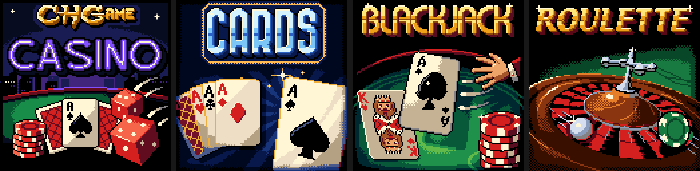
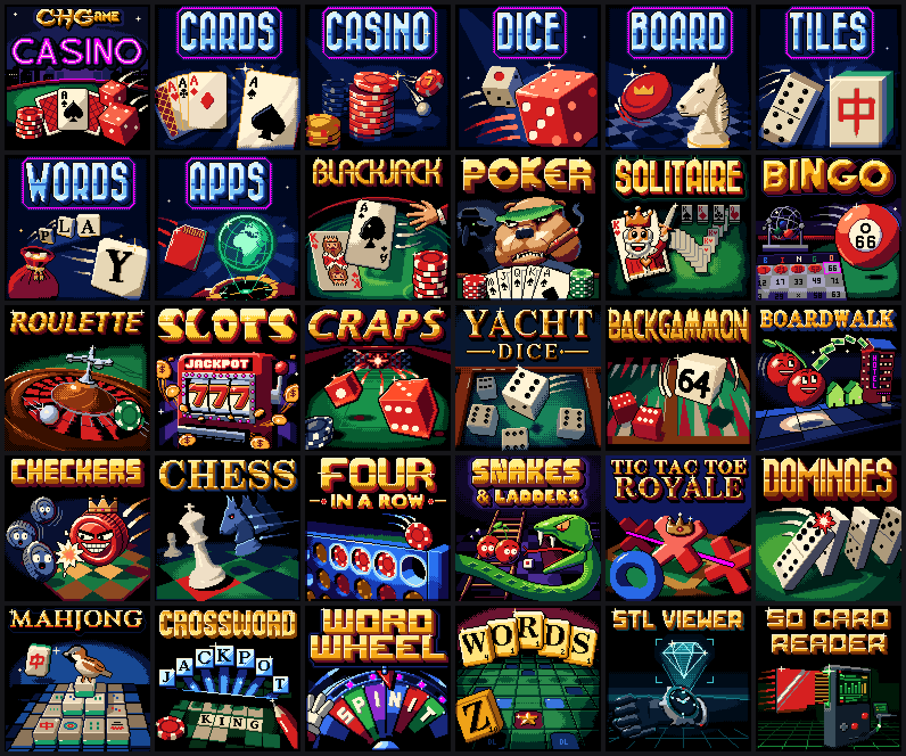

# CHGame

Everything for the **CHGame** handheld, in one repository: the Arduino board
package, the bootloader with its SD game menu, the graphics, SD-card and
sound code that games are built from, twenty casino games, and the PC tools
(simulator, uploader, packager, card builder).

**This repository is the source of truth for CHGame development.** It
replaces the separate repositories the pieces grew up in
(CH32SerialBoot, CHGfx and one repository per game). Those are frozen and
get no more updates; nothing here links to them at build time.

CHGame is a low-cost open colour handheld: a **WCH CH32X035** RISC-V
microcontroller (48 MHz, 62 KB flash, 20 KB SRAM), a **128x128 ST7735S**
colour LCD, a **microSD** slot on the same SPI bus as the screen, eight
buttons, a piezo speaker, a status LED and **USB-C**. It uploads over USB
with no button presses, like an Arduino Leonardo.


> **For AI agents and new developers:** read [CLAUDE.md](CLAUDE.md) first.
> It has the build, simulator and test commands, the rules of the codebase,
> and the hardware limits.
>
> **Coming from the Arduboy?** [docs/getting-started.md](docs/getting-started.md)
> maps the Arduboy2 calls to CHGame's, explains what happens behind the
> scenes, and walks through a first sketch. The CHGame library's
> [README](platform/board/arduino/CHGame/libraries/CHGame/README.md) is the reference.

## What this repository is for

The aim is the Arduboy model, with one repository instead of several:

- **One board package.** Install "CHGame" in the Arduino Boards Manager and
  you have all you need to write for the device: the core, the toolchain,
  the uploader, the bootloaders, the libraries, and the casino games under
  *File > Examples*.
- **One include.** A sketch includes `CHGame.h` and gets the buttons, frame
  pacing, graphics, the house palette and drawing helpers, sound, saving and
  the debug protocol the simulator drives it through, with no per-sketch
  set-up of pins or drivers. The graphics (CHGfx) and SD (CHSd) libraries
  stay as separate layers underneath it.
- **One update.** A bug fix or a feature in any layer reaches everyone with
  the next board package release: core, libraries, bootloader and examples
  move together and are tested together.
- **One place for the PC side.** The tools that talk to the device outside
  Arduino (simulator, uploader, serial and screenshot tools, `.CHG` packager,
  SD card builder) live here too, not in separate repositories.

### Where that stands today

Every piece is in this repository, and the board package built from it
delivers all of it. Release **0.3.0** is built and passes the new-user test
(below), but is **not published yet**: until it is, the URL under
*Installing* has nothing behind it, and
[platform/board/docs/trying-a-release.md](platform/board/docs/trying-a-release.md)
installs it from this machine instead.

| Piece | In this repository | Delivered by the board package (0.3.0) |
|---|---|---|
| Core, variant, toolchain, `chgame-upload` | `platform/board/` | yes |
| Bootloader with the SD game menu | `platform/bootloader/` | yes: *Tools > Bootloader* (SD Text Menu, the list, or SD Graphic Menu, the pictures, each in Rainbow or Static; or USB Only), written by *Burn Bootloader* over USB with the programmer **CHGame USB**: no driver, no buttons |
| The CHGame library (`CHGame.h`: buttons, pacing, palette, drawing, sound, saving, debug protocol) | `platform/board/arduino/CHGame/libraries/CHGame/`; every game is built on it | yes, in the package's `libraries/`: nothing to install |
| CHGfx, the graphics library | `platform/board/arduino/CHGame/libraries/CHGfx/` (1.3.1) | yes, with its examples |
| CHSd, the SD/FAT reader | `platform/board/arduino/CHGame/libraries/CHSd/` (1.0.0) | yes |
| The casino games and three apps (CHStlView, CHSDtoUSB, CHSDtoSerial) as examples | `platform/board/arduino/CHGame/libraries/CHGame/examples/Games/`, `apps/` | yes: *File > Examples > CHGame > Games*, *Apps* |
| `.chgame`, the format games are shared in ([spec/chgame.md](spec/chgame.md)), and the SD menu's card ([spec/card.md](spec/card.md)) | `spec/`, `tools/chcart/` (`chgame export`, `chgame cart ...`) | the release carries every game as one cart, `CHGame-Casino-<version>.chgame`, and its card as a zip. Every build also writes the menu's install file (`.chg`), and *Export Compiled Binary* puts it by the sketch |
| PC tools | `tools/`, `platform/bootloader/host/` | the ones an Arduino user needs, in `chgame-upload`: upload, burn the bootloader, pack for the SD menu. The developer tools (simulator, scripted runs, screenshots, GIFs, sound preview, `.chgame` carts and cards) are Python and work from a clone (`pip install -e .`) |

`python tools/release/stage.py` builds the release as `0.3.0-local` and
checks it the way a new user would get it: a fresh `arduino-cli` installs
it from the one URL; the libraries, examples, bootloaders and programmers
are there; every game and app compiles from the installed package with no
`--library`; and the casino cart and its SD card are made from those builds.
[docs/roadmap.md](docs/roadmap.md) has what is left: publishing it.
[docs/chgame-library.md](docs/chgame-library.md) records why the library
is as it is, and [docs/unification.md](docs/unification.md) how the
games' twenty copies of their shared code became it.

## Installing

**The board package** (the toolchain, the uploader, the bootloaders, the
libraries and the games come with it). In the Arduino IDE 2.x: add

```
https://github.com/bateske/CHGame/releases/latest/download/package_chgame_index.json
```

under *File > Preferences > Additional boards manager URLs*, then install
**CHGame** from the Boards Manager. With `arduino-cli`:

```bash
arduino-cli config add board_manager.additional_urls https://github.com/bateske/CHGame/releases/latest/download/package_chgame_index.json
arduino-cli core update-index
arduino-cli core install CHGame:ch32v
```

The same release, [v0.3.0](https://github.com/bateske/CHGame/releases/tag/v0.3.0),
carries every game and app as one cart, `CHGame-Casino-0.3.0.chgame`
([spec/chgame.md](spec/chgame.md)), and that cart's SD card as a zip.
(Boards Manager URLs from before 0.3.0, the CH32SerialBoot repository's,
offer 0.2.4 only.)

**Then, in the IDE:** *Tools > Board > CHGame Boards > CHGame Rev0*. The games are under *File >
Examples > CHGame > Games*; set *Tools > USB* to **Upload only** for them
(*Tools > Optimize* is **Smallest + LTO** by default, which they need too).
A new sketch only needs `#include <CHGame.h>`; *Hello* is the smallest one.

**The menu bootloader** is installed over USB, through the bootloader a
board already has: no driver, no buttons. *Tools > Bootloader* **SD Text
Menu (Rainbow)** (or **(Static)**), *Tools > Programmer*
**CHGame USB**, then *Tools > Burn Bootloader*. Without the 0.3.0 package:
`chgame uploader selfupdate platform/bootloader/release/chgame_sdboot.bin`
([platform/bootloader](platform/bootloader/README.md#installing-it-on-a-board)).
The WCH driver and the BOOT button are only for recovery.

**The visual menu** is the other face of the same bootloader: one picture at
a time, no text, like the Arduboy FX. The card's cover at power-on, a cover
for each folder (LEFT/RIGHT), each game's box art (UP/DOWN), a bar over the
picture while a game installs. *Tools > Bootloader* **SD Graphic Menu
(Rainbow)** or **(Static)**; the same card works with both
([docs/visual-menu.md](docs/visual-menu.md)).



**The SD card.** Unzip `CHGame-sdcard-<version>.zip` from the release page
onto a FAT32 card, or deploy `CHGame-Casino-<version>.chgame` to it
(`chgame cart deploy ... --card E:\`; [docs/sd-menu.md](docs/sd-menu.md)).

**Your own menu picture.** Everything behind the menu's list, the CHGAME
logo included, is one 128x128 picture on the SD card, so you can redraw it
or replace it with anything you like:

```bash
chgame background --template my-menu.png          # the default picture, to edit in any paint program
chgame background my-menu.png --preview p.gif     # see the menu on it (any image is converted to fit)
chgame background my-menu.png --card E:\          # put it on a mounted card
```

The menu leaves the top 20 rows (the logo) and the bottom 8 (key hints) to
the picture, and anything painted in pure magenta (#FF00FF) turns through
the rainbow (or stays as painted, with the Static bootloader). [docs/menu-image.md](docs/menu-image.md) walks through it step
by step, including putting a picture into a `.chgame` cart.

**Pictures for the visual menu** are the same kind of 128x128 PNG: a game's
box art (`docs/cart.png` in its sketch), the card's cover, a folder's
cover, the about page. Draw yours in any paint program:

```bash
chgame picture --template my-art.png           # a blank picture with the menu's marks shown
chgame picture my-art.png --preview p.gif      # as the visual menu shows it
chgame picture photo.jpg --out my-art.png      # any image made to fit (scaled, colours reduced)
```

Or paint it in code, as every picture in this repository is: a Python
recipe (a game's `tools/cart.py`) using `tools/artkit`, with shapes, light
and small 3D props in true colour, an ordered dither down to the 16
colours, and a title set in a pixel font at its own size.
[docs/cover-art.md](docs/cover-art.md) is the house look and the method:

```bash
chgame boxart                                  # in a game's folder: run its tools/cart.py, write docs/cart.png
python -m artkit show tools/cart.py            # previews at 1x and 4x and as the menu shows it, and the house checks
python tools/artsheet.py                       # from the root: every picture the menus show on one sheet
```

**This repository** is for working on the platform and the games: clone it
and `pip install -e .[sim]` (see *Quick start* below). `chgame build`
compiles against the repository's own copies of the libraries, so an edit
there takes effect at once.

## The games

Twenty casino and table games with one look: green felt, gold lettering,
casino chips and a dealer. They are the platform's examples and its test
load: most are within 1 KB of filling the flash. They all fit on one SD card
behind the **game menu built into the bootloader**: switch on, pick a game,
play, with no PC, like an Arduboy FX ([docs/sd-menu.md](docs/sd-menu.md)).

Each one, and each app, has its own box art for the visual menu, painted in
the manner of early-1990s game boxes, and the casino card has a cover and
a cover for each of its seven genre folders:



The menu's own pictures, which every card falls back on (the default
cover and text-menu picture, the about page, installed, no picture, a
folder without a cover, the five errors), are in
[docs/cover-art-defaults.png](docs/cover-art-defaults.png).
[docs/cover-art.md](docs/cover-art.md) says how they are all made.

Each game is a standalone sketch in `platform/board/arduino/CHGame/libraries/CHGame/examples/Games/<Name>/<Name>.ino` with its own
README (rules, controls, design) and NOTES.md (status, design decisions,
open items). The image column is the release build size with the 0.3.0
package (2026-10-07), against the
**50,944 B** the bootloader leaves for a sketch; up to 50,432 B a game keeps
both of its save pages.

| Game | What it is | Image |
|---|---|---|
| [CHBackgammon](platform/board/arduino/CHGame/libraries/CHGame/examples/Games/CHBackgammon) | Backgammon on felt with chip checkers, a trained CPU, optional match play and doubling cube | 49,488 B |
| [CHBingo](platform/board/arduino/CHGame/libraries/CHGame/examples/Games/CHBingo) | 75-ball bingo: up to nine cards against a hall of rivals, power-ups and a jackpot | 36,912 B |
| [CHBlackjack](platform/board/arduino/CHGame/libraries/CHGame/examples/Games/CHBlackjack) | Press Play On Tape's Arduboy Blackjack rebuilt in colour: the series' first table | 46,064 B |
| [CHBoardwalk](platform/board/arduino/CHGame/libraries/CHGame/examples/Games/CHBoardwalk) | BOARDWALK, a property-trading board game on an isometric board, with tap auctions | 49,832 B |
| [CHCheckers](platform/board/arduino/CHGame/libraries/CHGame/examples/Games/CHCheckers) | Checkers on CHChess's isometric board, with its own engine and chip pieces | 41,864 B |
| [CHChess](platform/board/arduino/CHGame/libraries/CHGame/examples/Games/CHChess) | Isometric chess with a pointing glove, whip-zoom camera and a CPU of three strengths | 48,480 B |
| [CHCraps](platform/board/arduino/CHGame/libraries/CHGame/examples/Games/CHCraps) | Casino craps with 3D dice and Blackjack's dealer as the stickman | 50,428 B |
| [CHCrossword](platform/board/arduino/CHGame/libraries/CHGame/examples/Games/CHCrossword) | 13x13 crosswords, built in and as packs on the SD card | 50,008 B |
| [CHDominoes](platform/board/arduino/CHGame/libraries/CHGame/examples/Games/CHDominoes) | Dominoes (ALL FIVES and DRAW) with bevelled tiles and a close-up camera | 43,424 B |
| [CHFour](platform/board/arduino/CHGame/libraries/CHGame/examples/Games/CHFour) | FOUR IN A ROW, against the dealer as a friendly coach | 36,456 B |
| [CHMahjong](platform/board/arduino/CHGame/libraries/CHGame/examples/Games/CHMahjong) | Mahjong solitaire with the 144 traditional tiles and a close-up view | 48,776 B |
| [CHPoker](platform/board/arduino/CHGame/libraries/CHGame/examples/Games/CHPoker) | Poker against three CPU players: Hold'em, Five Card Draw, Omaha and Seven Card Stud | 48,952 B |
| [CHRoulette](platform/board/arduino/CHGame/libraries/CHGame/examples/Games/CHRoulette) | Roulette with a physically simulated ball and the dealer as croupier | 49,872 B |
| [CHSlots](platform/board/arduino/CHGame/libraries/CHGame/examples/Games/CHSlots) | Three slot machines on one purse: LUCKY 7, SWEET and DRAGON FORTUNE | 48,076 B |
| [CHSnakes](platform/board/arduino/CHGame/libraries/CHGame/examples/Games/CHSnakes) | SNAKES & LADDERS with procedural snakes, CLASSIC and ARCADE rules | 37,280 B |
| [CHSolitaire](platform/board/arduino/CHGame/libraries/CHGame/examples/Games/CHSolitaire) | Klondike, after the Windows original | 31,304 B |
| [CHTicTacToe](platform/board/arduino/CHGame/libraries/CHGame/examples/Games/CHTicTacToe) | TIC TAC TOE: ROYALE, sixteen tables on 3x3 and 5x5 boards, for money | 50,232 B |
| [CHWords](platform/board/arduino/CHGame/libraries/CHGame/examples/Games/CHWords) | A crossword tile game (Scrabble rules) with a flash dictionary and a full one on SD | 50,036 B |
| [CHWordWheel](platform/board/arduino/CHGame/libraries/CHGame/examples/Games/CHWordWheel) | WORD WHEEL, a word-puzzle game show: spin, call letters, solve | 49,832 B |
| [CHYacht](platform/board/arduino/CHGame/libraries/CHGame/examples/Games/CHYacht) | YACHT DICE (five dice, thirteen boxes) with Craps's 3D dice | 44,704 B |

[docs/status.md](docs/status.md) lists what each game has been verified on
(the simulator or the device), its open items and the known issues.

## Repository map

```
CHGame/
├── CLAUDE.md          start here: commands, rules, limits, gotchas
├── platform/          the platform itself; these are the master copies
│   ├── board/           the Arduino board package (core, variant, linker scripts) + the board's docs
│   ├── bootloader/      the bootloader with the SD game menu: sources, PC test suite, binaries,
│   │                    and the uploader's source (host/go)
│   │   └── arduino/CHGame/libraries/  CHGame (CHGame.h), CHGfx (graphics), CHSd (SD/FAT), beside SPI, Wire, EEPROM
│   │       └── CHGame/examples/   Hello, games/ (the 20 casino games), apps/ (CHStlView, CHSDtoUSB, CHSDtoSerial)
│   └── hardware/        Rev 0 schematic and netlist
├── spec/              the .chgame format, the SD card's layout and the CHG file: the contract
│                      with the emulator and web tools, with conformance fixtures
├── tools/             the PC tools shared by every game (device.py, the simulator and script
│                      driver, sound preview, size report, serial, chcart/ for .chgame carts
│                      and cards, chgpack.py for CHG files, sdcard/ for the casino cart,
│                      artkit/ for the box art)
└── docs/              platform knowledge: hardware, performance, SD card, how a game is built,
                       status, the roadmap to the first release, the CHGame library's decisions
                       and history, and a getting-started guide for Arduboy developers
```

## Quick start for development

You need `arduino-cli` (or the Arduino IDE 2.x), Python 3.9+ and, for the
simulator and host tests, a C++ compiler. zig is the easiest; it comes with
pip.

```bash
# 1. The board package: see "Installing" above

# 2. Python tools, the `chgame` command and a compiler for the simulator
pip install -e .[sim]

# 3. Build a game (from its folder) against this repository's libraries
cd platform/board/arduino/CHGame/libraries/CHGame/examples/Games/CHFour
chgame build              # release build + size report
chgame check --no-device         # host tests + every sim script, twice (games that have check.py)
chgame sim # just the PC simulator
chgame run tools/scripts/endings.txt out/endings   # screenshots in out/endings

# 4. On a board (plugged in by USB)
chgame upload

# 5. Share a game, and make a card for the game menu
chgame export                             # build/CHFour.chgame
chgame card                               # every game: out/CHGame-Casino.chgame and out/sdcard/
chgame cart deploy out/CHGame-Casino.chgame --card E:\   # onto a mounted card
```

## The parts

### The board package: `platform/board/`

The Arduino core for the board: package `CHGame`, architecture `ch32v`,
version **0.3.0** (released 2026-10-07). It is a fork of the WCH CH32 Arduino core. It adds the
CHGame variant (pin names such as `PIN_BTN_A` and `PIN_SD_CS`), the USB CDC
serial port, the app linker script (the sketch starts at 0x3000, above the
12 KB bootloader), and the `chgame-upload` tool, which uploads over USB in
about half a second with no button presses. This folder is its master copy;
releases of the board package are cut from here.

Its Tools menus matter for every game:

| Menu (FQBN key) | Games use | What it does |
|---|---|---|
| Optimize (`opt`) | `oslto` (the default from 0.3.0) | `-Os -flto`. Usually 1-5 KB smaller than plain `-Os`; several games only fit with it. |
| Peripherals (`periph`) | `game` (default) | Compiles out Serial1, `tone()`, PWM and HardwareTimer: about 4 KB. |
| USB (`usb`) | `uploadonly` for release | Drops `Serial` (about 0.7 KB). Upload still works with no button presses. Debug builds keep `serial`. |
| C library (`rtlib`) | `nano` (default) | newlib-nano |

Release FQBN: `CHGame:ch32v:rev0:opt=oslto,rtlib=nano,periph=game,usb=uploadonly`.

### The CHGame library: `platform/board/arduino/CHGame/libraries/CHGame/`

`#include <CHGame.h>` is the one include of a CHGame sketch. On top of
CHGfx it gives:
- `chgame`: buttons (`pollButtons()`, `pressed`, `justPressed`,
  auto-repeat), frame pacing (`nextFrame()`, lockstep for the simulator),
  and the START-held-3-s exit to the game menu;
- the house palette with fades, flashes and cycling colours; panels,
  sprites, dithers and the 3x5 font; outlined, shadowed lettering; easing,
  integer sine and screen shake; number formatting;
- one sound engine for effects and music on the piezo, and the status LED;
- saving in two flash pages past the end of the image (there is no EEPROM);
- the serial debug protocol for screenshots, injected input and lockstep
  frames: how the simulator and the script driver run a game;
- `RAMFUNC`, which puts hot code in SRAM.

It was built from the code the twenty games carried copies of, and every
game is now built on it ([docs/unification.md](docs/unification.md)). Its
[README](platform/board/arduino/CHGame/libraries/CHGame/README.md) is the reference, and
`examples/Hello` the smallest complete sketch.

### CHGfx: `platform/board/arduino/CHGame/libraries/CHGfx/`

The graphics library, version **1.3.1**. A full 16-bit framebuffer would not
fit in 20 KB of RAM. CHGfx keeps a **4-bit indexed framebuffer** (8 KB, a
16-colour palette that can change every frame), converts it to the panel's
format in chunks, and streams it out by DMA at 24 MHz while the game draws
the next frame. It provides the drawing primitives, sprites (`sprite4`),
fonts, text effects, palette effects and partial updates. It also owns the
SPI bus that the SD card shares.
[docs/performance.md](docs/performance.md) explains the design and its
measured limits.

### CHSd: `platform/board/arduino/CHGame/libraries/CHSd/`

A small read-only SD library: a polled SPI block driver plus a FAT16/FAT32
reader, about 1.7 KB of flash and 24 B of RAM. CHWords, CHCrossword and
CHWordWheel use it to read their dictionary, puzzle packs and phrase bank
from the card, and the app CHStlView browses the card's folders and streams
3D models off it every frame (`sd::stream()`: one command, 24 MHz, DMA).
The games include it as a library (`<Fat.h>`, `<SdSpi.h>`); the
simulator swaps its SPI driver for a pretend card (`$CHSD_CARD`). CHSDtoUSB has its own faster, read-write SD driver, which
is GPL-3.0 and stays inside that sketch.

### The bootloader and the SD game menu: `platform/bootloader/`

The board's permanent bootloader (12 KB at 0x0000), with the game menu in
two faces, the list and the pictures ([docs/visual-menu.md](docs/visual-menu.md)):
- the menu appears at every power-on and lists `GAMES/*.CHG` from a
  FAT16/FAT32 card, in folders;
- the installed game is preselected, and starting it writes nothing;
- holding START for 3 s in any game goes back to the menu;
- another game is checked completely before anything is erased;
- USB uploading, recovery and the memory map are those of board package
  0.2.4.

It has its own PC test suite, which runs the real C code against models of
the flash, SD card and panel, including a power cut at every flash
operation of an install. Its README covers building, testing and installing
it; [docs/sd-menu.md](docs/sd-menu.md) is the players' guide and
[spec/chg.md](spec/chg.md) the developers' one-pager; what it reads from the
card is [spec/card.md](spec/card.md).

### The PC tools: `tools/`

The tools for working with the system outside the Arduino IDE:
- **`device.py`**: builds, uploads and drives any sketch on the board (each
  `chgame` command runs it on the game it is started in);
- the **PC simulator** (`tools/chsim`): it compiles a sketch's real code
  with CHGfx's and the library's for the PC, runs it deterministically, and
  produces screenshots and GIFs; its **script driver** (`chdrivelib.py`,
  which each game's `chdrive.py` extends with its own commands) runs the
  same scripts in the simulator and on the board;
- the **sound preview** (`audio/preview.py`): renders a game's effects and
  songs to WAV from the real engine;
- the flash/RAM **size report** (`check_size.py`);
- the USB **serial** helper (`serialcap.py`);
- the **cart tools** (`chcart/`, [spec/](spec/README.md)): `.chgame` files,
  the format games are shared in. `chgame export` makes one from a sketch;
  `chgame cart` inspects, checks, combines, reorders and edits carts,
  prepares the SD card from one, flashes and deploys;
- the **CHG file** tool (`chgpack.py`): wraps any sketch's `.bin` as the
  menu's install file, checks them, lists a card;
- the **casino cart** (`sdcard/mkcard.py`, `chgame card`): builds every game
  into one cart and its card;
- the **box art** ([docs/cover-art.md](docs/cover-art.md)): `artkit/`, the
  toolkit every menu picture is painted with (shapes and light, a small 3D
  ray marcher, the ramp-aware dither, pixel finishing, titles, the house
  checks), and `artkit.fontscout`, which sets a title in thousands of pixel
  fonts to choose from. The recipes are each program's `tools/cart.py`
  (`chgame boxart`), the casino card's `sdcard/art/src/` (`sdcard/covers.py`)
  and the menu's defaults in `art/menu/` (`menuart.py`); `artsheet.py` puts
  them all on one sheet;
- the **uploader**: `chgame upload` and `chgame uploader ...` go through the
  Python one (`platform/bootloader/host/py`, the package `chgame_upload`);
  `platform/bootloader/host/go` is the same tool in Go, `chgame-upload`, the
  executable the board package installs for Windows, Linux and macOS. The
  two share their test vectors;
- the **release scripts** (`tools/release/`): the uploader for five hosts,
  the platform archive and the Boards Manager index, published with `gh`
  ([platform/board/docs/building.md](platform/board/docs/building.md));
  `stage.py` builds the same as a local pre-release and `acceptance.py`
  tests it as a new user would get it, `serve.py` serves it to the Arduino
  IDE ([trying-a-release.md](platform/board/docs/trying-a-release.md)).

What is a game's own stays with it: its script commands (`chdrive.py`),
its description for the shared checks (`game.py`), the tests and the asset
pipeline. [tools/README.md](tools/README.md) classifies every tool in
the repository.

## Licences

Each folder carries its own licence:

| Path | Licence |
|---|---|
| `platform/board/arduino/CHGame/libraries/CHGame/examples/Games/*` | Apache-2.0 (see each game's `LICENSE` and `NOTICE`). CHChess's engine `ch2k.hpp` is MPL-2.0. |
| `tools/` | Apache-2.0 (`tools/LICENSE`, `tools/NOTICE`) |
| `platform/board/` | MIT (`platform/board/LICENSE`, `THIRD-PARTY.md`) |
| `platform/bootloader/` | MIT (`LICENSE`, `THIRD-PARTY.md`, `NOTICE`: its 5x7 font is Adafruit glcdfont, BSD); `host/` (the uploader, Go and Python) with it, `go.bug.st/serial` BSD-3-Clause in `THIRD-PARTY.md` |
| `platform/board/arduino/CHGame/libraries/CHGame/` | Apache-2.0 (`LICENSE`, `NOTICE`: the 3x5 font is Press Play On Tape's, by way of CHBlackjack) |
| `platform/board/arduino/CHGame/libraries/CHGfx/` | MIT; some fonts carry their own notices (in its `LICENSE`, e.g. the 3x5 font is Apache-2.0) |
| `platform/board/arduino/CHGame/libraries/CHSd/` | MIT |
| `platform/board/arduino/CHGame/libraries/CHGame/examples/Apps/CHSDtoUSB/` | GPL-3.0 (its SD layer comes from sdfatlib) |
| `platform/board/arduino/CHGame/libraries/CHGame/examples/Apps/CHStlView/` | MIT |
| `platform/hardware/` | No licence stated yet (schematic and netlist) |
| `docs/`, root files | Apache-2.0 (`LICENSE`, `NOTICE`) |

The box art's titles are lettered in pixel fonts by other people. Each
title's text art (`tools/art/title.txt` and the like) names its font, author,
stated terms and source in its header, and
[docs/cover-art.md](docs/cover-art.md#credits-fonts-in-the-titles) lists
them all.

## History

The pieces were developed in separate repositories and brought together
here on 2026-10-01, without their histories:

- the board package and bootloader from CH32SerialBoot `v0.2.4`;
- CHGfx at `1.3.0`;
- each game from the head of its own repository, and CHSDtoUSB from its own
  (the commits are listed in [docs/status.md](docs/status.md));
- CHSd 1.0.0, which never had a repository of its own.

The collection was first assembled under the working name CHCasino (the
name went from the code and comments on 2026-10-02). Those repositories are
frozen. All development continues here.
