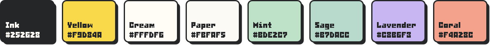

# The CHGame look


How CHGame presents itself outside the device: the repository's
[README](../../README.md), the [API reference](https://bateske.github.io/CHGame/)
and anything else that sits beside them. The aim is **punchy and
friendly**: a style called neobrutalism (flat colours, thick ink outlines,
hard shadows), in pastel colours, with pixel lettering like the console's
own.

The games keep their own look (green felt and gold, [cover-art.md](../cover-art.md));
this one is for the pages around them.

## The pieces

| File | What it is | Made by |
|---|---|---|
| `logo.png` | the logo: CH on a yellow badge (153 x 143, transparent corners) | the owner; never redrawn |
| `../../tools/brand/logo-pixel.png` | the pixel CHGAME logo, the console's own (73 x 18): ink letters, a magenta shadow | the owner; never redrawn |
| `banner.gif` | the README's banner: both logos, what it is, and the handheld paging through the game menu's box art | `tools/brand/make.py banner` |
| `btn-*.svg` | the README's link buttons (website, get started, API docs, shop, forum) | `tools/brand/make.py buttons` |
| `warning.svg` | the README's caution: in development, Rev0 hardware | `tools/brand/make.py warning` |
| `xoxo.gif` | the special thanks' easter egg: XOXO in CHTicTacToe's spinning pieces | `tools/brand/make.py xoxo` |
| `wordmark.svg` | the pixel logo for the API reference's header, its magenta held in yellow (`docs/api/Doxyfile` copies it there) | `tools/brand/make.py wordmark` |
| `palette.svg` | the palette below | `tools/brand/make.py swatches` |
| `social.png` | GitHub's link preview, 1280 x 640: the banner's opening picture, the logo in its own magenta (uploaded by hand under Settings > Social preview) | `tools/brand/make.py social` |
| `board.webp` | the Rev0 board, from [chgame.website](https://chgame.website) | a photo |

Everything but the logo and the photo is generated: change
`tools/brand/make.py` (or the art it reads), then run

```bash
python tools/brand/make.py            # all of it; or banner, buttons, warning, xoxo, wordmark, swatches, social
python tools/brand/make.py banner --still out/banner.png   # one frame of the banner, to look at
```

The banner shows the casino card's cover and then each program's
`docs/cart.png`, so it follows the box art: after a cover changes
(`chgame boxart`), run `make.py banner` again. Each press of DOWN brings
the next picture up from the bottom in three steps, as the visual menu
does, and the pixel logo's magenta turns through the rainbow as it does on
the device. About 1.4 MB: the rainbow only moves while the screen is still,
so a frame stores either the logo or the screen, never a rectangle round
both.

## The palette



| Name | Hex | Use |
|---|---|---|
| Ink | `#252628` | text, every outline, every shadow (the logo's own) |
| Yellow | `#F9D84A` | the special colour (the logo's own), kept for a few big highlights: the logo, the pixel logo's shadow in the API reference, the first button, the warning's hazard tape, a highlighted menu or tree item |
| Cream | `#FFFDF6` | cards, code, anything raised |
| Paper | `#FBFAF5` | the page behind them |
| Mint | `#BDE2C7` | what is selected or active, success |
| Sage (teal) | `#B7DACC` | **the main accent**: the API reference's menu bar, table and member headers, link underlines |
| Lavender | `#C8B6F3` | the topic a page belongs to, a third accent |
| Coral | `#F4A28C` | warnings in the API reference (sparingly, as a pale tint) |

Mint, sage and lavender come from the companion app's shapes (the circle,
the rectangle and the triangle). Pale tints of yellow, coral, lavender and mint (`#FFF6CC`,
`#FCE3DB`, `#EFE9FD`, `#E8F5EC`) fill the API reference's note, warning,
see-also and return boxes.

## The rules

- **Outlines are ink**, 2-3 px on the web (`2px solid #252628`), 4-6 px in
  the banner.
- **Shadows are hard**: ink, offset down and right, never blurred
  (`box-shadow: 4px 4px 0 #252628`; 3 px for small things such as pills).
- **Corners are round but small**: 8 px for cards and boxes, fully round
  for pills and tags.
- **Colour is flat.** No gradients, no glows, no transparency.
- **Pressed means flat**: a button that is pressed moves into its shadow,
  as the banner's D-pad does. On the web, hovering only highlights (teal;
  yellow in the menus and the tree).
- **Paper is dotted**: `#E6E2D3` dots on Paper, 2 px squares every 24 px
  in the banner and the warning; the API reference's header has round
  ones every 20 px.
- **Teal is the everyday accent, yellow the special one.** Most colour on a
  page is teal; yellow marks only the logo and the one thing that is
  highlighted right now.
- **Text on a colour is ink**, never white.

## Type

| Where | Face |
|---|---|
| The name | the pixel CHGAME logo (`tools/brand/logo-pixel.png`), at 3x and 4x: its magenta is the rainbow where things move (the banner) and yellow where they don't (the API reference) |
| The banner and the buttons | **Bitrimus** (`tools/art/fonts/about-bitrimus.json`), at 2x and 3x |
| The API reference | **Space Grotesk** for headings, **DM Sans** for text, **JetBrains Mono** for code (Google Fonts, loaded by `docs/api/extra.css`) |

Pixel lettering is always drawn at a whole multiple of its size, never
smoothed. On GitHub the README's text is GitHub's own, so the pictures
carry the type.

## Where it is used

- **The README** opens with `banner.gif` (linked to chgame.website), the
  buttons, shields.io badges in the palette
  (`style=for-the-badge&labelColor=252628&color=<one of the palette>`),
  then `warning.svg`. `xoxo.gif` closes it, under *Special thanks*.
- **The API reference** (`docs/api/extra.css`) maps the palette onto
  Doxygen's variables and gives its members, tables, notes and menus
  outlines and hard shadows. It is light only (`HTML_COLORSTYLE = LIGHT`).
  On a phone the tree is hidden and the menu button navigates.

## Credits

- Both logos: the project's own.
- **Bitrimus** by ggbot, CC0 ([ggbot.itch.io/bitrimus-font](https://ggbot.itch.io/bitrimus-font)).
- **Space Grotesk**, **DM Sans** and **JetBrains Mono**: SIL Open Font
  License, served by Google Fonts.
- The board photo: [chgame.website](https://chgame.website).
- The X and O: CHTicTacToe's pieces (its `tools/art/pieces/`).
- The box art on the banner's screen: each program's `tools/cart.py`
  ([cover-art.md](../cover-art.md), whose credits list the fonts of its
  titles).
