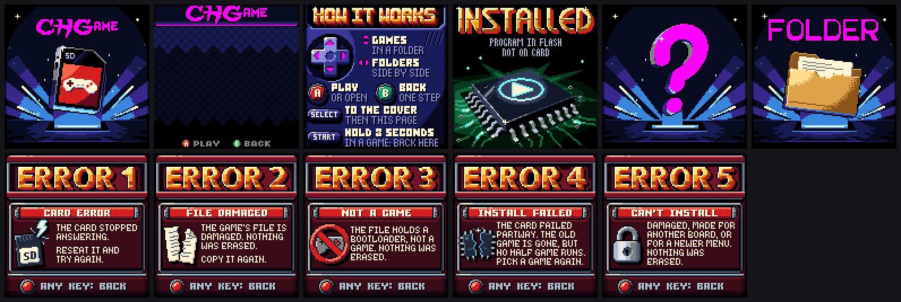

# Cover art: the house look and how a picture is made

Every picture the visual menu shows is box art: each game's cover, the
casino cart's cover (the power-on splash), the genre folders, the menu's own
screens (the about page, errors, installed, no picture). This page is the
style guide and the method. The format is in
[visual-menu.md](visual-menu.md) and [spec/card.md](../spec/card.md).




The aim is retro box art that sells the game: think Sierra's covers of the
early 1990s (Chessmaster 3000, King's Quest V), the punch of Doom and
Battletoads, the craft of Amiga and 16-colour pixel artists. It should be
over the top, full of depth and colour, and still read at a glance. Simple
is fine: five perfectly lit dice can be the whole picture. Programmer art is
not.

## The canvas

| | |
|---|---|
| Size | 128 x 128, shown 1:1 on the panel. Judge every picture at 1x. |
| Colours | 11 of the picture's own, plus four free fixed ones: **cream** #FFF4D6, **grey** #808080, **black** #000000, **red** #D62020. That is 15 to paint with. |
| Rainbow | Index 15, #FF00FF. The Rainbow bootloader turns it through the colour wheel (about 4 s a turn); the Static one shows magenta. It is an **animation**: a neon sign, marquee bulbs, a winning line. Use it only on purpose. |
| Panel colour | RGB565. artkit snaps own colours to it, so the PNG shows what the panel shows. |
| Edges | The installed game gets a 1 px border on rows and columns 0 and 127. Keep the edges dark (a vignette), so the border frames the picture. |
| Install bar | Over x 8-119, y 110-119 while a game installs. Nothing essential there. |
| Fades | Every colour halves at each step. A dark picture fades gracefully. |

## The house look

All the pictures are one family, a casino. These rules tie them together.

1. **A lit stage.**
   - One warm key light from the top left (`ak.KEY`; render3d's default lights).
   - Deep falloff into a dark vignette.
   - Near things are contrasty and saturated; far things are darker, cooler and dithered: atmospheric depth.
2. **The title is king.** Rich, present, and it pops.
   - It is set in a pixel font at the font's own size. Never enlarge one: no doubled pixels, ever.
   - It sits in the top band (about y 3-42) unless the composition truly wants it elsewhere.
   - It is set against a calm, dark area with no busy detail near it.
   - It owns its brightest ramp: about 3 of the 11 colours that **nothing else uses** (pass them as `exclude=` to the quantiser).
   - The stack: drop shadow, black outline, a 1-4 px extrusion, the face (2-4 bands with dithered seams; chrome, gold, ivory, neon, jade, marble...), a bevel (a light top-left edge, a dark bottom-right edge), and a glint or two in cream.
   - Readable at 1x is the test.
3. **One focal subject.**
   - Big, often breaking the frame, seen from a low or three-quarter camera.
   - Action through arcs, speed lines, smears, impact stars, dust, flying chips.
   - Depth through overlap, foreground / middle / background, and value contrast.
   - Silhouettes that read in black alone.
4. **Colour.**
   - Ramps are hue-shifted: shadows cooler and more saturated, lights warmer (`ak.ramp(dark, light, n, hue_shift=...)`).
   - Felt green, gold and wine are the casino's shared accents.
   - Cream is the specular highlight; black is the outline and the void.
5. **Pixel craft** (the full rule book: [pixel-art.md](pixel-art.md); `python -m artkit.craft` checks a sprite for orphans and jaggies).
   - **No pixel doubling.** Never scale up a game's sprites; draw at full resolution. `lint` flags doubled tiles.
   - **No jaggies.** Lines and curves step evenly (1-1-1, 2-2-2, 1-2-1-2), not 1-3-1-2. Look at 4x.
   - **Clean edges.**
     - Objects get an outline or a selective outline (dark on the shadow side, none or lighter on the lit side).
     - Edge pixels are never dithered (the quantiser keeps them clean).
     - Anti-alias by hand with an in-between colour where a curve meets the background.
   - **Dithering is the texture and the gradient.**
     - Ordered (Bayer 4x4 or a 50% checker), only between neighbours in one ramp.
     - Use it for felt, sky, glow, smoke, shadow falloff and metal sheen.
     - Keep it off small details, faces of letters, and anything that must read crisply.
   - **No specks.** Lone pixels unlike their neighbours read as noise, unless they are a deliberate glint (`lint` lists them).

**The defaults are every cart's.** The pictures in `spec/assets` (the
default cover, the default text-menu picture, no picture, the default
folder, installed, the about page, the errors) are shown by any cart that
brings none of its own, so they carry nothing of the casino: the console's
own night and slot of light, the CHGAME logo flat in the rainbow colour,
generic emblems. The casino card dresses its own cover, folders and text
menu in its gold.

## Making one

A picture is a Python recipe whose `draw()` returns the image. A game's recipe is its `tools/cart.py`; `chgame boxart` (in the sketch's folder) writes `docs/cart.png`. Recipes paint with [tools/artkit](../tools/artkit/__init__.py):

```python
import pathlib, sys
HERE = pathlib.Path(__file__).resolve().parent
sys.path.insert(0, str(HERE.parents[9] / "tools"))      # the repository's tools/ (from a sketch)
import numpy as np
import artkit as ak
from artkit import render3d as R

TITLE = HERE / "art" / "title.txt"

def draw():
    P = ak.Palette({                                     # 11 at most, named; dark to light per ramp
        "felt0": "#04180C", "felt1": "#0C4224", "felt2": "#1C7040",
        "ivory0": "#6E6458", "ivory1": "#B8AE9C", "ivory2": "#E8E2D4",
        "gold0": "#7A3A08", "gold1": "#E09A18", "gold2": "#FFE070",   # the title's own
        ...}, ramps=[["black", "felt0", "felt1", "felt2"],
                     ["black", "ivory0", "ivory1", "ivory2", "cream"],
                     ["gold0", "gold1", "gold2", "cream"]])
    cv = ak.Canvas("#000000")                            # 4x4 samples a pixel
    Pp = cv.P
    # paint in true colour: distance fields, gradients, noise, lighting, 3D
    t = ak.radial(Pp, 64, 80, 80, 60)
    cv.paint(1.0, ak.stops(t, [(0, "#1C7040"), (0.6, "#0C4224"), (1, "#000000")]))
    d = ak.circle(Pp, 64, 70, 24)
    dif, spec = ak.light(ak.sphere_normal(Pp, 64, 70, 24))
    cv.paint(ak.cover(cv, d), ak.shade("#E8E2D4", dif, spec), oid=cv.new_id("ball"))
    # to 16 colours: ramp-aware ordered dither; the title's colours kept out
    pic = cv.quantize(P, exclude=["gold0", "gold1", "gold2"])
    ak.selout(pic, pic.obj("ball"), "black")             # finishing passes on the pixels
    ak.title(pic, ak.load_mask(TITLE), x, y, fill=["gold2", "gold1", "gold0"], hi="cream", lo="gold0",
             extrude=dict(dx=1, dy=1, depth=2, side="wine", bottom="black"),
             shadow=dict(dx=1, dy=2, colour="black"), glints=[(gx, gy, 2)])
    return pic.image()

if __name__ == "__main__":
    import boxart
    boxart.save(draw(), HERE.parent / "docs" / "cart.png")
```

### The toolkit in short

- **`Canvas(bg)`.** `cv.paint(alpha, colour, dither=, oid=, blend=normal|add|multiply|screen)`.
  - `dither=0` keeps an area to flat colours, 0.5 allows a checker at most, 1 (the default) allows every level.
  - `oid=cv.new_id("name")` tags an object, for `pic.obj("name")` masks and clean edges.
- **Shapes** (distance fields, negative inside): `circle`, `ellipse`, `box`/`rect` (rounded, rotated), `segment`, `polyline` (tapered), `polygon`, `star`, `ring`, `halfplane`, `bezier()` points; `union`, `inter`, `sub`, `smin`; `cover(cv, d)` for coverage.
- **Perspective.** `quad_uv(P, quad, w, h)` maps a flat w x h design onto any screen quad: a card, a table, a board. `sample()` looks up a texture there.
- **Colour fields.** `linear`, `radial`, `stops`, `lerp`, `noise` (deterministic fractal value noise), `ramp_map`.
- **2D light.**
  - `sphere_normal`, `dome(cv, d, width, profile)` (any shape puffed up: pillows, bevels, coins), `height_normal`.
  - `light(n)` gives (diffuse, specular) from the key light; `rim(n)`.
  - `shade(base, dif, spec, shadow_col=)`.
- **3D: `artkit.render3d`.**
  - Primitives: `sphere`, `box` (rounded), `cylinder`, `torus`, `capsule`, `lathe` (chess pieces, from a profile), `extrude`.
  - Combine them with `U`, `Sub` (carved pips), `SU`, `Inter`; place them with `xf(pos, rot_x/y/z, scale)`.
  - `Mat(colour, spec, shin, refl, rim, shadow_col, tex)`; `Camera(pos, target, fov)`.
  - `render(cv, scene, cam, mats, region=, ss=2)`, then `R.paint(cv, out, {mat: oid})`.
  - `R.ground(cv, ...)` gives the shadows the scene casts on the floor. `cam.project(p)` tells where a point lands, to place 2D effects.
- **`cv.quantize(P, exclude=, allow={obj: [colours]}, penalty=, matrix=bayer4|checker)`.** Gives a `Picture`.
- **On the pixels.**
  - Outlines and shadows: `outline`, `selout`, `drop_shadow`.
  - Masks: `shift`, `dilate`, `erode`, `edge`, `checker`, `place`.
  - Hand work: `patch(pic, x, y, rows, key)` places pixels; `sparkle`; `clean_orphans`.
  - `pic.put(mask, colour)`, `pic.px(x, y, colour)`.
  - `Font(json).text(...)` for small lettering.
- **Titles.** `title(pic, mask, x, y, fill=[...], rows=[...per row...], hi=, lo=, outline=, outline2=, extrude=dict(dx, dy, depth, side, bottom | colours), shadow=dict(dx, dy, colour, pattern), glints=[(x, y, size)])`, `glow()`, `embolden()`, `centred_x()`. It returns the masks it drew.
- **Hand-finishing: `artkit.paint`.** It holds the tools the pilot covers grew.
  - Levels: `by_level`, `levels`, `put_levels`, `terrace`, `cel`.
  - Lines and strokes: `raster`, `line_px`, `ink` (clean 1-px lines with no L corners), `streak` (tapered speed lines with colour steps).
  - Clean-up: `despeckle`, `lonely`.
  - Sparkle: `glint`, `glint_in`.
  - Masks: `thick`, `runs`, `outside_of`, `distance_px`, `letters`.
  - Shapes: `PIPS`, `pip_template`, `tube` (snakes, ropes, cables), `path`, `hull`.
  - Arrays: `px_mean`, `at_px`, `up`, `ihash`.
  - Title bevels: `bevel_contour`, `bevel_runs` (better than title()'s own; pass hi=None, lo=None to title() and bevel after).
  - render3d adds `majority(out, s)`: each pixel's material.

### The title's lettering

The lettering comes from the pixel fonts Pixel Logo Lab collects (thousands of them), always at their own size. Pixel Logo Lab is a separate tool, not part of this repository: its `logolab.py fetch` and `build` download the collections and write its data, and the scout looks for it beside this repository (`../PixelLogoLab`) or at `$CHG_LOGOLAB`. Only the scout needs it. A chosen title is committed as text art, so the recipes never read outside the repository. The scout runs from `tools/`:

```
python -m artkit.fontscout scout "YACHT DICE" ../out/fontscout/CHYacht --min 14 --max 40 --weight 2
```

1. Look at `sheet-*.png`: every face that sets the words within 120 px, numbered, with a quick gold treatment. `index.json` lists the ids.
2. Shortlist the faces that suit the game; `show <id> "TEXT" out.png` shows one.
3. Commit the one chosen: `export "YACHT DICE" <id> <sketch>/tools/art/title.txt` (`A|B` sets two centred lines; `--gap` spaces letters). The text art's header keeps the font's name, author, terms and source.
4. Touch the pixels up by hand if a letter wants it (kerning, a swash, a joined pair).

### The same title on the title screen

A game's title screen draws its cover's lettering, so the two read as one.
The recipe gives it out: `title_lines()` in `tools/cart.py` returns each line
of the title as the cover places it (the mask after any arch, kern or
emboldening) with its extrusion's depth and colour. The game's
`tools/assets.py` packs them with [tools/titleart.py](../tools/titleart.py)
(`LOGO`, `LOGO_RAMP`, ...), and the CHGame library's `titleArt()` draws
them: the extrusion, an ink outline round it all thickened down and right
for the shadow, ink in any one-pixel gap between letters, and the face in
the house gold as a smooth gradient: a hint of white at the top fading into
GOLD, a wide GOLD middle, GOLD fading into a WOOD foot. The palette has no
light yellow or amber, so `titleart.py` blends the steps with a 4x4
ordered dither and bakes each row's pattern into `LOGO_RAMP`: the game
only masks and paints. (The profile is `TOP_WHITE`, `LIGHT_END` and `FOOT`
there.) Only these bitmap titles have it; the font-drawn titles (the other
seven games) keep their straight fills.

The game does not copy the cover's chrome bands, bevel or glints: in the
house palette their light gold is FX_B or SKIN, which reads pale, and at 1x
the bevel's edge pixels and the glints read as noise (the owner's choices,
2026-10-06: the strong yellow, clean, then the smooth gradient with the
gold dominant). It is about twice a plain
`maskDraw`: draw it onto still screens where the game can. Change a title
in the recipe, then run `chgame boxart` and `python tools/assets.py`; the
cover must not change when only `title_lines()` does.

Where a cover's title won't fit the title screen, keep its lettering and
simplify: CHYacht's screen has YACHT as the cover draws it and DICE small
between the cover's rules. Never enlarge a face to fit.

Fonts marked `?` have unclear terms.
- Prefer clear ones (CC0, OFL, public domain, "100% free", "free for commercial use").
- A `?` font may be used when it is clearly the best look; it is listed in the credits below.
- Never use a face lifted from a commercial game or company (names like WRESTLEMANIA or JAZZ JACKRABBIT, or a publisher's name), and never one that draws a real trademark.
- Small lettering (the about page's labels, errors) comes the same way: `font <id> out.json` exports a whole face for `ak.Font`.

### Looking at it

From anywhere once `pip install -e .` has been run in the repository's root (without it, from `tools/`):

```
python -m artkit show <recipe.py>
```

It writes `out/art/<Name>_1x.png`, `_4x.png` and `_menu.png` (as the menu shows it: the border and the install bar), then runs the house checks: colours, edges, doubled tiles, specks.

From the repository's root, the pictures together:

```
python tools/artsheet.py                          # every picture the menus show, labelled, at 2x and 1x: out/art-review.png
python tools/artsheet.py --compare OUT NAME ...   # before (git HEAD) and after, for a few (CHYacht, cover, error-2, ...)
python tools/artsheet.py --gallery                # this page's two galleries: docs/cover-art.png, docs/cover-art-defaults.png
```

Run `--gallery` again after changing a picture, so the README and this page show it.

Look at every render at 4x **and** at 1x, and iterate. The checks before calling a picture done:
- What is the message? Does the picture say it at a glance, at 1x?
- Is the title the first thing the eye reads? Is anything competing with it?
- Is there one focal point, depth (front, middle, back) and a clear light?
- At 4x: jaggies, specks, muddy dither, doubled pixels, orphan colours?

## What the pilots taught

The first three covers (Yacht Dice, Roulette, Snakes & Ladders) went through four rounds with two critics each. Their recipes are worked examples; read one before starting. What the critics kept catching:

- **Paint surfaces as levels, not through the quantiser alone.**
  - The cleanest results came from letting the canvas and render3d work out geometry and light, then painting each surface pixel by pixel as a level on one ramp (`by_level`, `terrace`).
  - `cv.quantize` is a good first pass for big soft areas; hand-finish what matters.
- **Dither in narrow seams, not wide bands.**
  - A wide 50% checker band reads as a screen door, or as target rings round a pool of light.
  - Use flat plateaus with 25/50/75% steps only where they meet, following the form (an ellipse in perspective, not a screen-space circle).
- **Commit to the key light.**
  - Light from the top left, cast shadows to the lower right, every object casting one.
  - A rim light on every edge makes a shape look outlined, not lit. Rim only where light really grazes.
- **The focal hierarchy is a value hierarchy.** The brightest, most contrasty shape must be the subject. Tone down bright secondary things (a chrome turret that outshone the ball).
- **Motion must read at 1x.** Speed lines are curved, follow the path, taper, and stand out from the structure lines around them (a different angle, a dark edge on a busy ground). Lines parallel to the frets vanish.
- **Small things need hand stamps.**
  - A die or a face under about 12 px ray-marched reads as a blob or an eye; stamp it from pixels (`pip_template`, PIPS).
  - Faces need eyes and mouths big enough to read at 1x.
- **No dashes, no specks.**
  - Evenly spaced highlight dashes read as stitching or a road marking; make one continuous tapered glint.
  - Lone pixels read as noise: `despeckle`, keeping only deliberate glints.
- **Titles.**
  - Seams dithered only on strokes 5 px or wider.
  - Bevel on the outer contour, with enclosed counters flat.
  - Close the 1-3 px notches between letters with the outline colour.
  - A glow or halo hugs the whole drawn footprint, never a straight shelf.
  - Nothing busy in the pockets between letters.
- **The frame.** No bright pixels on rows/columns 0-1 and 126-127; nothing that matters under the install bar.

## Where the pictures are

| Picture | Recipe | Picture written | Command |
|---|---|---|---|
| A game's or app's cover | `<sketch>/tools/cart.py` (+ `tools/art/title.txt`) | `<sketch>/docs/cart.png` | `chgame boxart` (in its folder); `--check` from the root |
| The casino cart's cover and folder covers; its text menu's picture | `tools/sdcard/art/src/<name>.py` | `tools/sdcard/art/<name>.png`; `tools/sdcard/menu.png` | `python tools/sdcard/covers.py` |
| The menu's defaults (every cart's): cover, about, installed, no picture, folder, errors, and the text menu's picture | `tools/art/menu/<name>.py` (cover, no picture and folder share `sdscene.py`; the text menu's `listbg.py` with the casino's) | `spec/assets/...` | `python tools/menuart.py` |
| The bootloader's built-in icons (12x12, 1 bit, drawn 8x) | `platform/bootloader/art/icons/*.png` | `src/icons.h` | `python platform/bootloader/tools/icons.py` |

## Credits: fonts in the titles

Each title's text art (`tools/art/title.txt` and the like) names its font, author, stated terms and source in its header. Small lettering is exported whole as `tools/art/fonts/*.json` (with the same details). The stated terms are as Pixel Logo Lab recorded them, often an excerpt of the font's page: read the page itself before a release. The fonts in use:
- **clear:** CC0, OFL, public domain, free for commercial use.
- **keep the X11/Adobe notice:** u8g2's bitmaps of the X11 fonts.
- **check before a release:** the BMF archive's and old systems' faces, whose authors stated no terms. The look of a bitmap face is rarely protected, but check each one, or redraw that title, before shipping.

| Font | Used in | Stated terms | Status | Source |
|---|---|---|---|---|
| CHARSET-DNS_FONT 5 | SD Card Reader, STL Viewer | Freeware; authors vary, few gave terms | **check before a release** | https://github.com/tajmone/pixel-art-supplies/tree/master/fonts/bmf-fonts/bmf-cz |
| Arc24 | Backgammon | Freeware; authors vary, few gave terms | **check before a release** | https://github.com/tajmone/pixel-art-supplies/tree/master/fonts/bmf-fonts/bmf-cz |
| ONE HUNDRED AND FIFTY FIVE | Bingo, Poker | Freeware; authors vary, few gave terms | **check before a release** | https://github.com/tajmone/pixel-art-supplies/tree/master/fonts/bmf-fonts/bmf-cz |
| ONE HUNDRED AND FIFTY NINE | Blackjack, Installed (title) | Freeware; authors vary, few gave terms | **check before a release** | https://github.com/tajmone/pixel-art-supplies/tree/master/fonts/bmf-fonts/bmf-cz |
| TWO HUNDRED AND TWENTY FOUR | Boardwalk | Freeware; authors vary, few gave terms | **check before a release** | https://github.com/tajmone/pixel-art-supplies/tree/master/fonts/bmf-fonts/bmf-cz |
| MIRRORED FONT BY SCOOPEX. FROM ARCHIVE OF CA | Checkers | Freeware; authors vary, few gave terms | **check before a release** | https://github.com/tajmone/pixel-art-supplies/tree/master/fonts/bmf-fonts/bmf-cz |
| ncenB24 | Chess, Words | u8g2: the X11/Adobe notice (use, copy, modify, distribute with the notice kept) | keep the X11/Adobe notice | https://github.com/olikraus/u8g2/wiki/fntlistall |
| luBIS24 | Craps | u8g2: the X11/Adobe notice (use, copy, modify, distribute with the notice kept) | keep the X11/Adobe notice | https://github.com/olikraus/u8g2/wiki/fntlistall |
| CUPID OF PADUA AND HITMEN. FROM ARCHIVE OF C | Crossword | Freeware; authors vary, few gave terms | **check before a release** | https://github.com/tajmone/pixel-art-supplies/tree/master/fonts/bmf-fonts/bmf-cz |
| BAZAR | Dominoes, Solitaire, Casino folders | Freeware; authors vary, few gave terms | **check before a release** | https://github.com/tajmone/pixel-art-supplies/tree/master/fonts/bmf-fonts/bmf-cz |
| KISS 91 | Four in a Row | Freeware; authors vary, few gave terms | **check before a release** | https://github.com/tajmone/pixel-art-supplies/tree/master/fonts/bmf-fonts/bmf-cz |
| NicoBold-Regular | Four in a Row | commercial or non-commercial | clear | https://emhuo.itch.io/nico-pixel-fonts-pack |
| Pix Romana | Mahjong | OFL | clear | https://helianthus-games.itch.io/pix-romana |
| Syndor24j.Scn.Fnt | Roulette | A system's font; its vendor's | **check before a release** | https://github.com/robhagemans/hoard-of-bitfonts/tree/master/oberon |
| Chunky Monkey | Slots | Free for games, with a credit | clear | https://damieng.com/typography/zx-origins/chunky-monkey/ |
| ONE HUNDRED AND SEVENTY THREE | Slots | Freeware; authors vary, few gave terms | **check before a release** | https://github.com/tajmone/pixel-art-supplies/tree/master/fonts/bmf-fonts/bmf-cz |
| DRD | Snakes & Ladders | Freeware; authors vary, few gave terms | **check before a release** | https://github.com/tajmone/pixel-art-supplies/tree/master/fonts/bmf-fonts/bmf-cz |
| JoyquestSample | Snakes & Ladders | commercial use | clear | https://narehop.itch.io/pixel-font-joyquest |
| ncenB12 | Tic Tac Toe | u8g2: the X11/Adobe notice (use, copy, modify, distribute with the notice kept) | keep the X11/Adobe notice | https://github.com/olikraus/u8g2/wiki/fntlistall |
| ncenB18 | Tic Tac Toe, Words | u8g2: the X11/Adobe notice (use, copy, modify, distribute with the notice kept) | keep the X11/Adobe notice | https://github.com/olikraus/u8g2/wiki/fntlistall |
| Bent 3 round by crs/broncs | Word Wheel | Freeware; authors vary, few gave terms | **check before a release** | https://github.com/tajmone/pixel-art-supplies/tree/master/fonts/bmf-fonts/bmf-cz |
| timB24 | Yacht Dice | u8g2: the X11/Adobe notice (use, copy, modify, distribute with the notice kept) | keep the X11/Adobe notice | https://github.com/olikraus/u8g2/wiki/fntlistall |
| timB14 | Yacht Dice | u8g2: the X11/Adobe notice (use, copy, modify, distribute with the notice kept) | keep the X11/Adobe notice | https://github.com/olikraus/u8g2/wiki/fntlistall |
| DyslexicPixel | Default folder (title) | commercial use | clear | https://ladyliefy.itch.io/dyslexic-lief |
| Pee Wee By Complex | Casino cover | Freeware; authors vary, few gave terms | **check before a release** | https://github.com/tajmone/pixel-art-supplies/tree/master/fonts/bmf-fonts/bmf-cz |
| Lanky Git Variable | Casino text menu | commercial work; editing, transforming and building on it encouraged (an excerpt) | clear | https://2bitcrook.itch.io/44-game-boy-fonts |
| ncenB08, ncenB10, ncenB12, ncenB24 | WORDS folder | the X11/Adobe notice (use, copy, modify, distribute with the notice kept) | keep the X11/Adobe notice | https://github.com/olikraus/u8g2/wiki/fntlistall |
| Bitrimus | About | CC0 | clear | https://ggbot.itch.io/bitrimus-font |
| Thintel | About | 100% Free | clear | https://www.dafont.com/thintel.font |
| RotorCap Neue | Casino and default text menus | 100% Free | clear | https://www.dafont.com/rotorcap-neue.font |
| Pizel | Errors | CC0 | clear | https://surrealember.itch.io/pizel |
| Gamer | Errors | 100% Free | clear | https://www.dafont.com/gamer-2.font |
| Lepidos | Installed | public domain | clear | https://surrealember.itch.io/lepidos |
| Green Flame | Bingo | Public domain / GPL / OFL | clear | https://www.dafont.com/greenflame.font |
| Round9x13 | About (title) | OFL | clear | https://heraldod.itch.io/bitmap-fonts |
| Oberon24b.Scn.Fnt | Errors (title) | A system's font; its vendor's | **check before a release** | https://github.com/robhagemans/hoard-of-bitfonts/tree/master/oberon |
