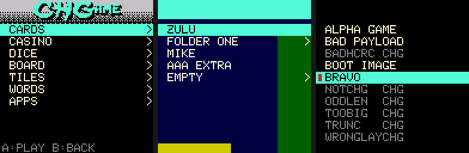

# The SD game menu

The CHGame bootloader has a game menu built in. Put games on a microSD card,
switch the CHGame on, pick one, and play. No PC is needed to change games.
If you know the Arduboy FX, it works the same way: the menu appears at
power-on, and the game you played last is already selected.


## Using it

**Switching on.** The menu appears, with the installed game highlighted. It
is marked with a red chip. (A card can name a game to start instead:
"Starting a game at power-on", below.)

| Button | In the menu |
|---|---|
| UP / DOWN | move (hold to repeat) |
| LEFT / RIGHT | a page (10 rows) up or down |
| A or START | play a game, or open a folder (marked `>`) |
| B | back out of a folder; close a message |

- **The game you already have.** Pressing A on the highlighted game starts it
  at once. Nothing is written to flash.
- **Another game.** A on any other game installs it, which takes about a
  second. The screen shows "INSTALLING" and a progress bar, then the game
  starts. The new game is checked completely before anything is erased, so
  a damaged file never costs you the game you had.
- **Folders.** A card can sort its games into folders, and folders into
  folders. A opens one, and B goes back to where you were.
- **Back to the menu.** Hold **START for 3 seconds** in any game. Switching
  the CHGame off and on works too, as on an Arduboy FX. The games don't
  mention it on screen: it is a feature of the platform, like a phone's home
  button.
  - Without a card, or under the old bootloader with no menu, the same hold
    simply restarts the game.
  - Anything since the game last saved is lost, as when switching off. The
    first press of START still does its usual job (pause, or start on a
    title screen) before the 3 s are up.
- **No card, or a card without games.** The installed game starts straight
  away, as it did before the menu existed.

**Starting a game at power-on.** A card can name one game to start by itself
whenever the CHGame is switched on, as a cartridge would: no menu. If it is
not the installed game, it is installed first. To reach the menu anyway,
**hold START while switching on**. Holding START for 3 seconds in the game
also brings up the menu, never the game again.

**Saved games.** Every game keeps its save in the same small area of
flash. When you switch games, the old game's save stays there until the new
game saves for the first time; after that it is gone. Game settings and
saves are not kept per game yet.

**Flash wear.** Showing the menu never writes flash. Installing a game
rewrites only the parts that differ from the game already there. The
microcontroller's flash is rated for many thousands of rewrites, so in
practice you can switch games as often as you like.

## The menu's look

Everything behind the list is one picture on the card, the CHGAME logo
included, so every card can look its own way. Anything the picture paints
in pure magenta (`#FF00FF`) turns through the colours, as the default
logo and the selection bar do; on the bootloader's Static style (*Tools >
Bootloader > SD Game Menu (Static)*) nothing turns and the picture shows
as painted, magenta included. A folder can
have a picture of its own.



A card with no picture shows the list on black. To change the picture,
`chgame background` converts any image, previews the menu on it and puts it
on a card: [menu-image.md](menu-image.md) has the steps.

## Preparing a card

- **Format.** The card must be FAT32 or FAT16. Cards up to 32 GB come that
  way. A 64 GB or larger card is usually exFAT, which the menu cannot read;
  reformat it as FAT32.
- **From a .chgame file.** Games are shared as `.chgame` files: one game or
  a whole cart of them, with their folders, order, picture and the files they
  read from the card. With the card mounted on a PC:

  ```
  chgame cart deploy MyCart.chgame --card E:\
  ```

  That writes everything, flashes a game that needs flashing, and leaves the
  rest of the card alone (`--clean` replaces the card's `GAMES` folder
  instead). `chgame cart prepare MyCart.chgame out/card` writes the same
  files into a folder, to copy over yourself. The format is
  [spec/chgame.md](../spec/chgame.md).
- **All the casino games.** Each release has them as one cart
  (`CHGame-Casino-<version>.chgame`) and as the card's contents in a zip
  (`CHGame-sdcard-<version>.zip`): unzip it onto the card. From a clone,
  `chgame card` builds every game and writes the cart and the card's
  contents (`out/sdcard/`).
- **By hand.** The menu lists the `GAMES` folder at the top of the card:
  ```
  GAMES/
      BACKGAMM.CHG       a game ("CHG file": spec/chg.md)
      ...
      APPS/              a folder: the same again
      MENU.IDX           the order, the folders' titles, the game started at power-on
      MENU.BG            the picture behind the menu
  WORDS.DIC              (CHWords' dictionary: stays at the top, where the game looks)
  PHRASES.BNK            (CHWordWheel's phrases)
  CHCW/                  (CHCrossword's puzzle packs)
  ```
  - A `.CHG` file is one game. The menu shows the title stored inside it,
    so the file name only has to be a short `NAME.CHG` (8 letters at most).
  - A game copied in by hand is listed after the card's own order, sorted
    by title.
  - Up to 240 entries (games and folders) in a folder, 4 folders deep,
    and as many folders as you like. Files can be copied in any order and
    can be fragmented.
  - `MENU.IDX` and `MENU.BG` are made by the tools from a `.chgame`
    ([spec/card.md](../spec/card.md)).

**Copying files without a card reader.** Open **APPS** in the menu and pick
**SD CARD READER**. The CHGame becomes a USB drive on the PC. Copy the
files, eject the drive, then hold B for a second (or START for 3 s, or
switch off and on) to go back to the menu.

## Messages

| Message | Meaning |
|---|---|
| NO GAMES | No game is installed, and there is no card, no `GAMES` folder or nothing in it. The CHGame waits for a card or a USB upload. |
| ERROR 1 | The card stopped answering. Reseat it and try again. |
| ERROR 2 | The game's file is damaged (CRC). Nothing was erased. Copy the file again. |
| ERROR 3 | The file holds a bootloader, not a game. Nothing was erased. |
| ERROR 4 | The card failed partway through an install. The old game is gone, but no half-written game will ever run. Pick a game again. |
| ERROR 5 | Not a game file this CHGame can install: damaged, made for another board, or for a newer menu. Nothing was erased. |
| USB UPLOAD / B: MENU | A PC is uploading a sketch, or asked for the bootloader. Press B to go back to the menu. |

A greyed-out row is a file the menu could not read as a game. Its file name
is shown instead of a title, and A on it gives its error.

## Developers

- **Uploading from the Arduino IDE.** This works as before, including while
  the menu is on screen. The uploaded sketch then starts directly. On the
  next power-on the menu shows it as **INSTALLED PROGRAM** at the top.
- **Sharing your game.** `chgame export` in the sketch's folder writes
  `build/<Name>.chgame`, described by the sketch's `chgame.json`
  ([getting-started.md](getting-started.md)). Anyone can then deploy it, put
  it in a cart (`chgame cart new`, `add`, `order`, `launch` ...) or run it in
  an emulator.
- **Just the CHG file.** With the board package 0.3.0 or later, *Sketch >
  Export Compiled Binary* in the Arduino IDE writes `MyGame.ino.chg` into the
  sketch's `build/` folder, beside the `.bin`. Its title is the sketch's name
  in capitals. Copy it to `GAMES/` under a short name (`MYGAME.CHG`). For
  another title, or with an older package:

  ```
  chgame-upload pack MyGame.ino.bin -out MYGAME.CHG -title "MY GAME"
  python tools/chgpack.py pack MyGame.ino.bin MYGAME.CHG --title "MY GAME"
  ```

  (the first is the uploader the board package installs, the second the
  repository's tool; they make the same bytes). [spec/chg.md](../spec/chg.md)
  describes the file and what a game needs to know. In short: nothing
  changes for your sketch.
- **Returning to the menu from a game.** Every sketch on the CHGame library
  has it built in: `chgame.pollButtons()` checks for START held 3 s.
  - `chgame.exitToMenu()` leaves on purpose, for example from a QUIT item.
  - `chgame.startExits = false` in `setup()` turns the hold off, for a game
    that needs long START holds for itself.
  - Without that core, call `NVIC_SystemReset()`. Any reset that is not an
    upload request shows the menu (never the card's power-on game).
- **Recovery.**
  - Hold **B** while switching on: the bootloader skips the card and the
    menu and waits in USB upload mode.
  - If even that fails, use the factory ISP: hold BOOT across power-on, see
    [recovery.md](../platform/board/docs/recovery.md).
- **The bootloader itself.** It lives in
  [platform/bootloader](../platform/bootloader): sources, tests, sizes, and
  how to install it. This page describes its menu v2; the first menu
  (board package 0.3.0) lists only the games directly in `GAMES/`, sorted
  by title, and shows each error in words.
