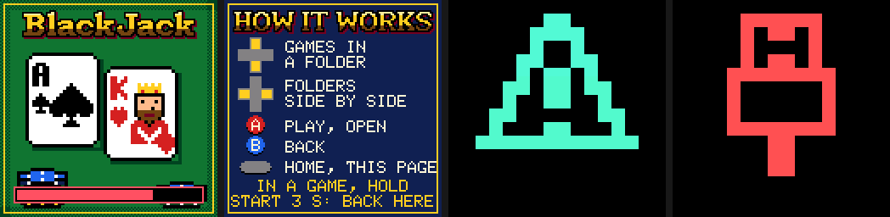
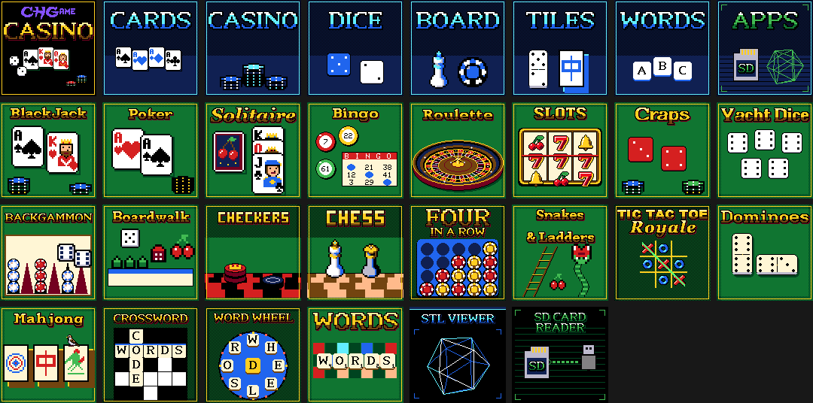

# The visual menu

The CHGame's bootloader comes with two faces for the SD game menu. The
[list menu](sd-menu.md) shows the card's games as a list of titles. The
**visual menu** shows **one picture at a time**: the card's cover at
power-on, each folder's cover, each game's box art. It draws no text at
all, in the manner of the Arduboy FX's menu. The same card works with both,
so you can switch between them whenever you like.




## Installing it

In the Arduino IDE: *Tools > Bootloader* **SD Graphic Menu (Rainbow)** or
**(Static)**, *Tools > Programmer* **CHGame USB**, *Tools > Burn
Bootloader*. To go back, burn **SD Text Menu** the same way. The card stays
as it is either way. Burning a bootloader erases the installed sketch.

From the command line: `chgame uploader selfupdate
platform/bootloader/release/chgame_sdvisual.bin --yes`. To try it without
touching the bootloader, upload `release/chgame_visual_dryrun.bin` as a
sketch: it is the visual menu as a program. It checks the games but never
installs them ([HARDWARE.md](../platform/bootloader/HARDWARE.md)).

**Rainbow or Static.** In the Rainbow style, the install bar and every
`#FF00FF` pixel of a picture turn through the colour wheel: the CHGAME logo
on the casino card's cover, the line through Tic Tac Toe's winning row. In
the Static style they stay magenta, as painted.

## Using it

| Button | In the visual menu |
|---|---|
| UP / DOWN | the picture before or after: the folder's cover, then its games (and the folders inside it), round and round |
| LEFT / RIGHT | the folder beside this one, on its cover. At the top: the card's own games and its folders, in a ring |
| A | play the game (installed first if need be); open a folder; on a folder's cover, go to its first game. On the card's own cover: the installed game's picture, then A plays it and B goes back |
| B | back: out of a folder inside a folder; from anywhere else, to the card's cover. On the card's cover, the about page (how the menu works). Any key closes it |
| SELECT | straight back to the card's cover from anywhere; there, the about page |
| START | nothing (in a game, hold it 3 s to come back here) |

- **Switching on.** The card's cover appears while the menu looks for the
  game you played last, then that game's picture comes up. A one-pixel
  border round the whole picture, turning through the rainbow (white on a
  Static bootloader), marks the installed game. A plays it at once and writes nothing.
- **Moving.** The next picture slides in from the side you pressed: up or
  down within a folder, left or right to the folder beside. Into or out of a
  folder (A, B), the screen fades through black.
- **Installing.** A on any other game puts a bar over its picture, which
  fills as the game is checked and written, then the game starts.
- **A launch game.** If the card names a game to start by itself (a cart's
  `launch`), the menu shows the cover, then that game's picture, installs
  the game if need be and starts it. Holding START while switching on gives
  you the menu instead.
- **A sketch you uploaded** that is not on the card comes up as the first
  picture after the cover, with the border. A runs it.
- **Errors** are a picture each, numbered as in [sd-menu.md](sd-menu.md).
  Any key goes back. If the card cannot be read at all, the menu draws its
  own built-in screens: an error triangle, a USB plug for an upload, an
  empty folder for a card with no games.
- **Back to the menu** from a game: hold START for 3 s, as always.

## Where the pictures come from

Everything comes from the card that `chgame card`, `chgame cart prepare` or
`chgame cart deploy` writes ([spec/card.md](../spec/card.md)):

| On the card | What | From the cart |
|---|---|---|
| `GAMES/COVER.PIC` | the cart's cover: the splash, and the top level's first picture | `menu.cover`, else [spec/assets/cover-default.png](../spec/assets/cover-default.png) |
| `GAMES/<FOLDER>/COVER.PIC` | a folder's cover | the folder's `cover` in `menu.folders` |
| `GAMES/SYSTEM.PIC` | the about page, then the menu's own screens: the installed program, no picture, no cover, errors 1-5 | `menu.about`, else [spec/assets/about-default.png](../spec/assets/about-default.png); the rest from [spec/assets/system/](../spec/assets/system) |
| inside each `.CHG` file | the game's picture, its box art | the game's `cartImage` |

A game's picture travels inside its CHG file, so a game copied onto a card
by hand, or added with `chgame cart deploy`, keeps it. A CHG file without
one shows the menu's "no picture" screen. Old menus ignore all of these
files.

## The picture rule

Every picture is a 128x128 PNG, opaque, with **at most 11 colours** besides
`#FF00FF` and the menu's four: `#FFF4D6`, `#808080`, `#000000` and
`#D62020`. Those four are always free to use. `#FF00FF` is colour 15, the
rainbow colour, so use it on purpose. The palette in
[tools/art/common/bootloader_palette.ACT](../tools/art/common/bootloader_palette.ACT)
follows the rule and works in any paint program. Over a game's picture the
menu draws only the installed game's border (the outermost pixel all round) and,
while installing, the bar over rows 110-119. Keep anything important clear of
those spots.

```
chgame picture --template my-art.png           # a blank picture with the border and the bar marked
chgame picture my-art.png --preview p.gif      # as the menu shows it: fading in, installing, fading out
chgame picture photo.jpg --out my-art.png      # any image made to follow the rule (scaled, colours reduced)
chgame picture my-art.png --card E:\           # straight onto a card as its cover (the splash)
chgame cart picture mycart.chgame my-art.png [--game ID | --folder F | --about]
chgame cart art mycart.chgame                  # a picture for every game and folder that has none
```

**Nothing is ever missing.** `chgame export` and every cart command draw a
picture for a game that has none: its title in the house lettering over its
first gameplay frame. `chgame cart build` and `chgame card` also draw a
cover for any folder that has none: a folder and its name.
[tools/boxart.py](../tools/boxart.py) draws both.

## Box art for your game

Put a 128x128 PNG at `docs/cart.png` in your sketch's folder. Your
`chgame.json` can name another path with `cartImage`. Draw it in any paint
program. Or do as every included game does and draw it with a short
Python recipe, `tools/cart.py`, using the house style in
[tools/boxart.py](../tools/boxart.py):

```python
import boxart as bx

def draw():
    fb = bx.game()                                   # green felt, dithered edges, a gold frame
    bx.logo(fb, bx.logo_from_assets(HERE.parent), 8) # the game's logo, in the titles' gold
    cards = bx.layer()                               # charms: from the game's own art
    bx.card(cards, 0, 0, "A", "s")
    bx.blit(fb, cards, 15, 31, 2, (0, 0, 23, 29))    # ...at twice the size
    bx.chips(fb, 24, 121, 160)
    return fb
```

`chgame boxart` in the sketch's folder runs it and writes `docs/cart.png`.
`chgame boxart --check`, from anywhere, checks that every recipe's picture
is up to date, and `chgame boxart --sheet out.png` puts them all side by
side. The house style is the games' own title screens: the game's logo, or
its name in the display font, in gold over felt; one bold charm from its own
sprites; a gold frame; every game on the dark green felt (`bx.game()`).
**A folder never looks like a game:** every folder is the navy gradient with
its word and charm in blues (`bx.folder()`, then `bx.blues()`), and the
cart's own cover is black (`bx.cart()`). Art of your own needn't follow any
of it: the two apps wear their own secret-agent style, and the APPS folder
mixes it with the folders' navy, the way a cart of yours sits beside these.



| What | Where | Made by |
|---|---|---|
| each program's box art | `<sketch>/docs/cart.png` | its `tools/cart.py` (`chgame boxart`) |
| the casino card's cover and genre covers | [tools/sdcard/art/](../tools/sdcard/art) | [tools/sdcard/covers.py](../tools/sdcard/covers.py) |
| the defaults: cover, about page, the menu's screens | [spec/assets/](../spec/assets) | drawn once by [tools/menuart.py](../tools/menuart.py), then edited as PNGs (it never overwrites one) |
| the built-in screens (no card needed) | [platform/bootloader/art/icons/](../platform/bootloader/art/icons) | 12x12 1-bit PNGs; `python platform/bootloader/tools/icons.py` makes `src/icons.h` |

Change a built-in icon by editing its PNG, then run `tools/icons.py` and
rebuild the bootloader. The PC suite fails if `src/icons.h` is out of date.

## For developers

- **The bootloader:** [platform/bootloader](../platform/bootloader).
  `build.sh release --ui=visual [--style=static]` builds it (12,080 B, 208 B
  spare); `src/visual.c` is the menu. It shares the card's code with the
  list menu (`src/card.c`). [SIZES.md](../platform/bootloader/SIZES.md) says
  where every byte went: no font and no text paid for the pictures, the
  ring, the search, the fades and the slides.
- **The tests:** `python3 platform/bootloader/test/native/run_tests.py` runs
  the visual menu's scenarios in both styles on test cards and on the real
  casino card. Each of its frames is pinned, and a check compares the
  bootloader's frame of a picture with the picture the tools made, pixel for
  pixel.
- **The format:** [spec/card.md](../spec/card.md) ("How the visual menu reads
  the card", step 7), [spec/chg.md](../spec/chg.md) (the picture in a CHG
  file), [spec/chgame.md](../spec/chgame.md) (`menu.cover`, `menu.about`, a
  folder's `cover`, `cartImage`).
