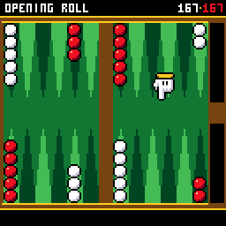
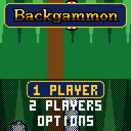
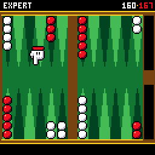
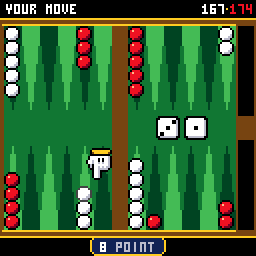
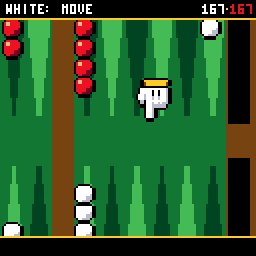
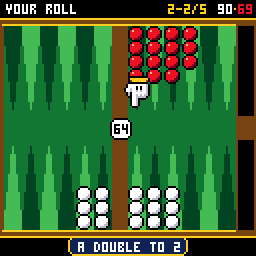
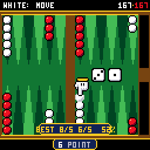
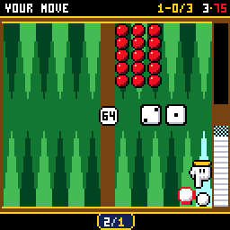

# CHBackgammon

> **Part of [CHGame](../../README.md)**: one of the casino games that are the platform's examples. This game lives in
> `games/CHBackgammon`; the simulator, size report and serial helper it uses are shared in the
> repository's root [`tools/`](../../tools), and the board package and CHGfx are in
> [`platform/`](../../platform). Notes for developers: [NOTES.md](NOTES.md).

Backgammon for the [CHGame](../../README.md) handheld
(CH32X035 RISC-V, 128x128 colour LCD, piezo), the third table in the casino
of [CHBlackjack](../CHBlackjack) and CHChess: the
whole board from above on green felt, checkers that are casino chips, a
pointing glove to pick them up, the points a checker can go to shimmering,
dice that tumble in across the table while the camera whips in to twice the
size to watch them land, blots knocked spinning to the bar in slow motion
under a red HIT!, DOUBLES!, PRIME!, CLOSED OUT! and GAMMON! dropping in
letter by letter in a slab-serif face drawn for the game, matches with the
doubling cube, a coach at your elbow, and a CPU opponent with a red glove
of its own that throws its dice, hovers over the plays it is weighing,
turns the cube when it should, and carries its checkers the way you do.

| Title | The opening roll | The CPU's turn |
|---|---|---|
|  |  |  |
| **A hit** | **A double** | **The cube** |
|  |  |  |
| **A hint, and the coach** | **The last checker off: the match** | |
|  |  | |

(Captured from the PC simulator in `tools/chsim`, which runs the real game
and graphics code and renders what the device shows. The game has been
built and checked in the simulator; its frame times and the CPU's thinking
times on the handheld itself are still to be measured.)

The CPU was not taught backgammon: it **learned it by playing itself**. Its
judgement is a small neural network (3.2 KB of integers) trained on a PC
over 1.6 million games of self-play, the way TD-Gammon was in 1992; see
[How it fits](#how-it-fits). The code, the CPU, its match equity table and
the display font are all this project's own, on the framework of
CHBlackjack and CHChess; the small 3x5 lettering is Press Play On Tape's
font, as there. See `NOTICE`.

## Installing

You need the Arduino IDE (2.x) or `arduino-cli`, and:

1. **The CHGame board package, 0.2.4 or later**: see [Installing](../../README.md#installing)
   in the repository's README.
2. **The CHGfx library, 1.3.0**, in this repository at
   [`platform/libraries/CHGfx`](../../platform/libraries/CHGfx). Copy it into your
   sketchbook's `libraries/` folder.
3. **This game's folder**, `games/CHBackgammon` of this repository (keep the name `CHBackgammon`).

The game needs **link-time optimisation** to fit: pick *Tools > Optimize >
Smallest + LTO*, and *Tools > USB > Upload only* (the game has no use for
USB Serial, and uploading works as before). That is 49.5 KB of the
50,944-byte application region, with room left for the two flash pages
that hold your saved games. From the command line:

    arduino-cli compile -b CHGame:ch32v:CHGame:opt=oslto,rtlib=nano,periph=game,usb=uploadonly CHBackgammon
    arduino-cli upload  -b CHGame:ch32v:CHGame -p COMx CHBackgammon

(`python tools/device.py build` does the same.)

## Playing

| Button | On the board | Elsewhere |
|---|---|---|
| A | throw the dice (or, on the cube, double); pick the checker up / set it down there; pick the dice up when you are done | select |
| D-pad | move the glove between your points, or, holding a checker, between the places it can go; before you throw, between the dice and the cube | menus |
| B | put the checker back; with an empty hand, take your last move back | back |
| SELECT | a hint: the best play of your roll, and your chances | |
| START | pause: resume, resign, save + quit | |

You are White: your checkers travel from the top right, round the left end
of the board, to your home board at the bottom right, and off into the tray
beside it. Red goes the other way round. (Option HOME LEFT mirrors it all,
for players brought up with the home boards on the left.) At the top are
each side's pips still to go, and in a match the score and its length.

**Your turn.** A throws the dice. The glove then stops on your points (on
the bar, while you have a checker there): each press of the D-pad takes it
to the nearest one in that direction, and the checker under it fades its
outline black to white. A picks that checker up (a rainbow outline) and the
places it can go light up: a point for each die, and for both dice together
(or two, three, four of a double) when the way is open. A point where it
would hit a blot pulses red, and the blot flashes. Move the glove to one and
press A to set the checker down; B puts it back. A plate at the foot of the
screen names what the glove is on ("13 POINT", "13/7", "8/5 HIT!",
"6 POINT NO MOVES"), and moves are called in the notation players use
("24/18* 13/11", "8/5(2)"); while you roll, the plate above shows the other
side's whole last play.

The rules about the dice are kept for you: you must play both if you can
(and the higher if only one can be played), so a move that would strand the
other die is not offered. With no move at all, NO MOVES comes up (DANCE!
when you are stuck on the bar) and the turn passes.

**Picking up the dice.** When your dice are played the glove goes to them:
A picks them up and the turn is Red's, as at a real table; B takes your
last checker back instead (as it does at any point in your turn, hits and
all), so nothing is final until the dice are up.

**Matches and the cube.** A single game (no cube) is the default; on the
setup screen choose a match to 3, 5 or 7 points instead, and the doubling
cube comes into play. It sits on the bar showing 64. Before you throw, move
the glove from the dice to the cube and press A to double; doubled
yourself, choose TAKE or PASS. A game is worth the cube's value, twice that
for a gammon, three times for a backgammon; a pass gives the doubler what
the cube showed before. When a side first needs just one point, the next
game is the Crawford game, played without the cube. The CPU uses the cube
too: it doubles when it is well ahead (cashing when you ought to pass, and
doubling at once when it trails after the Crawford game), and takes or
passes by what the score makes the game worth.

**The coach and hints.** SELECT, during your move, shows the best play of
your roll and your chances ("BEST 8/5 6/5 52%"), its points lit in gold.
With COACH on (Options), every play you finish is checked before you pick
up the dice: "ERROR" or "BLUNDER!" with the better play, so you can take it
back - or "BEST PLAY!". It also gives its view when you are doubled, and
counts your errors and blunders for the game.

Play one or two players. Against the CPU, choose one of three opponents:

| Opponent | |
|---|---|
| BEGINNER | still learning: plays any of its best few plays |
| EXPERT | its best play, every roll |
| GRANDMASTER | looks a roll ahead: every roll you could throw next, and your best answer to it |

The dice are the same for everyone: one generator, seeded from the moment
you press the button, that the CPU cannot see or touch (it is handed each
roll, as you are), and tested for fairness. Your record against each
opponent, games and matches, is on the opponent screen (hold SELECT there
to clear it). Options: sound, the felt (green, blue, red, purple), the side
of the home boards, the pace (FUN, or QUICK: no close-ups and shorter
pauses) and the coach. Options, records and a game or match in progress
(SAVE + QUIT, then CONTINUE) are saved to flash and survive re-uploading.

## How it fits

* **The CPU** (`src/ai`) evaluates a position just after a side has moved:
  how likely is that side to win? The answer is a neural network with 196
  inputs (for each side and point: a first checker, a second, a third, and
  each one more; the bar; the tray), 16 hidden units and one output - 3,188
  bytes of 8-bit weights, evaluated with integer adds, a 65-entry sigmoid
  table and no floating point. It learned by temporal-difference self-play
  (`tools/train`): 1.6 million games against itself on a PC, about a quarter
  of an hour, starting from random weights and the rules alone. The trainer
  compiles the game's own rules and its integer evaluator, so the network
  that was measured is bit for bit the one in the cartridge: it wins 99.7%
  against random play and 77% against a hand-written player that runs,
  hits and covers its blots sensibly; the integer version plays the float
  one dead even.
  * EXPERT tries every play the roll allows (about 17 on average, up to
    several hundred for a double) and takes the one the network likes best.
  * GRANDMASTER then takes its best ten and, for each, every roll the other
    side could throw and that side's best answer: a few thousand positions.
    It beats EXPERT 55% of the time - in backgammon, where the dice decide
    so much, that is a real edge - and the hand-written player 80%.
  * BEGINNER picks at random among its three best plays that are not much
    worse than the best: it loses to EXPERT nearly three games in four
    (73%).
  * A pure race (no contact left) is played, at every level, by a
    25-number table fitted to the exact answer for all 54,264 home-board
    positions, which the handheld has no room for: it bears off 0.013 rolls
    slower than perfect play.
  * **The cube** (`src/ai/Cube.*`): the network's chance, and a match
    equity table worked out from first principles in `tools/train/met.py`
    (a 7x7 table and the post-Crawford column, 112 bytes): take when taking
    is worth more than passing, double near the point where the other side
    should pass.
  * **Speed.** Consecutive plays differ by a checker or two, so the network
    keeps the hidden sums of the last position it saw and adds or takes
    away only the rows of the points that changed (an incremental
    evaluation; the tests check it against a fresh one half a million
    times). That, and the evaluation and the move generator running from
    SRAM, makes a position about three times cheaper. The thinking is done
    a slice per frame, so the frames never stop and nothing needs a second
    stack; the red glove wanders over the checkers being weighed, and a soft
    clock ticks if it takes long.
* **The rules** (`src/rules`) are written once, for "the side to move",
  each side counting the points its own way. Every play of a roll is
  enumerated without storing any (the list for a double can run to
  hundreds), each final position exactly once. A second, naive
  implementation in the tests agrees with it on 2.1 million rolls.
* **The board** (`src/table`) is drawn top-down in world units that the
  camera scales by fifths, 1x to 2x, a row at a time: each row's wood,
  felt and tray in one pass of word stores, then the points' tapering spans,
  from SRAM. The checkers, dice and glove are span-encoded sprites
  recoloured per side by a palette swap, with a second, detailed drawing of
  the checker for the close-ups. A still board is not redrawn: the frame is
  sent again, so the palette effects (the shimmering targets, the outlines,
  the lettering's shimmer) keep moving for free.
* **The lettering** is a slab serif drawn for the game (`tools/art/font.txt`,
  capitals and figures 11 pixels high, a few lower-case letters for the
  logo): 600 bytes of packed bits, drawn through CHBlackjack's mask code
  for the outlined, gradient-filled logo, banners and headings, and plain
  for the setup and options choices. Menus use the 3x5 font at twice the
  size, as in the other tables.
* **Sound** is CHBlackjack's piezo sequencer of short step lists, three
  bytes a step: the dice rattling to rest, a knock for each checker set
  down, a smash and falling swoops for a hit, a chip dropped in the tray,
  fanfares.
* **Saved games** hold the position as the turn began, its roll, the match
  and the cube, and the dice generator's state, so reloading can never
  change a roll.
* **Room.** The game fills the flash; the last few kilobytes came from
  replacing a 64-bit division with a 32-bit one (1.2 KB of library code),
  table-driven saving, a font found by walking its glyphs rather than an
  index, and the shadows drawn as rounded boxes rather than ellipses.

## Development

The tools need Python 3 with `pip install -r ../../tools/requirements.txt`, and a
C++ compiler (zig, clang++ or g++ on the PATH, `pip install ziglang`, or
`CHSIM_CXX="path/to/zig c++"`).

* `python tools/check.py` - everything that can be checked without the
  board: the host tests; each script in `tools/scripts` run in the simulator
  twice (the frames must be identical); the network's evaluation the same in
  the simulator as on the host; the device build compiled and sized.
  `--compare A B` compares two runs' images (the simulator's against the
  board's).
* `python tools/tests/run_tests.py` - the rules against the reference
  implementation, the step-by-step validator (every way of playing a turn
  ends on a legal position, and can never get stuck), the dice (chi-square),
  hundreds of whole matches through the game's own calls with take-backs,
  doubles, takes, passes, the Crawford rule, save and reload, the notation,
  the cube's judgement, and the CPU (always legal, the same choice however
  its thinking is sliced; its incremental evaluation the same as a fresh
  one).
* `python tools/chsim/chdrive.py --sim . tools/scripts/showcase.txt out/showcase`
  - runs the game from a script and writes the GIFs above (the reel at the
  top is `tools/scripts/gameplay.txt`). In a script,
  `say X <side> <position>` sets up a position (`w 6:5 8:3 r 24:2 ..`: each
  side's points and counts), `say C <length> <white> <red> <cube> <owner>
  <crawford>` the match, `say D 6431` stacks the next rolls, `move 13 7`
  walks the glove with D-pad presses and picks up and sets down, `waitturn`
  waits for your turn, `auto` plays on for you, `rec` records, `cal` and
  `perf` estimate the device's render time.
* `python tools/train/train.py train out/net.bin --games 600000` trains a
  network from nothing; `bench int:tools/train/net.bin heur` plays two
  players against each other (`random`, `pips`, `heur`, `float:<file>`,
  `int:<file>`, and the game's own opponents `ai0:` `ai1:` `ai2:`);
  `export tools/train/net.bin src/ai/NetData.cpp` writes the tables;
  `race src/ai/RaceData.cpp` fits the race table. `tools/train/net.bin` is
  the network in the game. `python tools/train/met.py src/ai/MetData.cpp`
  works out the match equity table.
* `python tools/device.py upload [--debug]` - build and upload (`--debug`
  adds the serial protocol for screenshots, injected input and lockstep; to
  fit it, debug builds leave out saving, the setup and options screens, the
  hint and the coach). `tools/scripts/device_render.txt` and
  `device_think.txt` measure the render time and the CPU on the board.
* **Editing the art:** `python tools/assets.py` packs `tools/art/` into
  `src/assets/` and writes each drawing to `tools/art/gen/` as a PNG on the
  game's palette. To redraw one, copy it up to `tools/art/` (`checker.png`,
  `checker_big.png`, `dice.png`, `hand.png`), edit it with the palette's 16
  colours, and run the tool again. `tools/art/sides.txt` is the palette swap
  that dresses the checker and the dice as each side. The display font is
  `tools/art/font.txt`, `#` and `.` per glyph; `python tools/font_preview.py`
  draws it as the game does.
* `python ../../tools/audio/preview.py . out/audio` renders the sound effects to WAV.

## License

Apache License 2.0 (`LICENSE`). See `NOTICE`.
