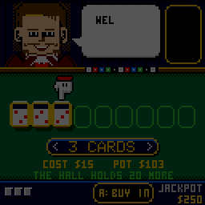
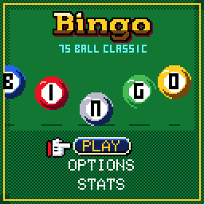
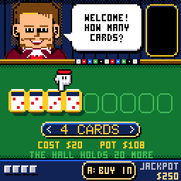
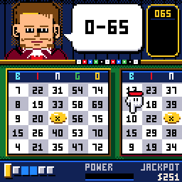
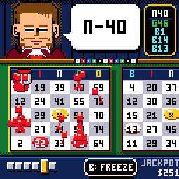
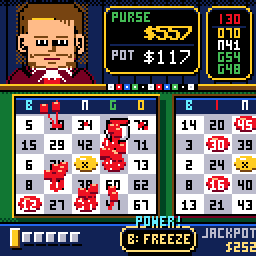
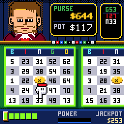

# CHBingo

> **Part of [CHGame](../../README.md)**: one of the casino games that are the platform's examples. This game lives in
> `games/CHBingo`; the simulator, size report and serial helper it uses are shared in the
> repository's root [`tools/`](../../tools), and the board package and CHGfx are in
> [`platform/`](../../platform). Notes for developers: [NOTES.md](NOTES.md).

Bingo for the [CHGame](../../README.md) handheld
(CH32X035 RISC-V, 128x128 colour LCD, piezo), in the casino style of
[CHBlackjack](../CHBlackjack) and its siblings. The
dealer from Blackjack's tables calls the balls; you buy up to nine cards and
race a hall of rivals to the first line. Every card has to be daubed on its
own, and the screen only ever shows one and a half of them, so the game is
swiping: a card with a called number waiting wears a rainbow frame, and you
have to get to it and press A before somebody across the hall shouts first.
Get there and the word comes up in Blackjack's dancing rainbow letters.
Now and then it comes up as "IT'S A BINGO!", and the dealer has something
to say about that.

<i>A whole round, played with the buttons: six cards, swiping to the rainbow
frames, daubing, a FREEZE and a WILD, and the bingo on the eleventh call.</i>

| Title | The buy-in | Swiping and daubing |
|---|---|---|
|  |  |  |
| **Bingo!** | **One word too many** | **Somebody else's bingo** |
|  |  |  |

(Captured from the PC simulator in `tools/chsim`, which runs the real game
and graphics code and renders what the device shows.)

The caller is Press Play On Tape's dealer from their Arduboy Blackjack
(**vampirics**, art; **filmote**, code), as recoloured for CHBlackjack, as
are the broke screen's lettering and the 3x5 font. Apache-2.0, like this
game; see `LICENSE` and `NOTICE`.

## Installing

You need the Arduino IDE (2.x) or `arduino-cli`, and:

1. **The CHGame board package, 0.2.4 or later**: see [Installing](../../README.md#installing)
   in the repository's README.
2. **The CHGfx library, 1.3.0**, in this repository at
   [`platform/libraries/CHGfx`](../../platform/libraries/CHGfx), and **the CHGame
   library** at [`platform/libraries/CHGame`](../../platform/libraries/CHGame).
   Copy both into your sketchbook's `libraries/` folder.
3. **This game's folder**, `games/CHBingo` of this repository (keep the name `CHBingo`).

Pick *Tools > Optimize > Smallest + LTO* and *Tools > USB > Upload only*
(the game has no use for USB Serial; uploading works as before). Built that
way it is 36.7 KB of the 50.9 KB application region, which leaves the last
two flash pages for saved games. From the command line:

    arduino-cli compile -b CHGame:ch32v:CHGame:opt=oslto,rtlib=nano,periph=game,usb=uploadonly CHBingo
    arduino-cli upload  -b CHGame:ch32v:CHGame -p COMx CHBingo

(`python tools/device.py build` does the same.)

## Playing

| Button | The buy-in | A round | Elsewhere |
|---|---|---|---|
| LEFT / RIGHT | fewer / more cards | swipe to the previous / next card (hold to run) | change an option |
| UP / DOWN | more / fewer cards | | menus |
| A | buy in | daub every called number waiting on the card in play | select |
| B | | use the power-up | back |
| START | pause | pause: resume, the called board, options, save & quit | |

### Rules

75-ball bingo: 5x5 cards, B 1-15, I 16-30, N 31-45, G 46-60, O 61-75, the
centre free. The first complete row, column or diagonal wins.

* **Cards.** You buy one to nine cards a round, $5, $10 or $25 each. You
  start with $500 and play until you are broke.
* **Daubing.** A called number only counts once it is daubed, and each card
  is daubed on its own: swipe to it and press A. A card with a number
  waiting has a rainbow frame, and so has its pip in the bar at the foot of
  the screen, which is how you know which way to swipe. Numbers you missed
  stay daubable. CHChess's glove points at the next number waiting on the
  card in play, or across at the next card when the waiting numbers are
  elsewhere. Pressing A on a card with nothing waiting buzzes and ends
  your streak. Completing a line with a daub is the call: BINGO!
* **The hall.** 8, 20 or 40 rival cards play the same draw. When one of
  them completes a line you still have until the next call to daub a line
  of your own; after that the round is theirs.
* **The pot** is 90% of what the whole hall paid for its cards, so more
  cards cost more, win more often, and are harder to keep up with.
* **Power-ups.** Daubs fill the POWER meter, and a daub within a second of
  its call fills it faster (and builds a streak). When it is full you are
  handed one of three, used with B: WILD daubs the open cell nearest to
  finishing a line on the card in play, FREEZE holds the caller for two
  calls' time, and 2X POT doubles the pot if that card wins.
* **The jackpot** grows by 5% of every buy-in and pays, on top of the pot,
  for a bingo within the first ten calls: about one round in 135 with nine
  cards played perfectly, one in 1,250 with one card.

### Options and stats

Stakes, the hall's size, how fast the balls come (a call every 2 seconds;
1.3 on FAST, 3 on SLOW), sound, the caller's look and your dauber's
colour (red, blue, green, cyan or peach: the daubs, their splat and the
glove's cuff all wear it). Options, lifetime
statistics, the jackpot and a game in progress, the round being played
included, are saved to flash and survive re-uploading: SAVE & QUIT, then
CONTINUE. Hold SELECT on the stats screen to reset them.

## How it fits

* **The hall costs nothing to keep.** At the start of a round the draw is
  shuffled and each rival card is dealt, reduced to the call on which it
  completes a line, and thrown away; only the earliest of those calls is
  kept. A saved round is its seed and the daubs: the draw, the cards and
  the hall are dealt again from the seed.
* **The rainbow is free.** The frame of a card with a number waiting, its
  pip and the winning line are drawn in one palette entry that cycles
  through the rainbow, so nothing is redrawn to animate them.
* **Redraws:** the wall, the plaque, the felt and the bar each redraw only
  when what they show changes or something moving touches them; every
  frame is still sent to the panel. `tools/chsim/diffdrive.py` checks every
  frame against a full redraw.
* **Size:** 36.7 KB of flash and 15.2 KB of static RAM. Estimated from the
  simulator, a slide across the cards renders in about 7 ms a frame, a
  daub with its splat in about 8 ms and the title in about 5 ms; none of
  it has been measured on the board yet.
* **Saving without EEPROM:** the two flash pages below the bootloader's
  metadata survive re-uploads; records alternate between them with a
  sequence number and a CRC.

## Development

The tools need Python 3 with `pip install -r ../../tools/requirements.txt`, and a
C++ compiler for the simulator and tests (zig, clang++ or g++ on the PATH,
`pip install ziglang`, or `CHSIM_CXX="path/to/zig c++"`).

* `python tools/tests/run_tests.py` - the rules: the lines, the cards, the
  race against the hall over thousands of rounds (a player who daubs
  everything wins exactly when one of their cards is first or level), the
  money, the power-ups, the buttons, saving a round, the jackpot's odds,
  and the round set-up against an independent Python model.
* `python tools/tests/sim_save.py` - in the simulator: save in the middle
  of a round, power off and on, continue; options; going broke.
* `python tools/chsim/chdrive.py --sim . tools/scripts/smoke.txt out/smoke`
  - every screen and a round, as screenshots. `gameplay.txt` plays with
  the buttons only, `perf.txt` estimates render times, `showcase.txt`
  records the GIFs above into `docs/`.
* `python tools/chsim/autoplay.py docs/gameplay.gif` - plays a round with
  the buttons, as a person would (reaction times, swiping toward the
  rainbow frames, power-ups in the quiet moments), finds a seed the player
  wins, and records it: the GIF at the top of this page.
* `python tools/chsim/diffdrive.py tools/scripts/diff/diff_soak.txt out/diff`
  - the incremental redraw against a full redraw, frame by frame.
* `python tools/device.py build [--debug]`, `upload`, `run SCRIPT OUTDIR`,
  `shot OUT.png` - the board. Debug builds carry the serial protocol the
  scripts drive (`src/debug/Debug.h`, and the game's own commands at the
  top of `CHBingo.ino`).
* `python tools/assets.py` - art in `tools/art/` to `src/assets/Assets.*`.
* `python ../../tools/audio/preview.py . out/audio` - the sound effects as WAVs.
* `python ../../tools/check_size.py build/release` - flash and RAM from the map.

## Files

    CHBingo.ino          the frame loop and the debug commands
    config.h             build switches
    src/game/Bingo.*     the rules: no graphics, no sound, host-tested
    src/fx/Presenter.*   events to motion: the caller, the carousel, the wins
    src/fx/Fx.*          particles, banners, floating text
    src/render/          the wall (Table), the cards, the buy-in and the bar (Cards)
    src/states/          title, play, pause, options, stats, broke
    src/audio/           the sound effects (the CHGame library's sequencer plays them)
    src/save/            the two flash pages
    src/debug/           the serial protocol
    tools/               simulator, tests, scripts and art tools

## License

Apache License 2.0. See `LICENSE` and `NOTICE`.
