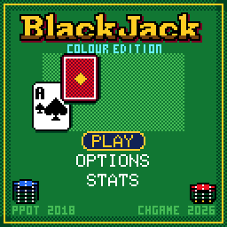
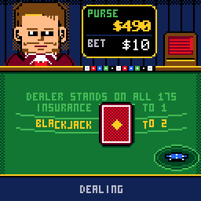
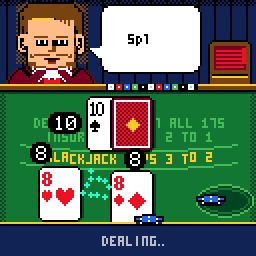
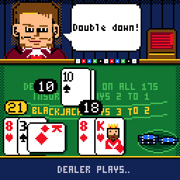
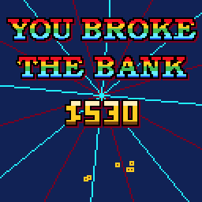
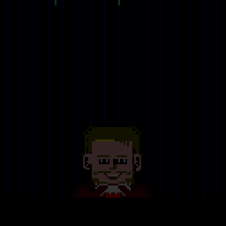
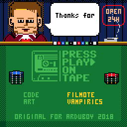

# CHBlackjack

> **Part of [CHGame](../../README.md)**: one of the casino games that are the platform's examples. This game lives in
> `games/CHBlackjack`; the simulator, size report and serial helper it uses are shared in the
> repository's root [`tools/`](../../tools), and the board package and CHGfx are in
> [`platform/`](../../platform). Notes for developers: [NOTES.md](NOTES.md).

Press Play On Tape's Arduboy **Blackjack**, rebuilt in colour for the
[CHGame](../../README.md) handheld (CH32X035 RISC-V,
128x128 colour LCD, piezo). Same game flow and screens as the original, then
as much as the hardware would take: cards that fly out of the shoe and flip,
chips that fly to and from the betting circle, a dealer who talks and blinks,
banners, confetti, screen shake, music and sound, saved games, and a
credits page in the casino's back room.

| Title | Blackjack! | Split and double |
|---|---|---|
|  |  |  |
| **Payout** | **You broke the bank** | **You are broke** |
|  |  |  |

(Captured from the PC simulator in `tools/chsim`, which runs the real game
and graphics code and renders pixel-for-pixel what the device shows.)

Original game by [Press Play On Tape](https://github.com/Press-Play-On-Tape/Blackjack):
**filmote** (Simon Holmes, code) and **vampirics** (Stephane C, art).
Apache-2.0, like this port; see `LICENSE` and `NOTICE`.

## Installing

You need the Arduino IDE (2.x) or `arduino-cli`, and:

1. **The CHGame board package, 0.2.4 or later**: see [Installing](../../README.md#installing)
   in the repository's README.

2. **The CHGfx library, 1.3.0**, in this repository at
   [`platform/libraries/CHGfx`](../../platform/libraries/CHGfx), and **the CHGame
   library** at [`platform/libraries/CHGame`](../../platform/libraries/CHGame).
   Copy both into your sketchbook's `libraries/` folder.

3. **This game's folder**, `games/CHBlackjack` of this repository (the name must
   match `CHBlackjack.ino`; cloning the repository does that for you).

Select the board **CHGame**, set *Tools > Optimize* to *Smallest + LTO
(-Os -flto)* and *Tools > USB* to *Upload only*, and keep *Peripherals:
Game*. The game never uses Serial, and Upload still works without touching
the board. Built that way the game uses about 45.6 KB of the 50.9 KB
application space. Saved games live in the last two 256-byte flash pages
of that space, so the game has to end before them. With both menus left at
their defaults (no LTO, USB Serial) it does, but by only 60 bytes; *Upload
only* alone leaves about 0.7 KB to spare and *Smallest + LTO* alone about
3.9 KB. A build that grows into the pages saves to the one page left, so a
power cut during a save can lose it, and one that leaves neither saves
nothing (Stats says SAVING UNAVAILABLE).
Then press Upload. From the command line:

    arduino-cli compile -b CHGame:ch32v:CHGame:opt=oslto,rtlib=nano,periph=game,usb=uploadonly CHBlackjack
    arduino-cli upload  -b CHGame:ch32v:CHGame -p COMx CHBlackjack

No other libraries are needed; sound is built in.

## Playing

| Button | Betting | Your turn | Elsewhere |
|---|---|---|---|
| LEFT / RIGHT | choose a chip, DEAL or CLR | choose HIT / STAND / DOUBLE / SPLIT | menus |
| A | add the chip (hold to repeat), deal, clear | do it | select |
| B | take that chip back | dismiss the dealer's speech | back |
| UP / DOWN | add / remove the chip | UP hits, DOWN stands | menus; insurance amount |
| START | pause (resume, options, save & quit) | pause | |
| SELECT | mute | mute | |

Start with $500 and reach the goal ($1000 by default, as in PPOT) before you
go broke. Your last bet is placed again for you each hand; CLR or B takes it
back. CONTINUE on the title screen picks up a saved game. Leave the title
screen alone and, once its tune has played through, a demo game plays
itself at a pace you can follow.

### Rules

**Casino** (default): six-deck shoe with a cut card and a visible shuffle,
dealer stands on all 17s and peeks for blackjack under an ace or a ten,
blackjack pays 3:2 and beats a three-card 21.
**Classic** (Options): PPOT's rules - one deck reshuffled every hand, the
dealer draws while his hard total is 16 or less (so he hits soft 17-20),
peeks only under an ace, and a blackjack pushes against 21.

Both: bets $1/$5/$10/$25 up to $200; split one pair of equal rank (split aces
get one card each); double on any two cards including after a split; the
insurance offer under an ace pays 2:1. PPOT's money bugs are fixed in both
(see `NOTICE`).

### Options, stats and credits

Rules, goal ($1000 / $5000 / endless), speed, sound (lead: the tune as
single notes / arpeggio: melody and accompaniment taking turns / off),
felt colour (green, blue, red, purple - it's a palette swap), two- or
four-colour deck, hand totals on or off, and a second dealer look.
Options, lifetime statistics and your purse are saved to flash and survive
re-uploading the game.

On the Stats screen, hold SELECT for a second and a half to reset the
statistics, or press A for the credits:

## How it fits (and what it taught)

* **Flash is the wall.** The CH32X035 gives a sketch 50,944 bytes and the
  game uses about 45.6 KB of it with link-time optimisation. Without LTO it
  is about 50 KB: roughly core + USB 5.1 KB, CHGfx 8.7 KB, rules and saving
  5.8 KB, presentation (table, cards, button bar, effects, palette and the
  game's own drawing) 17.1 KB, screens 7.4 KB, art 3 KB, sound and music
  2.9 KB.
  Getting there meant building everything at -Os, dropping `snprintf`
  (3.5 KB with 64-bit division), replacing `pinMode` with register writes
  (2 KB of pin tables), writing a 1.8 KB sound sequencer (now the CHGame
  library's `chgame/Audio`) instead of the 6.5 KB CHGameSound library, and storing dealer expressions as pixel edits.
  `python ../../tools/check_size.py build/release` prints the budget.
* **Code runs from flash with 3 wait states**, so a function call per pixel
  costs 2-3 us. Hot loops (glyphs, spans, remapped sprites) run from SRAM,
  and the play screen redraws only the bands (wall, felt, button bar) whose
  content changed or that something moving touched. Every frame is still
  flushed, so palette effects (the rainbow BLACKJACK!, pulsing highlights,
  fades) cost nothing. Gameplay holds 60 fps; the heaviest moments (a bust
  with screen shake and a banner) took up to 25 ms to draw on CHGfx 1.2
  and take 11 ms now, measured on the board.
* **Logic runs at a fixed 60 Hz**; if drawing falls behind, the loop
  catches up with extra logic ticks, so the game never slows down.
* **Big outlined lettering is expensive** (a 1 bpp mask of the words is
  built, grown by a pixel for the outline, then painted as up to three
  layers), so screens that animate draw it once. The credits page draws
  its felt once and redraws only the wall band - the dealer telling the
  credits, a neon sign on the blink, a cigarette's smoke - in 3.3 ms a
  frame measured on CHGfx 1.2 (about 2 ms now, by an instruction-count
  estimate).
* **Saving without EEPROM:** the CHGame bootloader erases only the pages a
  new sketch occupies, so the two pages below its metadata page (0xF500,
  0xF600) survive re-uploads. Records carry a sequence number and CRC, and
  alternate between the two pages so a power cut mid-save loses nothing.
* **Music on one pin:** a piezo plays one note at a time, so the scores have
  two renderings - Lead (the melody; other voices only fill its rests) and
  Arpeggio (voices take 6 ms turns). Notes change pitch at the end of a
  wave cycle rather than restarting the timer, which would click.

## Development

The tools need Python 3 with `pip install -r ../../tools/requirements.txt`, and a
C++ compiler for the simulator, tests and audio previews: zig, clang++ or
g++ on the PATH, `pip install ziglang`, or `CHSIM_CXX="path/to/zig c++"`.
The simulator (the repository's shared `tools/chsim`) builds with its copy of
CHGfx in `platform/libraries/CHGfx` (`CHSIM_CHGFX` can point at another `src/`
folder instead).

* `python tools/tests/run_tests.py` - host unit tests of the rules: hand
  values, dealer policies, every payout including split, double and
  insurance, PPOT's bug regressions, and a 16,000-hand random-play fuzz
  that checks money is conserved and the flow never stalls.
* `python tools/chsim/chdrive.py --sim . tools/scripts/sc_split.txt out/` -
  runs the game on the PC from a script and writes screenshots, GIFs and a
  contact sheet. It flags drawing into the framebuffer while a flush is
  still converting it. `tools/scripts/showcase.txt` makes the GIFs above.
* `python tools/device.py upload [--debug]` - build and upload, with the
  settings above. `--debug` keeps USB Serial and adds a serial protocol
  (`src/debug/Debug.h`) for screenshots, injected input and frame-by-frame
  lockstep; debug builds leave out the music and the credits page, which
  the tests never need.
* `python tools/device.py run tools/scripts/sc_split.txt out/` - the same
  script on the attached board, in lockstep; device and simulator
  screenshots match pixel for pixel. `pace.txt` checks real-time frame
  pacing (~300 frames per 5 s, no late frames).
* `python tools/assets.py` - rebuilds `src/assets/` from Press Play On
  Tape's art (cloned into `tools/.cache/`, pinned to a commit) and the
  hand-drawn pieces in `tools/art/` (text sheets, and `dealer.png`, which
  must use palette colours only).
* `python tools/make_music.py` - the scores; `python ../../tools/audio/preview.py
  . out/audio` renders every tune and effect to WAV from the real sequencer code.

## Files

    CHBlackjack.ino         loop: logic ticks, then draw, then DMA flush
    config.h                build switches
    src/game/Round.*        the rules and PPOT's ViewState flow (no graphics)
    src/fx/Presenter.*      events -> motion; band-level redraw
    src/fx/Fx.*             particles, banners, floating text
    src/render/*            table, cards and chips, action bar, layout
    src/states/Screens.*    splash, title, play, options, stats, credits, win, lose
    src/audio/*             sound effects and music scores
    src/save/*              flash save pages
    src/debug/*             serial debug protocol (debug builds only)
    src/assets/*            generated art (tools/assets.py)
    tools/                  simulator, tests, asset pipeline, music, device tools

## License

Apache License 2.0, the same as the original; see `LICENSE`. `NOTICE` lists
the original authors and what this port changed.
