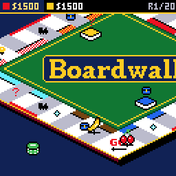
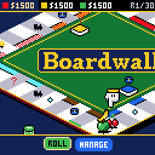
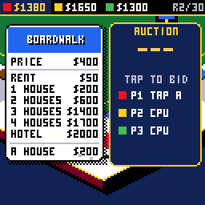
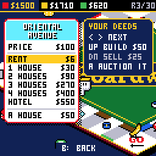
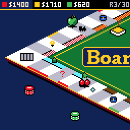
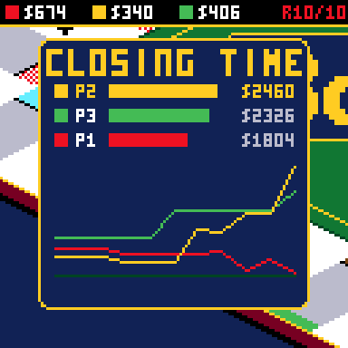
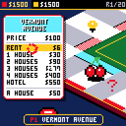
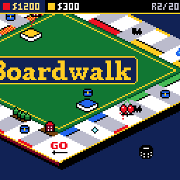
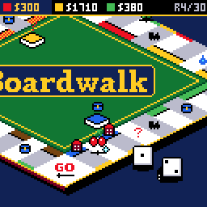

# BOARDWALK

> **Part of [CHGame](../../README.md)**: one of the casino games that are the platform's examples. This game lives in
> `games/CHBoardwalk`; the simulator, size report and serial helper it uses are shared in the
> repository's root [`tools/`](../../tools), and the board package and CHGfx are in
> [`platform/`](../../platform). Notes for developers: [NOTES.md](NOTES.md).

A property game for the [CHGame](../../README.md)
handheld (CH32X035 RISC-V, 128x128 colour LCD, piezo), in the casino style
of [CHBlackjack](../CHBlackjack) and
[CHChess](../CHChess): the classic Atlantic City
streets round an isometric board, dice that tumble in and knock the table, a
token that hops tile to tile with the camera after it and whips in close
where it lands, deeds and cards that flip up like Blackjack's, coins arcing
between the players' counters, and auctions against the clock where you tap
to outbid the table. It is the classic game played arcade style: made for
one player against the CPU, or two on one handheld, and over in minutes.

*Two turns each against the CPU: a buy that makes most of a set, the CPU
paying rent on a railroad, BUILD up the set, a tap-to-outbid auction won at
$190 (another set), the CPU landing on the houses, and the map.*

| A turn | The auction | Building |
|---|---|---|
|  |  |  |
| **Go to jail** | **Title** | **The story of the game** |
|  |  |  |
| **A set made** | **Payday** | **Bankrupt** |
|  |  |  |

(Captured from the PC simulator in `tools/chsim`, which runs the real game
and graphics code and renders what the device shows.)

**Status:** complete and played through in the simulator (rules tested over
thousands of games). Frame timing and the sound on the handheld itself are
still to be checked.

## Installing

You need the Arduino IDE (2.x) or `arduino-cli`, and:

1. **The CHGame board package, 0.2.4 or later**: see [Installing](../../README.md#installing)
   in the repository's README.
2. **The CHGfx library, 1.3.0**, in this repository at
   [`platform/libraries/CHGfx`](../../platform/libraries/CHGfx). Copy it into your
   sketchbook's `libraries/` folder.
3. **This game's folder**, `games/CHBoardwalk` of this repository (keep the name `CHBoardwalk`).

Pick *Tools > Optimize > Smallest + LTO* and *Tools > USB > Upload only*
(the game is 49.9 KB of the 50,944-byte application region that way). From
the command line:

    arduino-cli compile -b CHGame:ch32v:CHGame:opt=oslto,rtlib=nano,periph=game,usb=uploadonly CHBoardwalk
    arduino-cli upload  -b CHGame:ch32v:CHGame -p COMx CHBoardwalk

(`python tools/device.py build` does the same.)

## Playing

1 PLAYER is you against a CPU; 2 PLAYERS is the two of you, passing the
handheld. Either way THE TABLE comes up set and A deals; it can seat up to
four, each a person or a CPU (EASY, FAIR or SHARK), and sets closing time.
A CPU's turn goes by quickly: the show is for your own.

| Button | |
|---|---|
| LEFT / RIGHT, A | choose a button on the bar at the foot of the screen: ROLL, MANAGE (BUILD when there is a house to be had), BUY, AUCTION, and in jail PAY $50 or CARD |
| SELECT | the map: the whole board from above, who owns what, everyone's cash and net worth |
| START | pause: resume, options, save + quit; it shows the round and closing time |
| A | answers a card or a PRESS A |

**The rules** are the ones you know, in the short game's shape:

* Everyone starts with $1500 and a few deeds, dealt free: four each with
  two players, two each with more.
* Roll, move, collect $200 passing GO - and **payday**, $400, landing on it
  with the dice. Doubles roll again; three running go to jail. In jail, pay $50, play a card, or roll for doubles (the third
  miss pays and moves).
* Land on an unowned deed and BUY it at its price, or send it to AUCTION.
  Land on someone's and pay the rent on its card; a full colour set doubles
  the bare rent, railroads pay by how many, utilities by the dice.
* Hold **most of a colour group** - two of its three streets, or both of a
  pair - and BUILD houses on what you hold, evenly, and a hotel after
  four. The table hears about it: CAN BUILD! when a deed gives you most of
  a group, FULL SET! when it gives you all of it. (With no trading and
  only two at the table, full sets would be rare; this way the houses
  come.)
* **There is no trading. There are auctions.** A deed the lander turns down
  starts at nothing: the first tap leads at $0 and each tap after raises
  it a step. Every bid restarts the clock - GOING ONCE, GOING TWICE - and
  when it runs out the lot is SOLD to whoever leads (unbid, it goes free to
  the next seat). Several people on one handheld each get a button: the
  first taps **A**, the second the **D-pad**, then **B**, then **SELECT**.
* From MANAGE you can put a deed of your own up for auction (A, then
  confirm). The bank opens at half its price, so that is the least you
  get; the others can tap past it. It is the only way a deed changes hands,
  and the way to raise cash.
* A debt you cannot pay is settled for you: houses go back at half price,
  then your deeds go to auction, strays first. If that is still not
  enough, you are bankrupt.
* **The jackpot:** taxes, fines and bail pile up on Free Parking - the pot
  floats over its corner - and go to whoever lands there.
* The game ends at the **first bankruptcy**, or at **closing time** (10 to
  60 rounds, set at the table; 20 to begin with). The richest player left -
  cash, deeds at their price, buildings at cost - wins, and the result
  draws everyone's worth round by round: the story of the game.

MANAGE: LEFT / RIGHT walk your deeds, UP builds a house, DOWN sells one back
at half price, A auctions the deed, B goes back. BUILD opens it on a street
you can build on, and each UP moves along the set, so UP, UP, UP builds it
up evenly. Under the card, THEY PAY is what the others pay to land there as
it stands - it grows as you build. Landing on any owned deed, the plate at
the foot of the screen names its owner and what it charges. With four at
the table the top bar has no room for the round, so it floats up as each
round begins.

Options: sound, and the pace (FUN, or QUICK: faster turns, no zooming in on
landings). Options, the house's records and a game in progress (SAVE + QUIT,
then CONTINUE, which picks the game up as that turn began) are saved to
flash and survive re-uploading.

## How it fits

* **The rules** (`src/game`) are plain logic with no graphics: a phase
  machine that reports events - dice, moves, payments, bids - and waits
  while the stage is busy showing them. Only the auction runs on the clock.
  The host tests play thousands of games through it.
* **The board** is an isometric 13 x 13 lattice drawn as 2:1 diamonds
  sampled at pixel centres, so every edge is a clean staircase at every
  zoom step. The ring is two cells deep: a tile is one cell along its side
  and two into the board, with its colour band on the inside edge and its
  owner's colour along the rim. Pink and orange are dithered from the
  sixteen colours the three games share. The name lies across the felt on
  the board's long diagonal - level on screen - between the two decks, in
  the title's own lettering, and stacks of chips stand about on the carpet.
* **Sprites** are span-encoded and drawn through a palette remap and a
  scale: the same art at the resting size and doubled when the camera
  whips in; CHChess's pointing glove, gold-cuffed for you and red for a
  CPU.
* **Text** is built, not stored: tile names share their endings, and each
  card's wording comes from its effect.

## Development

The tools need Python 3 with `pip install -r ../../tools/requirements.txt`, and a
C++ compiler (zig, clang++ or g++ on the PATH, `pip install ziglang`, or
`CHSIM_CXX="path/to/zig c++"`).

* `python tools/tests/run_tests.py` - every rule on its own, then 5,000
  seeded games (CPUs, and "humans" pressing at random) checking that the
  books balance, houses stay even and every game ends; and a table of how
  games go by seats and closing time, which the CPUs are tuned on.
* `python tools/chsim/chdrive.py --sim . tools/scripts/showcase.txt docs/` -
  runs the game from a script and writes the GIFs above. Scripts tap
  buttons, `waitturn` until the game wants you, `rec` a GIF, and `say`
  debug commands: `G` a new game, `D` the next dice, `A` the next card,
  `$`, `E` and `T` to set cash, deeds and tokens (the list is in
  `src/states/Screens.cpp`). `cal` and `perf` estimate the device's render
  time. `pop.txt` plays the big moments (a set made, BUILD, a hotel, payday,
  the jackpot, a hotel's rent), `info.txt` the round, THEY PAY and the
  landing plate, `story.txt` an all-CPU game to its result graph, and
  `gameplay.txt` the clip at the top.
* `python tools/device.py upload [--debug]` - build and upload (`--debug`
  adds the serial protocol for screenshots, injected input and lockstep;
  to fit, it leaves out the options screen and saving).
* **Editing the art:** `python tools/sheet.py export` writes
  `tools/art/sheet.png`, an indexed PNG on the game's palette with every
  sprite in a labelled cell. Edit it (Photoshop keeps it indexed), then
  `python tools/sheet.py import` writes what changed to `tools/art/` and
  rebuilds the assets. Details at the top of `tools/sheet.py`.
  `python tools/lookdev.py` renders a contact sheet of the board at each
  zoom and in each tile treatment.
* `python tools/assets.py` packs the art, `python ../../tools/audio/preview.py
  . out/audio` renders the sound effects to WAV.

## License

Apache License 2.0 (`LICENSE`). See `NOTICE`.

This is an independent game. It is not affiliated with or endorsed by the
makers of any commercial board game.
