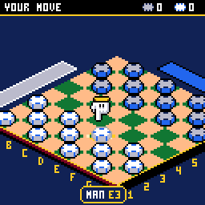
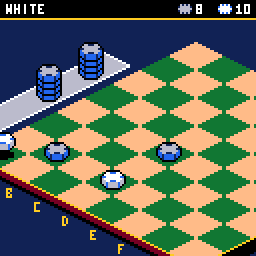
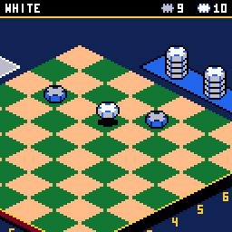
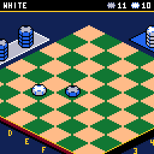
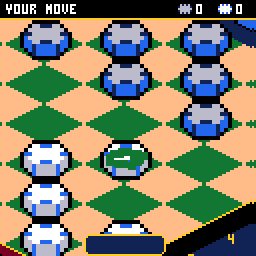
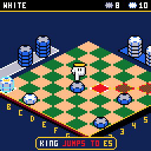

# CHCheckers

> **Part of [CHGame](../../README.md)**: one of the casino games that are the platform's examples. This game lives in
> `games/CHCheckers`; the simulator, size report and serial helper it uses are shared in the
> repository's root [`tools/`](../../tools), and the board package and CHGfx are in
> [`platform/`](../../platform). Notes for developers: [NOTES.md](NOTES.md).

Checkers for the [CHGame](../../README.md) handheld
(CH32X035 RISC-V, 128x128 colour LCD, piezo): the second game on
[CHChess](../CHChess)'s isometric board. The same
table, camera, pointing glove and called-out moves, with casino chips for
pieces in the chess set's colours, and what the chess engine's flash used to
hold spent on the show: multiple jumps that escalate (DOUBLE! TRIPLE!
RAMPAGE!, each hop a tone higher, the last one in slow motion), captured
chips knocked spinning onto trays beside the board where the score piles up,
a crown that slams down on a new king (KING ME!), a winning blow that stops
the clock, a title where the chips rain onto the board and the board plays
itself, and a tune.

The first moves of a game against the TOURIST, from the title screen
(`tools/scripts/gameplay.txt`):

| Triple jump | Crowning | The winning blow |
|---|---|---|
|  |  |  |
| **Title** | **The CPU's turn** | **A flying king (house rules)** |
|  |  |  |

(Captured from the PC simulator in `tools/chsim`, which runs the real game
and graphics code and renders what the device shows.)

**Status: checked in the simulator only.** It has not been run on the board
yet, so frame times, how long the CPU thinks and how it all sounds are
still to be measured there (see *Development*).

The rules and the CPU are this game's own (`src/engine`). The 3x5 lettering
is Press Play On Tape's font, as in CHBlackjack. See `NOTICE`.

## Installing

You need the Arduino IDE (2.x) or `arduino-cli`, and:

1. **The CHGame board package, 0.2.4 or later**: see [Installing](../../README.md#installing)
   in the repository's README.
2. **The CHGfx library, 1.3.0**, in this repository at
   [`platform/libraries/CHGfx`](../../platform/libraries/CHGfx). Copy it into your
   sketchbook's `libraries/` folder.
3. **This game's folder**, `games/CHCheckers` of this repository (keep the name `CHCheckers`).

Build with *Tools > Optimize > Smallest + LTO* and *Tools > USB > Upload
only* (the game has no use for USB Serial, and uploading works as before).
From the command line:

    arduino-cli compile -b CHGame:ch32v:CHGame:opt=oslto,rtlib=nano,periph=game,usb=uploadonly CHCheckers
    arduino-cli upload  -b CHGame:ch32v:CHGame -p COMx CHCheckers

(`python tools/device.py build` does the same and reports the size: about
42 KB of the 50.9 KB application region.)

## Playing

White moves first, up the board. Men step one square diagonally forwards
and jump an enemy piece next to them onto the empty square beyond; a man
that reaches the far row becomes a king, which moves and jumps backwards
too. A piece that can jump again after a jump must carry on. You win by
taking every enemy piece or leaving them none that can move. Forty moves
each without a jump or a man moving, or the same position three times, is a
draw.

| Button | On the board | Elsewhere |
|---|---|---|
| D-pad | move the glove between your pieces, or, holding one, between the squares it can go to | menus |
| A | pick up the piece / put it down there | select |
| B | put the piece back | back |
| B held (+ D-pad) | inspect: the camera zooms right in; the D-pad pushes the view to the board's edges and corners until you let go (holding a piece, a bar under the top line fills first: let go before it is full and the piece goes back) | |
| SELECT | change view: the board, or the map (from above) | |
| START | pause: resume, undo, resign, save + quit | |

The glove only stops on your own pieces (the one under it fades its outline
black to white, the one you pick up gets a rainbow outline), or, holding
one, on the squares it can go to (cyan for a slide, red for a jump; the
piece a jump would take flashes). Each press takes it to the nearest spot
in that direction as the screen shows it; with nothing that way it wraps
round to the farthest spot the other way. A plate at the foot of the screen
names what it is on ("MAN C3", "MAN JUMPS TO E5"), then calls out each move
as it lands ("KING TAKES MAN ON E5", "MAN TAKES 3 ON G7 = KING").

When you have to jump, the pieces that can are ringed and the glove starts
on one; the others say MUST JUMP (or NO MOVES when they are simply stuck)
and buzz if you press A. In the middle of a multiple jump the piece stays in
your hand: with one way on it goes by itself, with a choice you pick the
square, and B will not put it down (KEEP JUMPING). Undo, from the pause
menu, takes a half-made jump back.

The top line shows whose turn it is and, on the right, the tally: the
chips you have taken, then the chips you have lost - the same chips that
pile up on the two trays beyond the far edges of the board (and along the
top of the map).

### Opponents

| | |
|---|---|
| TOURIST | just here for the buffet: looks a move or two ahead and often picks a second-best move |
| DEALER | knows every trick |
| THE HOUSE | its best move, every time |

Setup keeps your record against each. A rematch swaps sides.

### Rules

RULES on the setup screen (one or two players) changes the house rules for
the next game; a saved game keeps the rules it was started with.

| | | |
|---|---|---|
| JUMPS | **FORCED** | a jump must be taken when there is one (American checkers) |
| | FREE | jumping is your choice (a jump once begun is still finished) |
| KINGS | **SHORT** | kings step one square |
| | FLYING | kings slide any distance, take a piece from afar and land on any empty square beyond it |
| MEN | **AHEAD** | men only jump forwards |
| | ANY WAY | men jump backwards too (they still only step forwards) |

In every variant a jumped piece comes off the board at once, a man crowned
by a jump stops there, and there is no rule about taking the most pieces.

### Options

SOUND, BOARD (the felt's colour), MUSIC (the title's tune) and PACE: FUN is
the full show, QUICK drops the camera's dive on every move and hurries the
CPU's hand.

## How it fits

| | Flash | RAM |
|---|---|---|
| Release build | 42.2 KB of 50.9 KB | 17.1 KB of 18.4 KB (+ 2 KB stack) |

The save takes the last two flash pages, through the CHGame library's
`chgame/Save` (shared with the other CHGame games: each ignores the others'
records, so saving in one replaces the other's save).

- `src/engine`: the rules and the CPU. The board is the 32 dark squares in
  a padded row, moves are single steps (a multiple jump is several, the
  turn staying with the piece), and the search is alpha-beta over those
  steps with iterative deepening inside a node budget, only stopping on
  positions with no jump pending. About 3 KB.
- `src/game/Match`: turns, the events the presentation shows, undo and
  saved games (a snapshot plus one byte per step since).
- `src/stage`: the play screen - camera, glove, movers, the flying chips
  and trays, combos, the crowning, the HUD. `src/iso`: the board and table.
- `src/Frame`: while the CPU thinks, frames are drawn from inside the
  search on a stack of their own, in bursts, with a soft clock ticking.
- `src/audio/Sounds`: the effects and the title's tune, played by the
  CHGame library's piezo sequencer (`chgame/Audio`).

## Development

Python 3 with `pip install -r ../../tools/requirements.txt`, and a C++ compiler
for the host tools: `zig` on the PATH, the `ziglang` pip package, clang++ or
g++, or name one in `CHSIM_CXX` (for example `CHSIM_CXX="C:\zig\zig.exe c++"`).

    python tools/check.py                # everything below except the board, in one go
    python tools/tests/run_tests.py      # host tests
    python tools/chsim/chdrive.py --sim . tools/scripts/moments.txt out/moments
    python tools/device.py build         # release build + size report
    python tools/assets.py               # art (tools/art) -> src/assets
    python tools/sheet.py export         # the art as one sheet to edit; import reads it back
    python ../../tools/audio/preview.py . out/audio   # the effects and the title's tune to WAV

- **Host tests** (`tools/tests/test_checkers.cpp`): move counts from the
  opening against the published numbers (7, 49, 302, 1469, 7361, 36768,
  179740); every rule combination against a second, naive move generator
  written in the test; hand-made positions for each rule; both kinds of
  draw; 2,000 random games through the same calls the pad makes, with undo
  and save/load on the way; the CPU (legal, inside its budget, abortable,
  repeatable from a seed, stronger at a higher level).
- **Simulator** (`tools/chsim`): the game compiled for the PC, driven by
  scripts (`tools/scripts/*.txt`) over the same debug protocol as the
  board (the CHGame library's `chgame/Debug.h`). `tools/check.py` runs
  every script twice and compares the frames.
  Scripts set positions up with `say X <32 cells> <w|b> <rules>` and can
  play with the pad themselves (`auto N`: the game picks the moves, the
  script walks the glove).
- **On the board** (`python tools/device.py run SCRIPT OUTDIR`: a debug
  build, uploaded and driven the same way). Still to do there: the render
  profile (`say Y`), the CPU's speed (`say W`: the levels' node budgets and
  the simulator's pacing in `src/Frame.cpp` are estimates until then), the
  stack high-water marks (`perf`), and a listen.

## License

Apache-2.0 (`LICENSE`); see `NOTICE` for what came from CHChess and
CHBlackjack and for Press Play On Tape's font.
