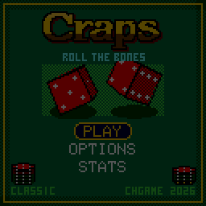
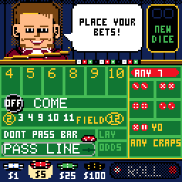
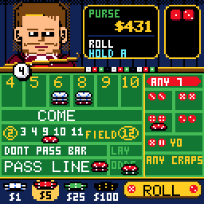
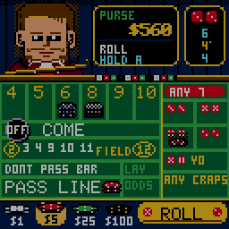
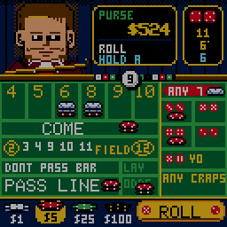
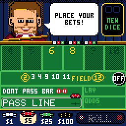
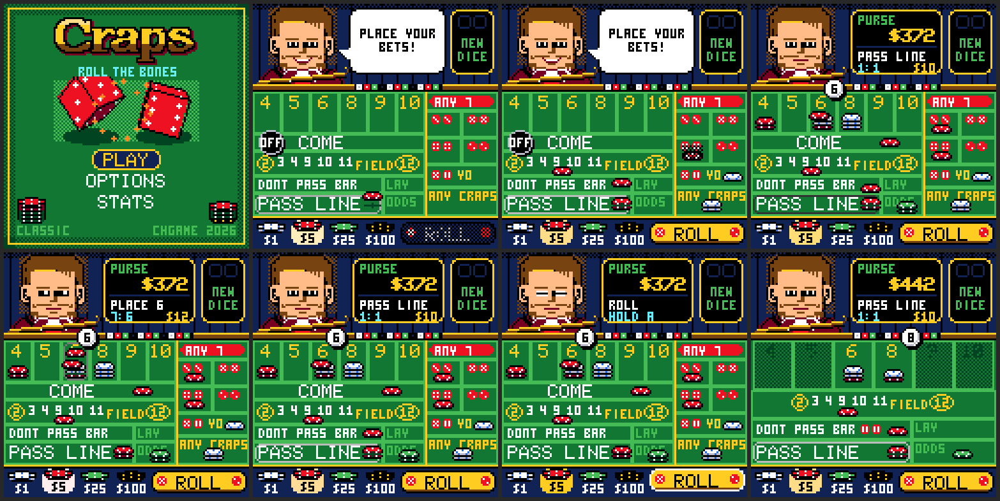

# CHCraps

> **Part of [CHGame](../../README.md)**: one of the casino games that are the platform's examples. This game lives in
> `games/CHCraps`; the simulator, size report and serial helper it uses are shared in the
> repository's root [`tools/`](../../tools), and the board package and CHGfx are in
> [`platform/`](../../platform). Notes for developers: [NOTES.md](NOTES.md).

Casino craps for the [CHGame](../../README.md)
handheld (CH32X035 RISC-V, 128x128 colour LCD, piezo), at the same table as
[CHBlackjack](../CHBlackjack) and CHChess: the same
felt and gold lettering, and Blackjack's dealer working the table as the
stickman. He calls every roll in his speech bubble ("YO-LEVEN! FRONT LINE
WINNER", "THE POINT IS SIX! MARK IT", "SEVEN OUT! LINE AWAY").

Hold A on ROLL to shake the dice and let go to throw. The view fades down
the table into the **dice cam**, where two real 3D dice fly to the back wall,
bounce off its rubber pyramids in a burst of sparks, tumble back, and settle.
The camera then cranes up over them for the result. Then it fades back to the
layout, where the dealer sweeps the losers into his rack, stacks the payouts
beside the winners, and sends your money home while the purse rolls up.

A minute at the table from the title screen, played with the buttons alone
(`tools/scripts/gameplay.txt`; only the dice are scripted, so the tour hits
the good parts):
1. $10 on the pass line and $5 on the field.
2. A yo-leven on the come-out.
3. Point six, with $50 odds behind the line.
4. The 8 placed for $12 (two $1 chips picked from the rack) and a dollar on
   the hard 8.
5. Hard eight pays.
6. Winner six pays the line and the odds.
7. A Come bet travels to the 8 and takes odds.
8. The seven-out sweeps the layout.

| Betting up close | A roll: a hard 4 makes the point | A hot hand: the dice burn |
|---|---|---|
|  |  |  |
| **Seven out: line away** | **The Beginner table** | **Title** |
|  |  |  |

In *Betting up close*:
- the plaque names each spot under the cursor and what it pays;
- the stickman explains a refused bet;
- chips go down with A and come back with B (hold B to take the whole bet
  down);
- the rack's chips are picked with A.

The *Beginner table* hand: the pass line and field, the point 8, the 6
placed for $12, $20 odds, a hard six, then winner eight.

(Captured from the PC simulator in `tools/chsim`, which runs the real game
and graphics code and renders what the device shows. Each GIF is made by
the script of the same name in `tools/scripts`, or by `showcase.txt`.)

## Installing

You need the Arduino IDE (2.x) or `arduino-cli`, and:

1. **The CHGame board package, 0.2.4 or later**: see [Installing](../../README.md#installing)
   in the repository's README.
2. **The CHGfx library, 1.3.0**, in this repository at
   [`platform/libraries/CHGfx`](../../platform/libraries/CHGfx). Copy it into your
   sketchbook's `libraries/` folder.
3. **This game's folder**, `games/CHCraps` of this repository (keep the name `CHCraps`).

The game needs **link-time optimisation** to fit the 50,944-byte
application region. Pick *Tools > Optimize > Smallest + LTO*. Also pick
*Tools > USB > Upload only*: the game doesn't use USB Serial, and uploading
works as before. From the command line:

    arduino-cli compile -b CHGame:ch32v:CHGame:opt=oslto,rtlib=nano,periph=game,usb=uploadonly CHCraps
    arduino-cli upload  -b CHGame:ch32v:CHGame -p COMx CHCraps

(`python tools/device.py build` does the same.)

## Playing

| Button | At the table | In the dice cam |
|---|---|---|
| D-pad | move between the spots on the layout, and down into the chip rack and ROLL (UP from the rack goes back where you were) | |
| A | put a chip on the spot (hold to keep adding); on a rack chip, pick that chip; on ROLL, **hold to shake** | let go: throw |
| B | take a chip back; **hold** to take the whole bet down (a bar fills along the gold line first) | while shaking: put the dice down; while they tumble: skip to the end |
| SELECT | next chip ($1, $5, $25, $100) | |
| START | pause: resume, options, sound, save & quit | |
| A / B during the payout | hurry the dealer up | |

You start with $500.

**The plaque on the wall** names the spot under the cursor: what it pays,
what's on it, and OFF when that bet isn't working this roll. **The board to
its right** shows the last roll as two dice and the totals before it:
winners in gold, craps in wine, a seven-out in red, and hard numbers marked.
If something can't be done, the stickman says why ("COME OPENS AFTER THE
POINT", "THAT ONE STAYS UP!", "TABLE MAX IS $500").

**The game:**
- The shooter must bet the PASS LINE or DON'T PASS before the come-out roll.
- On the come-out, 7 or 11 wins the pass line, and 2, 3 or 12 (craps) loses it.
- Any other number becomes the **point**. The black OFF puck turns over and
  slides to that number's box. There it sits as a round white badge showing
  the number, pinned to the box's top right corner like a notification on an
  app icon, so the box's own number stays clear.
- The shooter then rolls until the point comes again (the pass line wins) or a
  7 (**seven out**: the line loses, and a new shooter comes out).
- Make two points in one hand and the shooter is **hot**: the dice burn.

### The bets (TABLE: CLASSIC)

| Bet | Wins | Pays |
|---|---|---|
| Pass line | come-out 7/11, then the point before a 7 | 1:1 |
| Don't pass | come-out 2/3 (12 is a push), then a 7 before the point | 1:1 |
| Odds (behind the pass line) | the point before a 7 | true odds: 2:1 on 4/10, 3:2 on 5/9, 6:5 on 6/8 |
| Lay (behind don't pass) | a 7 before the point | 1:2, 2:3, 5:6 |
| Come | like a pass bet, starting with the next roll; it moves to its number (odds can go on it) | 1:1 |
| Field | one roll: 3, 4, 9, 10, 11 | 1:1; 2 pays double, 12 triple |
| Place 4/5/6/8/9/10 | the number before a 7 | 9:5, 7:5, 7:6 |
| Hard 4/6/8/10 | the number as a pair before a 7 or the easy way | 7:1 (4, 10), 9:1 (6, 8) |
| Any 7 / Any craps / Yo | one roll: 7 / 2, 3 or 12 / 11 | 4:1 / 7:1 / 15:1 |

Rules as in a casino:
- Place bets, hardways and come-bet odds are **off on the come-out**. They stay
  on the layout dimmed, and the plaque says OFF.
- The pass line and come bets on their numbers are contract bets: once
  they're working they can't come down.
- Don't pass can come down but not go up.
- Winners stay up; only the winnings come home.
- Payouts are rounded down to the dollar: bet place 6 and 8 in sixes, and the
  odds on 5 and 9 in twos, to be paid in full.

**TABLE: BEGINNER** keeps only the pass line, don't pass, their odds, the
field, and place 6 and 8, on a roomier layout.

### Options and stats

- **TABLE:** Classic or Beginner.
- **ODDS:** how much odds you may take behind the line. 3-4-5X means 3x the
  line bet on 4/10, 4x on 5/9 and 5x on 6/8; the lay is capped to win the
  same. The other settings are 2X and 10X.
- **GOAL:** $1000, $5000 or endless. Reach it and you've broken the bank; run
  out and you're broke.
- **SPEED:** normal or fast.
- **FELT:** green, blue, red or purple.
- **SOUND:** on or off.

STATS keeps rolls, points made, seven-outs, the longest hand, hardways hit,
the best purse, the biggest win, banks broken and times broke. Hold SELECT
there to reset them.

Saving uses flash: the options, the stats and the table as it stands (every
chip, the point). SAVE & QUIT, then CONTINUE, puts you back mid-hand.

## How it works

- **The rules settle a roll the moment the dice leave your hand**
  (`src/game/Craps.cpp`). Every bet's fate goes into a result table, and the
  presenter (`src/fx/Presenter.cpp`) then shows it at its own pace. The
  money has already moved, so saving mid-show is always consistent.
  `tools/tests/test_craps.cpp` checks every bet against every point and all
  36 rolls with an independent oracle. It works out each bet's house edge
  exactly by enumerating the dice: pass 1.414%, don't 1.364%, field 2.778%,
  place 6 1.515%, odds 0. It also checks a long fuzz for money conservation
  and a chi-square test of the dice.
- **The 3D dice are integer maths** (`src/cam/Dice3D.cpp`):
  - Each die has a Euler-angle rotation matrix from the game's sine table and
    a pinhole camera that can tilt.
  - Faces are back-face culled, filled by a scanline polygon fill, shaded in
    three levels and outlined.
  - Physics runs one step per 60 Hz tick: gravity, felt bounces that turn
    speed into a tumble, the back wall's kick, side rails, and the two dice
    pushing off each other.
- **The dice don't decide the roll.** The rules roll first. The throw is
  deterministic, so the game simulates it ahead to see which face of each die
  will land on top, then repaints that die so the face shows the rolled number:
  - The repaint is always a real die, opposites adding to 7.
  - Of the four ways to do it, the game picks the one that changes the
    fewest pips.
  - The new pips go on as the dice hit the back wall, small, spinning and
    in a shower of sparks.
- **Flash is the limit.** The release build is 50,032 B of 50,944, which
  leaves both save pages free. To fit:
  - the chips are span sprites recoloured by remap tables, and the pucks are
    span sprites too (round discs made by `tools/assets.py`);
  - every die orientation comes from one walk of quarter turns stored in a
    24-bit constant;
  - the dice share the game's sine table;
  - there is no music, only sound effects.
- **Drawing.** The table redraws only the bands (wall, felt, bar) that
  changed or that something moving touched. The dice cam redraws the whole
  scene each frame. Logic runs at a fixed 60 Hz either way, so the dice keep
  their speed if a frame is slow.

## Development

The tools need Python 3 with `pip install -r ../../tools/requirements.txt`, and
a C++ compiler for the simulator and tests (zig, clang++ or g++ on the PATH,
`pip install ziglang`, or `CHSIM_CXX="path/to/zig c++"`).

    python tools/tests/run_tests.py          # rules, dice physics, layout reachability
    python tools/tests/sim_save.py           # save mid-hand, power-cycle, continue
    python tools/chsim/chdrive.py --sim . tools/scripts/gameplay.txt docs/   # also betting, beginner, showcase
    python tools/assets.py                   # dealer, logo, chips -> src/assets/
    python tools/audio/preview.py out/audio  # every sound effect to WAV
    python tools/device.py build|upload [--debug]
    python ../../tools/check_size.py build/release

The debug build (`--debug`) speaks the serial protocol in
`src/debug/Debug.h`. The game's commands are in `src/states/Screens.cpp`:
- reseed or force the dice;
- jump to a screen;
- set bets, the purse or the point;
- move the cursor;
- dump the table state.

Scripts in `tools/scripts` drive it in the simulator or on the board. In
the simulator:
- `goto ZONE` walks the cursor to a spot with real D-pad presses, using the
  route the game plans;
- `idle` waits for the dice cam and the payout to finish.

So a script reads like a player at the table.

## Files

    CHCraps.ino, config.h   the frame loop and build switches
    src/game/Craps.*        the table: bets, payouts, the point, the dice
    src/cam/                the dice cam: 3D dice and physics, the scene
    src/render/             the wall, the layout and its spots, chips, the bar
    src/fx/                 particles and banners; the presenter
    src/states/Screens.*    title, play, options, stats, the two endings
    src/gfx, src/audio, src/save, src/debug, src/CHGame.*   shared with CHBlackjack/CHChess
    tools/                  simulator, tests, assets, sound preview, device helpers

## License and credits

Apache License 2.0 (`LICENSE`).

The dealer's art and the 3x5 lettering come from
[Press Play On Tape](https://github.com/Press-Play-On-Tape)'s Arduboy
**Blackjack** (Apache-2.0): code by Simon Holmes (filmote), art by Stephane C
(vampirics). They reach this game by way of CHBlackjack. See `NOTICE`.
