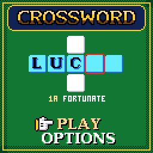
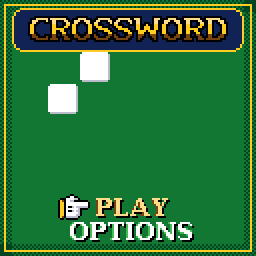
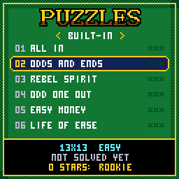
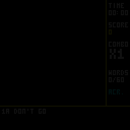
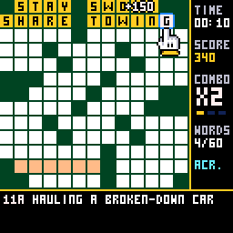
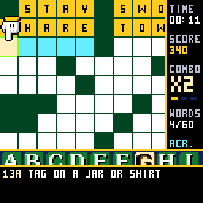
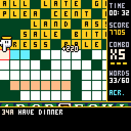
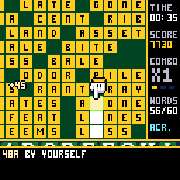

# CHCrossword

> **Part of [CHGame](../../README.md)**: one of the casino games that are the platform's examples. This game lives in
> `games/CHCrossword`; the simulator, size report and serial helper it uses are shared in the
> repository's root [`tools/`](../../tools), and the board package and CHGfx are in
> [`platform/`](../../platform). Notes for developers: [NOTES.md](NOTES.md).

A crossword for the [CHGame](../../README.md) handheld
(CH32X035 RISC-V, 128x128 colour LCD, piezo), in the casino of
[CHBlackjack](../CHBlackjack) and the tables after it:
full 13x13 puzzles with the whole grid on screen, ivory tiles on green felt,
a pointing glove and a rainbow frame on the square you are at, a camera that
whips in to a close-up - bevelled tiles, the clue numbers in their corners,
letters in an anti-aliased serif face - whenever you type or hold B, a letter
board of felt-green keys that slides up to type on, and a score attack on
top of the solving. A right word locks in gold, tile by tile,
each a note up the scale; words in a row build a combo up to x5; one letter
that finishes two words is a CROSS!; one word in every puzzle is the JACKPOT,
worth three times over; a wrong word buzzes and shakes the table;
and the last word sets the whole grid off under SOLVED!, with a time against
par and one to three stars to keep.

| Title | The puzzle list | The first words |
|---|---|---|
|  |  |  |
| **The close-up (hold B)** | **Down the grid** | **A wrong word** |
|  |  |  |
| **The last word** | | |
|  | | |

(Captured from the PC simulator in `tools/chsim`, which runs the real game
and graphics code and renders what the device shows. The game has been built
and checked in the simulator; it has not yet been run on the handheld itself,
and its SD card driver in particular has never met a real card.)

Twenty puzzles are built in - six easy, eight medium, six hard - and more
come on the **SD card**: packs of up to 32 puzzles, up to 15x15, in a folder
named `CHCW`. `sdcard/CHCW/BONUS.CWD` is one to start with, and
`tools/puzzles/puz2cwd.py` makes packs from your own Across Lite `.puz`
files. The grids were filled by this project's own grid maker and every clue
written for the game; the framework is CHBlackjack's by way of CHChess and
CHBackgammon, and the small 3x5 lettering is Press Play On Tape's font, as
there. See `NOTICE`.

## How to install

There are two parts: the **game**, which goes onto the CHGame over USB, and
the **puzzle packs**, which go on a microSD card. The card is optional: 20
puzzles are built into the game. Each pack on the card adds up to 32 more.

### Step 1: put the puzzle packs on a microSD card

1. **Download [`BONUS.CWD`](https://github.com/bateske/CHGame/raw/main/games/CHCrossword/sdcard/CHCW/BONUS.CWD)**,
   a pack of three puzzles. It is in this game's
   [`sdcard/CHCW`](sdcard/CHCW) folder.
2. **Use a microSD card formatted FAT32** (FAT16 works too). Cards of
   32 GB or less come formatted that way, so a new one is ready as it is.
   Cards of 64 GB and more come as exFAT, which the game cannot read: reformat
   such a card as FAT32 first (or use a smaller card).
3. **Make a folder named `CHCW` at the top level of the card, and copy
   `BONUS.CWD` into it.** Packs anywhere else are not found. The card should
   look like this:

       SD card
       └── CHCW
           └── BONUS.CWD

   Other packs (`.CWD` files, up to eight) go into the same `CHCW` folder.
4. **Put the card in the CHGame's slot.** The game looks at the card each
   time you choose **PLAY**. On the puzzle list, **LEFT** and **RIGHT** move
   between the built-in puzzles and the card's packs. If something is wrong,
   the list says so: **CARD: FORMAT IT AS FAT32** (an exFAT card),
   **CARD: NO PACKS IN CHCW**, or **CARD: CANNOT READ IT**.

### Step 2: put the game on the CHGame

1. Install the **Arduino IDE 2.x** from <https://www.arduino.cc/en/software>.
2. Add the **CHGame board package** (0.2.4 or later). The Boards Manager URL
   to paste into *File > Preferences* is under [Installing](../../README.md#installing)
   in the repository's README. Then open *Tools > Board > Boards Manager*,
   search for **CHGame** and click *Install*.
3. **Download this repository.** On <https://github.com/bateske/CHGame> click
   *Code > Download ZIP* and unzip it. The game is the folder `games/CHCrossword`,
   already named like its `.ino` file (the Arduino IDE only opens a sketch
   whose folder has the same name).
4. Add the **CHGfx library** (1.3.0). Copy the folder `platform/libraries/CHGfx`
   from the download into the `libraries/` folder of your sketchbook (its
   location is shown in *File > Preferences*).
5. Open `games/CHCrossword/CHCrossword.ino` in the IDE and set:
   - *Tools > Board*: **CHGame**
   - *Tools > Optimize*: **Smallest + LTO**. The game does not fit without it.
   - *Tools > USB*: **Upload only**
   - *Tools > Port*: the CHGame's port
6. Plug the CHGame in by USB and click **Upload** (the arrow button).

The same from the command line:

    arduino-cli compile -b CHGame:ch32v:CHGame:opt=oslto,rtlib=nano,periph=game,usb=uploadonly CHCrossword
    arduino-cli upload  -b CHGame:ch32v:CHGame -p COMx CHCrossword

That is 50.3 KB of the 50,944-byte program area. The last two flash pages are left for your saved puzzle and records.

## Playing

| | On the grid | On the letter board |
|---|---|---|
| **D-pad** | Move to the next open square | Move to another key |
| **A** | Bring up the letter board | Press the key |
| **B** | Tap: turn the word, across / down. Hold: the close-up | Rub out (hold: keep rubbing) |
| **SELECT** | Jump to the next clue not done | Turn the word |
| **START** | Pause | Put the board away |

The clue of the word you are on is under the grid, with its number (`14A`,
`7D`); the word is tinted, and the square you are on has a rainbow frame
and the glove pointing at it (from below, on the top rows). Bringing up the
letter board brings the camera in round the word, twice the size, and it
follows as you type; typing moves on to the word's next empty square and
puts the board away (and the camera back) when the word is full. Holding B
on the grid is the same close-up to look round in: empty squares show the
numbers of the words that start on them. On the puzzle list, left and right change pack when a card with packs
is in.

**The score.** A right word locks: 10 a letter, times the combo. Every third
word in a row without a mistake raises the combo, to x5. A word locked within
eight seconds of the last earns half as much again; a letter that completes
two words at once is a CROSS!, worth both and 50 more times the combo. One
of each puzzle's longer words is its **jackpot** - its squares are a warmer
ivory, and `*X3*` shows beside the grid when you are on it - and pays three
times over. A
complete wrong word costs 20 and the combo (the letters stay: fix them).
REVEAL LETTER, on the pause menu, costs 50 and the combo, and that word then
pays half. Solving pays 500, two points for every second under par (six
seconds a square), 250 more for revealing nothing and 1,000 instead for a
perfect solve with no wrong word either. Stars: one for solving, two under
par with nothing revealed, three under two-thirds of par with at most three
wrong words. The stars you hold across the built-in puzzles make your rank
on the puzzle list, from ROOKIE to LEGEND at all sixty.

**Options.** CHECKING OFF plays it straight: no locks, no combo, the grid
judged only when its last square is right (CHECK WORD on the pause menu rubs
out a word's wrong letters, for 25). TYPING STEPS moves square by square
instead of skipping the filled ones. VIEW CLOSE plays in the close-up all the
time, and holding B then shows the whole grid. SAVE + QUIT keeps the puzzle, clock and
score for CONTINUE on the title; best times, scores and stars are kept for
the built-in puzzles, and which puzzles are solved for the last two card
packs played.

## How it fits

- **The grid.** 13 squares of 8 pixels is 104: the whole puzzle fits with a
  24-pixel column beside it for the clock and score and three lines below for
  the clue. (15x15 packs use 7-pixel squares.) A square is a 7x7 tile with a
  3x5 letter - M and W are drawn five wide there, since in three columns they
  are an H with its bar out of place - and there is no room for numbers in
  the squares, so the clue line carries them.
- **The close-up** is not the small grid doubled: at 16 pixels a square each
  tile is drawn with a shaded edge and clipped corners, its number in the
  3x5 font, and its letter in a face of its own - capitals nine pixels tall,
  rasterized from DejaVu Serif Bold and anti-aliased as far as sixteen
  colours go: each letter has a layer of half-ink pixels on its curves and
  diagonals, drawn in a tone between its own colour and that of the tile it
  is on - silver on white, brown on gold, blue on cyan, light green on the
  keys (`tools/tilefont.py`; 1 KB for the 26, and the keys of the letter
  board use them too). The camera steps
  through the sizes between in four ticks, with flat tiles, to get there.
- **A puzzle is about 700 bytes.** The black squares are one bit each (half
  of them: the other half is the first turned half a turn), the answers five
  bits a square, and the title and clues Huffman-coded with one fixed table
  (4.5 bits a character), so twenty puzzles are 14 KB. The grid and word
  list are unpacked into RAM when a puzzle starts; clues stay packed and are
  decoded one at a time. The same bytes are a puzzle in flash and in a pack
  on the card (`tools/puzzles/cwformat.py` describes the format and holds
  the reference decoder the tests check the game's against).
- **The card.** A polled, read-only block driver and FAT16/FAT32 reader
  (CHSd, shared with CHWords and CHWordWheel; HypeRunner's) find `CHCW/*.CWD`, and a
  card puzzle is copied into 2 KB of RAM when it starts, so the card is not
  touched again while you play - pull it out mid-puzzle and nothing happens.
  The card shares its SPI bus with the screen: it is only read between
  frames, and only on the puzzle list.
- **Drawing only what changed.** The play screen is redrawn when something
  on it moves, about once a second otherwise (the clock). The pulsing cursor
  and the shimmer on gold are the palette animating, which costs nothing.
- **Saving** uses the last two pages of the application flash in turn, with
  a CRC, as the other games do (and shares them: saving here replaces
  another CHGame game's save). Twenty built-in puzzles is what one page has
  room to keep records for.

## Making puzzles

    python tools/puzzles/newgrid.py --seed 7          # a filled 13x13 grid and its word list
    python tools/puzzles/build_pack.py                # check tools/puzzles/src/*.txt, pack them into the game
    python tools/puzzles/build_pack.py --cwd MINE.CWD --name MINE a.txt b.txt   # a pack for the card
    python tools/puzzles/puz2cwd.py MINE.CWD *.puz    # ... or from Across Lite files
    python tools/puzzles/mkcard.py out/card.img MINE.CWD   # a card image for the simulator

A puzzle source is a text file: a title, a difficulty, the grid (`#` for
black) and a clue for each word (see any file in `tools/puzzles/src`). The
checker insists on what crosswords insist on - symmetry, every letter in two
words, no two-letter words, one piece - and on what the game needs: clues
that fit the clue box in the characters the font has. `newgrid.py` draws a
blank grid, fills it with common words (ENABLE, ranked by the `wordfreq`
package: `pip install wordfreq`), never two forms of one word, and prints it
ready for clues.

## Development

    python tools/check.py                 # puzzles, host tests, every script twice, device build
    python tools/chsim/chdrive.py --sim . tools/scripts/play.txt out/play
    python tools/chsim/chdrive.py --sim . --card out/card.img tools/scripts/card_packs.txt out/card
    python tools/device.py build [--debug] | upload | run SCRIPT OUTDIR

(A `--debug` build for the board adds the serial debug protocol the scripts
drive it through, the CHGame library's `chgame/Debug.h`; to make room it
carries only the first three built-in puzzles and leaves out saving and the
options screen.)

The simulator needs a C++ compiler (`CHSIM_CXX`, zig, clang++ or g++) and
Python with `pillow` (`tools/requirements.txt`). The host tests hold the game's decoder to the Python
reference on every puzzle, play whole puzzles through the rules, and read
packs out of FAT16 and FAT32 images - fragmented files, long names, decoy
entries, files that are not packs - with the card failing at every possible
read. The scripts in `tools/scripts` drive the real game through its debug
protocol (`solve` types each word on the letter board as a player would), in
the simulator or on the board.

## License

Apache License 2.0 (`LICENSE`); the SD card driver and FAT code in `src/sd`
and `tools/puzzles/fatimg.py` are MIT. Credits in `NOTICE`.
