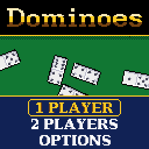
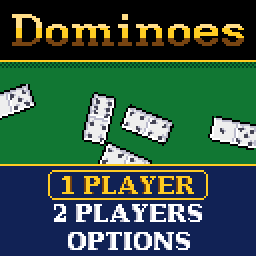
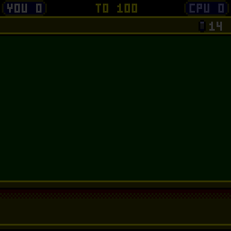
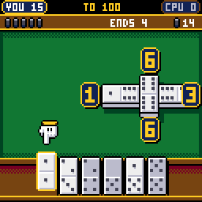
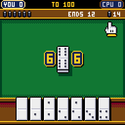
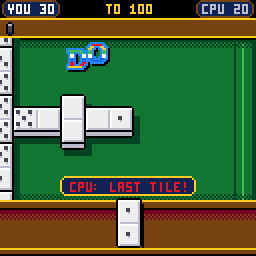
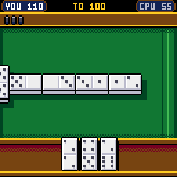

# CHDominoes

> **Part of [CHGame](../../README.md)**: one of the casino games that are the platform's examples. This game lives in
> `games/CHDominoes`; the simulator, size report and serial helper it uses are shared in the
> repository's root [`tools/`](../../tools), and the board package and CHGfx are in
> [`platform/`](../../platform). Notes for developers: [NOTES.md](NOTES.md).

Dominoes for the [CHGame](../../README.md) handheld
(CH32X035 RISC-V, 128x128 colour LCD, piezo), another table in the casino of
[CHBlackjack](../CHBlackjack), CHChess and
CHBackgammon: the double-six set on lamp-lit green felt seen from above
and close up, bevelled tiles with their pips set into them, thick enough
to cast a shadow, in a set of your choosing - white, black or six colours -
your hand standing in a wooden rack, a camera that follows the play along
the line, a pointing glove to pick tiles from your rack, the open ends
named in figures that light up where your tile fits, tiles that turn in
the air on their way down, FIVE! TEN! FIFTEEN! dropping in letter by
letter - and, when you play your last tile, DOMINO!: the whole line goes
off like a string of firecrackers, tile after tile blown spinning off the
table, faster and faster, from the one you just played back to the first
and out along every arm.

| Title | The deal, and a FIFTEEN | A tile that fits two ends |
|---|---|---|
|  |  |  |
| **Nothing fits: the boneyard** | **DOMINO! The firecrackers** | **The match** |
|  |  |  |

(Captured from the PC simulator in `tools/chsim`, which runs the real game
and graphics code and renders what the device shows. The game has been
built and checked in the simulator; its frame times and its sound on the
handheld itself are still to be checked.)

Two games: **ALL FIVES**, where the ends of the line are added up after
every tile and a total that divides by five scores at once, and classic
**DRAW**. One player against three CPU opponents, or two players passing
the handheld. The code is this project's own, on the framework of
CHBlackjack, CHChess and CHBackgammon; the serif lettering is rasterized
from DejaVu Serif Bold, and the small 3x5 lettering is Press Play On
Tape's font, as there. See `NOTICE`.

## Installing

You need the Arduino IDE (2.x) or `arduino-cli`, and:

1. **The CHGame board package, 0.2.4 or later**: see [Installing](../../README.md#installing)
   in the repository's README.
2. **The CHGfx library, 1.3.0**, in this repository at
   [`platform/libraries/CHGfx`](../../platform/libraries/CHGfx). Copy it into your
   sketchbook's `libraries/` folder.
3. **This game's folder**, `games/CHDominoes` of this repository (keep the name `CHDominoes`).

Pick *Tools > Optimize > Smallest + LTO* and *Tools > USB > Upload only*
(the game has no use for USB Serial, and uploading works as before). That
is 42.4 KB of the 50,944-byte application region, with the two flash pages
that hold your saved games free. From the command line:

    arduino-cli compile -b CHGame:ch32v:CHGame:opt=oslto,rtlib=nano,periph=game,usb=uploadonly CHDominoes
    arduino-cli upload  -b CHGame:ch32v:CHGame -p COMx CHDominoes

(`python tools/device.py build` does the same.)

## Playing

| Button | At the table | Elsewhere |
|---|---|---|
| D-pad | move the glove along your rack; with a tile that fits several ends, between those ends | menus |
| A | play the tile under the glove; with nothing to play, draw from the boneyard | select |
| B | hold: the whole table; while choosing an end: put the tile back | back |
| SELECT | a hint: the tile the SHARK would play, and where | |
| START | pause: resume, save + quit | |

Your tiles stand on the rack at the foot of the screen; the other hand's
backs are on the rack at the top, with the boneyard's count beside them.
The line is laid out on the felt between: the first tile in the middle,
doubles across, the arms turning corners as they reach the table's edge.
You see it close up, the camera going to wherever the play is; hold B to
pull back and see the whole table at once.

**Your turn.** Tiles that fit nowhere are greyed. At each open end of the
line a plate shows the pips open there - an end out of view keeps its plate
at the edge of the felt on the side it lies, so all the open ends are
always in sight - and the plates your tile fits blink, the camera going to
the first of them.

A plays the tile: it flies out, turns to lie as it must and
clacks down. If it fits ends that differ in what they score or leave
open, the glove goes to the line and the places light up: D-pad between
them (in ALL FIVES the count at the top shows what each would make), A to
play there, B to put the tile back.

**Nothing fits.** The glove goes to the boneyard: A draws a tile, and
again, until one fits. With the boneyard empty you pass, with a knock on
the table. When neither side can play the round is BLOCKED.

**The first tile.** In a match's first round the heaviest double is set
at once by whoever holds it; after that the winner of a round leads the
next with any tile.

### ALL FIVES

After every tile the open ends are added up - a double at an end counts
both its halves - and if the total divides by five, whoever played scores
it: FIVE!, TEN!, FIFTEEN!, TWENTY! The count is shown at the top, gold
when it is worth points.

A double set as the first tile is the **spinner**: once it has a tile on
both sides, its two free ends open as well, four arms in all. (Their ends
count once a tile has been played on them.)

When a round ends, the winner also scores the pips left in the other
hand, to the nearest five. Play is to 100, 150 or 200; the scores are
compared when a round ends, so a round is always played out.

### DRAW

Nothing is scored during play. The first to play their last tile scores
the pips left in the other hand; in a blocked round the lighter hand
scores the difference. To 50, 100 or 150.

### Opponents

| Opponent | |
|---|---|
| ROOKIE | plays whatever fits, half the time |
| REGULAR | takes every point going, then sheds its heaviest tiles, doubles first |
| SHARK | also keeps its next turn open, leaves you the ends you have passed on, and weighs what every tile it cannot see would score in reply |

The CPU sees what a player sees: its own hand, the line, how many tiles
you hold and which pips you have drawn or passed on - never your hand or
the boneyard. The tiles are shuffled by one generator, seeded from the
moment you press the button. Your record against each opponent, rounds
and matches, is on the setup screen (hold SELECT there to clear it).

Options: sound, the felt (green, blue, red, purple), the pace (FUN, or
QUICK: shorter pauses) and your set of TILES: white, black, ivory, red,
blue, jade, grape or pink, shown on the options screen as you choose.
Options, records and a match in progress (SAVE + QUIT, then CONTINUE) are
saved to flash and survive re-uploading.

Two players pass the handheld: between turns the rack turns face down
until the next player presses A.

## How it fits

* **The rules** (`src/rules`) keep a round in 56 bytes: each hand and the
  boneyard as a bit per tile, the line as the tiles in the order played
  with the arm each went on, and the pips open at each arm's end. A
  second, naive implementation in the tests, which keeps the line as lists
  of tiles and works everything out from them, agrees with it on 40,000
  random rounds, step by step.
* **The table** (`src/table/Layout.*`) is a grid of units, 42 by 26 (six
  pixels each close up, three seen whole). Each arm walks outward from the
  middle: straight on while there is room, else round a corner - clockwise by choice, so the arms turn about
  the middle like a pinwheel and keep out of each other's way - leaving a
  unit clear between tiles that are not neighbours. A tile once down never
  moves, so the layout of a saved game is simply played again. The tests
  lay out 1.5 million tiles in 20,000 matches: every one on the felt, none
  over another.
* **The tiles** are drawn, not stored (`src/table/Table.cpp`), in five
  colours lit from the top left: a bone face bevelled white along its top
  and left and silver along its bottom and right, an engraved bar across
  the middle, slate pips 2 x 2 from a 9-bit pattern per number, each with
  a two-pixel shadow off its lower right and a pixel of the face between
  the pips and the bevel; the near edge showing below in shade, and a
  shadow cast on the felt. Two of the casino palette's sixteen colours
  were given over to the tiles (the bone and the slate), so a set of tiles
  is a palette swap: a light set puts its face in the one and its pips in
  the other, a dark set its face in the slate, white pips, and its lit
  bevel in the bone (`table::useSet`). The line is drawn back to front, so
  a tile's edge goes under the face of the tile in front of it, and a tile
  in the air leaves a shadow on the felt that shrinks and softens as it
  climbs. Close
  up, a tile is drawn by one routine running from SRAM that works out each
  kind of row once (an outline, a row through a band of pips, a row between
  bands, the bar, the edge) and copies it down two pixels a byte, rather
  than as twenty-odd rectangles. Sizes: 13 x 25 close up and on the rack,
  10 x 19 for a hand shown at the round's end, 7 x 13 with the whole table
  in view. `python tools/tilemock.py` draws the look-dev sheet of pip
  treatments the style was chosen from (`out/tilemock.png`). For a tile in
  the air the same pattern is written into CHGfx's scratch buffer as a
  small image and rotated and scaled from there, CHChess's way of sending a
  captured piece flying.
* **The firecrackers** (`src/stage`): each tile's place on the fuse is its
  distance along the line from the last tile played - back down that arm to
  the first tile, then out along the others, so the arms of a spinner burn
  together. The gaps shorten as it burns. A tile about to go spits sparks
  and glows; then it is gone from the line, leaving a scorch, and a copy of
  it is thrown up and away (the camera running along the fuse), spinning
  and growing, with a burst of sparks, a puff of smoke, a shake of the table and a crack whose pitch climbs. The
  last goes with a boom. (A round the CPU wins is just swept away.)
* **The CPU** (`src/ai`) is a page of rules of thumb, no search: over
  2,000 matches each, REGULAR beats ROOKIE 69.8% of the time at ALL FIVES
  (58.5% at DRAW) and SHARK beats REGULAR 62.0% (70.3% at DRAW).
* **The title** is CHMahjong's and CHSolitaire's: white and black tiles
  tumbling slowly end over end down the felt at eight paces, all at their
  true size, now and then a meteor streaking across with a rainbow trail;
  the name, drawn letter by letter at its full size in
  `tools/art/logo.txt` (116 x 16, a 1-bit image), on the black rail. Each
  falling tile is built once into a 175-byte image and only turned each
  frame; the lettering on the top rail, the costliest drawing on the
  screen, is drawn once and left in the framebuffer, everything else below
  it.
* **The lettering** is CHCrossword's anti-aliased serif, at its own size:
  capitals, figures and a few stops rasterized from DejaVu Serif Bold at
  12 px (capitals 9 pixels tall) by `tools/aafont.py`, each glyph its ink
  - the typeface's own one-bit rendering, so stems stay crisp - and a layer
  of half ink on its curves and diagonals, drawn in a tone between the ink and what is
  under it: silver on white, wood on gold (1.7 KB for 43 glyphs). It is
  the menus, the options and setup choices, the panels, and through
  CHBlackjack's mask code the outlined, gradient-filled headings and the
  dancing banners (their half ink in a tone between fill and outline).
* **Sound** is the CHGame library's piezo sequencer (CHBlackjack's) of
  short step lists, three bytes a step (`src/audio/Sounds.cpp`): bone on
  wood, knuckles for a pass, a rising run for points, the crackers'
  climbing cracks and the boom, fanfares.
* **Saved games** hold the round as it stands, the score and the
  generators' state, so reloading can never change a tile to come.

## Development

The tools need Python 3 with `pip install -r ../../tools/requirements.txt`, and a
C++ compiler (zig, clang++ or g++ on the PATH, `pip install ziglang`, or
`CHSIM_CXX="path/to/zig c++"`).

* `python tools/check.py` - everything that can be checked without the
  board: the host tests; each script in `tools/scripts` run in the simulator
  twice (the frames must be identical); the device build compiled and sized.
  `--compare A B` compares two runs' images (the simulator's against the
  board's).
* `python tools/tests/run_tests.py` - the rules against the reference
  implementation and known positions, thousands of whole matches through
  the game's own calls with the layout checked after every tile, save and
  reload in mid-round, and the CPU's levels against each other.
* `python tools/chsim/chdrive.py --sim . tools/scripts/showcase.txt out/showcase`
  - runs the game from a script and writes the GIFs above (the reel at the
  top is `tools/scripts/gameplay.txt`). In a script,
  `say G <mode> <level> <seed> <game> <target>` starts a match,
  `say D 63 55 50 ..` stacks the next deal (seven tiles for you, seven for
  the other side, then the boneyard in order), `say C <you> <them>` sets
  the score, `say W <side>` ends the round as if that side had gone out,
  `waitturn` waits for your turn, `auto` and `round` play on for you, `rec`
  records, `cal` and `perf` estimate the device's render time. GIFs are
  written with every frame whole on one shared palette
  (`../../tools/chsim/fbimage.py` `save_gif`), so no viewer can show a frame
  half-updated; `say Y` reports the drawing time by section (on the board
  in microseconds; in the simulator in host nanoseconds).
* `python tools/device.py upload [--debug]` - build and upload (`--debug`
  adds the serial protocol for screenshots, injected input and lockstep).
* **Editing the art:** `python tools/assets.py` packs `tools/art/` into
  `src/assets/`: the glove (`hand.png`, CHChess's), the serif lettering
  (`aafont.txt`, `#` ink, `+` half ink; `python tools/aafont.py` starts it
  again from the typeface, `--preview` compares sizes) and the title's name
  (`logo.txt`). The tiles have no art: their look is in
  `src/table/Table.cpp` (`tilePx` for the close-up drawing, `SETS` for the
  sets of tiles).
* `python ../../tools/audio/preview.py . out/audio` renders the sound effects to WAV.

## License

Apache License 2.0 (`LICENSE`). See `NOTICE`.
