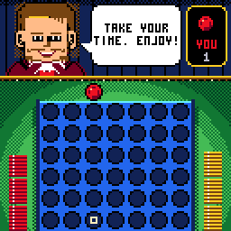
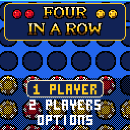
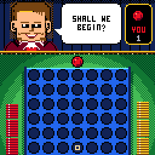
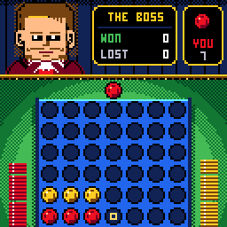
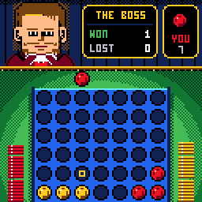

# CHFour - FOUR IN A ROW

> **Part of [CHGame](../../README.md)**: one of the casino games that are the platform's examples. This game lives in
> `games/CHFour`; the simulator, size report and serial helper it uses are shared in the
> repository's root [`tools/`](../../tools), and the board package and CHGfx are in
> [`platform/`](../../platform). Notes for developers: [NOTES.md](NOTES.md).

Four in a row for the [CHGame](../../README.md) handheld
(CH32X035 RISC-V, 128x128 colour LCD, piezo), another table in the casino of
[CHBlackjack](../CHBlackjack), CHChess and
CHBackgammon: a blue board standing on green felt, discs that are casino
chips dropping behind it with a knock and a bounce, and across the table the
dealer from the blackjack game - courtesy itself, and something of a coach.
He plays properly and talks you through the game as he does: a good block
gets a "WELL SPOTTED!", a missed win a "LOOK AGAIN", and he warns you when
he has three in a row. When a four is made the camera comes in to twice the
size and the four discs light up one by one; then the scene cuts to him -
"GOOD GAME" and his congratulations if you won, "TRY AGAIN" and a word of
encouragement if he did. The felt lies under a lamp, its greens in rings
from the light in the middle to the dark corners; a row of marquee bulbs
runs along the rail; and each side's 21 discs stand in a stack beside the
board that goes down as they are played.

| Title | The opening | You win | He wins |
|---|---|---|---|
|  |  |  |  |

(Captured from the PC simulator in `tools/chsim`, which runs the real game
and graphics code and renders what the device shows. The game has been
built for the device and checked in the simulator; its frame times and the
CPU's thinking times on the handheld itself are still to be measured.)

## Installing

You need the Arduino IDE (2.x) or `arduino-cli`, and:

1. **The CHGame board package, 0.2.4 or later**: see [Installing](../../README.md#installing)
   in the repository's README.
2. **The CHGfx library, 1.3.0**, in this repository at
   [`platform/libraries/CHGfx`](../../platform/libraries/CHGfx). Copy it into your
   sketchbook's `libraries/` folder.
3. **This game's folder**, `games/CHFour` of this repository (keep the name `CHFour`).

Pick *Tools > Optimize > Smallest + LTO* and *Tools > USB > Upload only*.
That is 36.3 KB of the 50,944-byte application region, with room left for
the two flash pages that hold your record and a saved game. From the
command line:

    arduino-cli compile -b CHGame:ch32v:CHGame:opt=oslto,rtlib=nano,periph=game,usb=uploadonly CHFour
    arduino-cli upload  -b CHGame:ch32v:CHGame -p COMx CHFour

(`python tools/device.py build` does the same.)

## Playing

| Button | On the board | Elsewhere |
|---|---|---|
| LEFT / RIGHT | move your disc over a column | change a setting |
| A or DOWN | drop it | select |
| B | | back |
| START | pause: resume, resign, save + quit | |
| any button | hurry an ending along | |

Take turns dropping a disc into one of the seven columns; the first to get
four in a line - across, up, or on a diagonal - wins. If all 42 holes fill
with no four, it is a draw.

**1 PLAYER** puts you (red) against the dealer (gold). Choose who he is
today:

| | |
|---|---|
| ROOKIE | Takes a win when he sees one and blocks yours, and not much more; one move in four he plays anything that does not lose on the spot. Set him two threats at once and he is yours. |
| SHARK | Looks five moves ahead. |
| THE BOSS | Looks as far ahead as 30,000 positions take him - ten moves and more, the whole rest of the game towards the end - and plays the best move he finds. |

and who moves first (you, him, or turn about). Your record against each is
kept (hold SELECT on that screen to wipe it).

**2 PLAYERS** pass the handheld between red and gold. The dealer watches,
and comments.

OPTIONS: sound on or off, and PACE: QUICK drops the close-up on the winning
four and shortens his pauses.

### The dealer

His lines are not random. After every move the game works out what is true
on the board - which cells each side could win in right now, before and
after the move - and his search reports what it found, so what he says is
about the position in front of you:

* you blocked his three: *WELL SPOTTED!* You threatened and he must block:
  *GOOD THREAT! I MUST BLOCK.*
* you had a win and played somewhere else: *YOU HAD A FOUR THERE! LOOK
  AGAIN.*
* you have two ways to win, and he can only stop one: *TWO THREATS AT ONCE.
  SUPERB!*
* he has three in a row: *CAREFUL: I HAVE THREE.* You did not block it: *I
  HAD THREE IN A ROW THERE.* Your disc let him play on top of it for the
  win: *THAT DISC OPENED THE CELL ABOVE.*
* his search has found a forced win: *I SEE A WIN IN 3 MOVES. LOOK CLOSE.*
  (The tests check that he then wins within that many.)
* about to drop the fourth disc: *PARDON ME. THAT MAKES FOUR.*

and a tip now and then (*BUILD TWO THREATS AT ONCE.*), not too often. 98
lines in all, none repeated until the others of its kind have been said.
You win, he congratulates you; you lose, he asks you to try again.

## How it fits

* **The board** is two 64-bit sets of discs, seven bits a column, so that a
  four in any direction, and every cell that would complete one, come from a
  handful of shifts and ANDs (after Pascal Pons's solver). Nothing in the
  search calls libgcc: a cell's bit is made with a 32-bit shift.
* **The CPU** is an alpha-beta search, middle columns first, that asks of
  every position what a player asks - can I win now, must I block, which
  columns would hand over a win on top of my disc - before it looks deeper.
  It runs a slice at a time from the 60 Hz tick with its stack kept in an
  array, so frames never stop and nothing needs a second stack; its inner
  functions run from SRAM. On the board a slice is five milliseconds; in the
  simulator a fixed 150 positions, so scripted runs repeat exactly.
* **The dealer** is CHBlackjack's sprite, unchanged: the body, a face patch,
  and each other expression as the pixels that differ. The endings draw him
  at twice the size by scaling the sprite's row spans.
* **The camera** is CHBackgammon's: a zoom in fifths about a world point,
  one step a drawn frame; the 10x10 disc has a 20x20 version for the close-up.
* A still screen is not redrawn: the frame is sent again (the palette
  effects keep moving) and drawing waits for something to change.

`python ../../tools/check_size.py build/release --top 20` lists what the image is
made of.

## Development

Everything can be checked on a PC. The tools need Python 3 with Pillow
(`pip install -r ../../tools/requirements.txt`) and a C++ compiler for the host
builds (set `CHSIM_CXX`, or have `zig`, `clang++` or `g++` on the path).

    python tools/check.py               # host tests, every script twice, device compile + size
    python tools/tests/run_tests.py     # the rules, the CPU, whole games, his lines
    python tools/tests/run_tests.py --story 3    # a game against each dealer, told move by move
    python ../../tools/chsim/chsim.py build .
    python tools/chsim/chdrive.py --sim . tools/scripts/endings.txt out/endings
    python tools/assets.py              # art -> src/assets (previews in build/assets)
    python tools/device.py upload       # build and upload the release

`tools/scripts/*.txt` drive the game through its debug protocol
(`src/debug/Debug.h`; the game's own commands are listed above the hook in
`src/states/Screens.cpp`): `say M 0 2 0 4435` sets up a position against
THE BOSS, `col 4` walks your disc to a column and drops it, `snap` and
`rec` take pictures. The same scripts run on the device with a debug build
(`python tools/device.py run SCRIPT OUTDIR`).

The art is in `tools/art`: `dealer.png` and `faces.png` (the seven
expressions, 24x18 each), `font.txt`, `sides.txt` (each side's colours).
The discs are drawn by `tools/assets.py` into `tools/art/gen/`; copy
`disc.png` or `disc_big.png` up a folder and edit it to redraw them. His
lines are in `src/game/Taunt.cpp`: at most three rows of twelve characters
each, which the tests check.

## License

Apache License 2.0; see `LICENSE` and `NOTICE`. The dealer and the 3x5 font
are from "Blackjack" for the Arduboy by Press Play On Tape (Apache-2.0), by
way of CHBlackjack.
