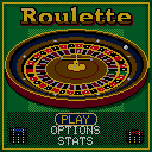
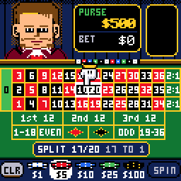
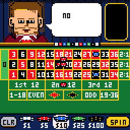
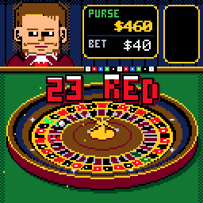
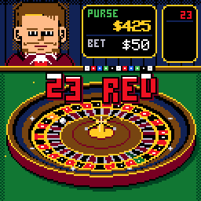
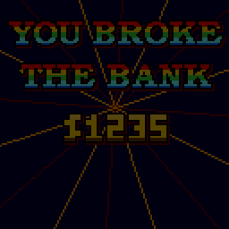

# CHRoulette

> **Part of [CHGame](../../README.md)**: one of the casino games that are the platform's examples. This game lives in
> `games/CHRoulette`; the simulator, size report and serial helper it uses are shared in the
> repository's root [`tools/`](../../tools), and the board package and CHGfx are in
> [`platform/`](../../platform). Notes for developers: [NOTES.md](NOTES.md).

Roulette for the [CHGame](../../README.md) handheld
(CH32X035 RISC-V, 128x128 colour LCD, piezo), in the casino style of
[CHBlackjack](../CHBlackjack) and
[CHChess](../CHChess). The croupier from Blackjack's
tables runs the wheel; Chess's pointing glove places your chips on the
felt, half a cell a tap, so splits, streets, corners and six lines are
there as on a real layout. Call NO MORE BETS and the camera whips across
the table to the wheel: the croupier flicks the ball, it laps the track,
drops past the deflectors, rattles over the frets and settles - and the
number bursts out in Blackjack's dancing letters. Back at the layout he
stands the dolly on it, rakes in the losing chips, pays the winners beside
their stakes and slides the winnings home while your purse rolls up.

| Title | Betting | The spin |
|---|---|---|
|  |  |  |
| **The payout** | **35 to 1** | **You broke the bank** |
|  |  |  |

(Captured from the PC simulator in `tools/chsim`, which runs the real game
and graphics code and renders what the device shows.)

The croupier is Press Play On Tape's dealer from their Arduboy Blackjack
(**vampirics**, art; **filmote**, code), as recoloured for CHBlackjack, as
are the end screens' lettering and the 3x5 font. Apache-2.0, like this
game; see `LICENSE` and `NOTICE`.

## Installing

You need the Arduino IDE (2.x) or `arduino-cli`, and:

1. **The CHGame board package, 0.2.4 or later**: see [Installing](../../README.md#installing)
   in the repository's README.
2. **The CHGfx library, 1.3.0**, in this repository at
   [`platform/libraries/CHGfx`](../../platform/libraries/CHGfx), and **the CHGame
   library** at [`platform/libraries/CHGame`](../../platform/libraries/CHGame).
   Copy both into your sketchbook's `libraries/` folder.
3. **This game's folder**, `games/CHRoulette` of this repository (keep the name `CHRoulette`).

The game needs **link-time optimisation** to fit the 50,944-byte
application region: pick *Tools > Optimize > Smallest + LTO* and *Tools >
USB > Upload only* (the game has no use for USB Serial; uploading works as
before). Built that way it is 49.8 KB, which leaves the last two flash
pages for saved games. From the command line:

    arduino-cli compile -b CHGame:ch32v:CHGame:opt=oslto,rtlib=nano,periph=game,usb=uploadonly CHRoulette
    arduino-cli upload  -b CHGame:ch32v:CHGame -p COMx CHRoulette

(`python tools/device.py build` does the same.)

## Playing

| Button | Betting | Elsewhere |
|---|---|---|
| D-pad | tap: the glove steps half a cell, onto the lines and corners between numbers; hold: it runs from cell to cell | menus |
| A | drop a chip (hold to repeat); on a chip in the bar: use that chip; on CLR: press twice to clear; on SPIN: spin | select |
| B | take a chip back (hold to repeat) | back |
| SELECT | next chip you can afford | |
| START | pause: resume, options, save & quit | |
| A, held during the spin | the ball at double speed (press it again after SPIN) | |

The plate under the layout names the bet the glove is on, what is on it
and what it pays ("SPLIT 17/20 $10 17 TO 1"); every number the bet covers
lights up. Taps wrap round the edges (UP from the top row reaches the bar
and SPIN); a held direction stops at them.

### Rules

**European** wheel by default (one zero, 37 pockets), **American** in the
options (0 and 00, 38 pockets, and the top line 0/00/1/2/3 instead of the
first four). Payouts are the casino's:

| Bet | Pays |
|---|---|
| straight up (one number) | 35 to 1 |
| split (two) | 17 to 1 |
| street, trio (three) | 11 to 1 |
| corner, first four (four) | 8 to 1 |
| top line (five, American) | 6 to 1 |
| six line | 5 to 1 |
| column, dozen | 2 to 1 |
| red, black, odd, even, 1-18, 19-36 | 1 to 1 (they lose on 0 and 00) |

Chips are $1, $5, $10, $25 and $100; up to $100 on an inside bet, $250 on
an outside bet and $1,000 on the table. You start with $500 and play to
the goal ($1000, $5000 or endless) or until you are broke. A winning bet
stays on the table for the next spin; the losing ones are placed again
for you if your purse covers them, so the layout carries over as it does
on a real table (CLR takes it all back). The American wheel's 0/2 and 00/2
splits are not offered: their spots would sit 2.5 px apart.

### Options and stats

Wheel, goal, pace (FUN, or QUICK: shorter spins and payouts), sound
(the melody, an arpeggio of all the voices, or off) and the croupier's
look. Options, lifetime statistics (spins, wins, the biggest win, the
straight-ups you hit, the hot and cold numbers) and a game in progress
are saved to flash and survive re-uploading; SAVE & QUIT, then CONTINUE.
Hold SELECT on the stats screen to reset them.

## How it fits

* **The wheel** is a tilted bowl of stacked ellipses with the rotor painted
  from a polar angle map: one quadrant, a byte a pixel (515 bytes, made by
  `tools/wheel.py`), mirrored four ways through a 1 KB colour table built
  each frame for the rotor's angle in CHGfx's spare chunk buffer. The
  pockets, the frets and the lit winning pocket all come out of that
  table, so the ring costs a map read and a table read a pixel, from SRAM.
  The bowl, which never moves, is repainted only in the rows the ball and
  the sparks passed through.
* **The ball** is an integer simulation: flick, laps of the track, the drop
  past the deflectors, hops over the frets, the catch. The rules pick the
  number when you press SPIN; while the croupier calls NO MORE BETS the
  spin is run once in the background, and the real one starts with the
  rotor turned by whole pockets so the ball lands exactly there (1.2
  million host test cases: every pocket, both wheels, both paces).
* **Redraws:** the wall, the plaque, the layout and the action bar each
  redraw only when what they show changes or something moving touches
  them; every frame is still sent to the panel, so the palette effects
  (the rainbow banners, the pulsing highlights) run for free. The layout's
  rows are built once and stamped down with word copies.
* **Flash is the wall:** 49.8 KB of 50.9 KB with link-time optimisation.
  CHBlackjack's back room (the croupier telling the credits) and an
  attract-mode demo are in the code but switched off to make room
  (`CHRL_CREDITS`, `CHRL_DEMO` in `config.h`).
* **Saving without EEPROM:** the two flash pages below the bootloader's
  metadata survive re-uploads; records alternate between them with a
  sequence number and a CRC.

## Development

The tools need Python 3 with `pip install -r ../../tools/requirements.txt`, and a
C++ compiler for the simulator and tests (zig, clang++ or g++ on the PATH,
`pip install ziglang`, or `CHSIM_CXX="path/to/zig c++"`).

* `python tools/tests/run_tests.py` - the rules: every spot's coverage and
  payout on both wheels against an independent Python model, the
  navigation, limits, the spin flow, saving the layout, and a 16,000-spin
  fuzz checking that no money appears or vanishes.
* `python tools/tests/run_ball_tests.py` - the ball lands on the chosen
  pocket for every pocket, wheel, pace and many seeds, within its time.
* `python tools/chsim/chdrive.py --sim . tools/scripts/showcase.txt docs/` -
  runs the game from a script and writes the GIFs above. `say F <n>`
  forces the next number, `say W <spot> <amount>` places a bet, `say G
  <spot>` moves the glove; `perf.txt` estimates the device's render times.
* `python tools/chsim/diffdrive.py tools/scripts/diff/diff_soak.txt out/d 3` -
  runs a script on the game and on a copy that redraws everything every
  frame, and reports any pixel the incremental redraws left stale.
* `python tools/device.py upload [--debug]` - build and upload (`--debug`
  adds the serial protocol for screenshots, injected input and lockstep).
* `python tools/assets.py` packs the art in `tools/art/` (it checks the
  croupier, his faces and the glove come out byte-identical to
  CHBlackjack's and CHChess's), `python tools/wheel.py` makes the wheel's
  map and previews, `python tools/make_music.py` the tunes,
  `python tools/audio/preview.py out/` renders them to WAV.
* `tools/mockup.py` drew the design mockups (`docs/design/` has the specs).

## Files

    CHRoulette.ino          loop: logic ticks, then draw, then DMA flush
    config.h                build switches
    src/game/               the rules (Roulette), the betting spots, the glove's
                            navigation, the wheels' orders - no graphics, host-tested
    src/wheel/              the ball and its solver; the wheel's drawing
    src/fx/                 the presenter (events -> motion), particles, banners, floating text
    src/render/             the wall and croupier, the felt layout, chips, the action bar
    src/gfx/Remap.*         the glove's colour remaps
    src/states/Screens.*    title, play, options, stats, won, broke
    src/audio/              sound sequencer and music
    src/save/               flash save pages
    src/debug/              serial debug protocol (debug builds only)
    src/assets/             generated art and the wheel's map
    tools/                  simulator, tests, asset pipeline, wheel generator, music, device tools

## License

Apache License 2.0; see `LICENSE`. `NOTICE` lists where the borrowed
parts come from.
