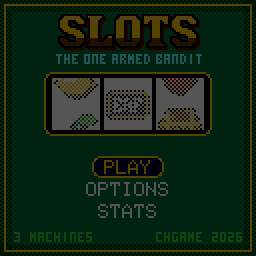
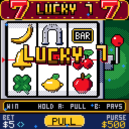
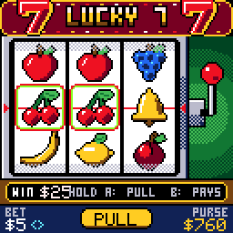
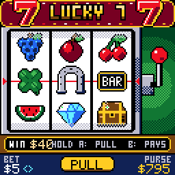
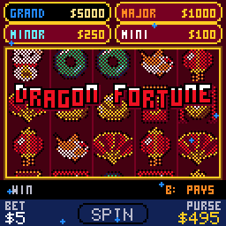
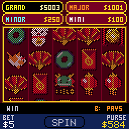
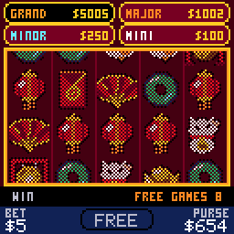
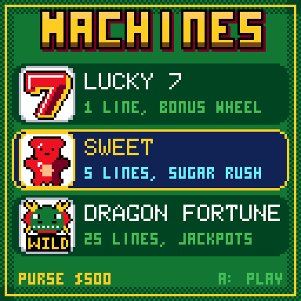
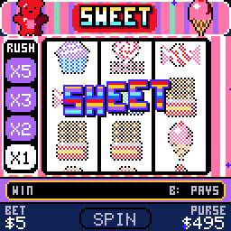
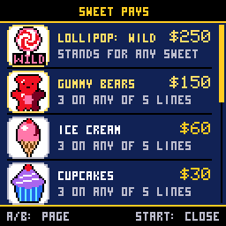

# CHSlots

> **Part of [CHGame](../../README.md)**: one of the casino games that are the platform's examples. This game lives in
> `games/CHSlots`; the simulator, size report and serial helper it uses are shared in the
> repository's root [`tools/`](../../tools), and the board package and CHGfx are in
> [`platform/`](../../platform). Notes for developers: [NOTES.md](NOTES.md).

The slot machines of the CHGame casino: three cabinets on one purse, for the
[CHGame](../../README.md) handheld (CH32X035,
128x128 colour LCD, piezo). It shares its palette, lettering, banners and
coin fountains with CHBlackjack, CHChess, CHCraps, CHRoulette and the rest of
the series.

* **LUCKY 7** is the one-armed bandit: three reels, one line, fifteen
  old-school symbols, an arm you pull, and a bonus wheel.
* **SWEET** sits between the two: three reels showing three rows, five
  lines, a lollipop wild and a sugar rush that multiplies wins in a row.
* **DRAGON FORTUNE** is the modern cabinet in red and gold: five reels, 25
  lines, an expanding dragon wild, free games, four jackpot meters and Hold
  and Spin.

Nothing here has run on the board yet. Everything below was captured from,
and verified in, the PC simulator.

| | |
|---|---|
|  |  |
| The title. Left alone, it plays a demo. | LUCKY 7: pull, wait for the third reel. |
|  |  |
| Two lucky charms spin the bonus wheel. | Three sevens. |
|  |  |
| DRAGON FORTUNE: five of a kind, then the dragon. | Hold and Spin: six coins lock, three respins. |
|  |  |
| Three gongs: eight free games at double pay. | Pick a machine. |
|  |  |
| SWEET: a sugar rush climbing to x5. | B: the paytable, scrolling by itself until you take over. |

## Installing

You need the Arduino IDE (2.x) or `arduino-cli`, and:

1. **The CHGame board package, 0.2.4 or later**: see [Installing](../../README.md#installing)
   in the repository's README.
2. **The CHGfx library, 1.3.0**, in this repository at
   [`platform/libraries/CHGfx`](../../platform/libraries/CHGfx), and **the CHGame
   library** at [`platform/libraries/CHGame`](../../platform/libraries/CHGame).
   Copy both into your sketchbook's `libraries/` folder.
3. **This game's folder**, `games/CHSlots` of this repository (keep the name `CHSlots`).

The game is built with **link-time optimisation**, like the rest of the
series. Pick *Tools > Optimize > Smallest + LTO* and *Tools > USB > Upload
only* (the game doesn't use USB Serial, and uploading works as before). From
the command line:

    arduino-cli compile -b CHGame:ch32v:CHGame:opt=oslto,rtlib=nano,periph=game,usb=uploadonly CHSlots
    arduino-cli upload  -b CHGame:ch32v:CHGame -p COMx CHSlots

(`python tools/device.py build` does the same.)

## Playing

You start with $500. Pick a machine from the menu (UP / DOWN, then A); the
purse goes with you when you change machines from the pause menu.

| Button | At a machine |
|---|---|
| A | LUCKY 7: hold to pull the arm, let go to spin. SWEET and DRAGON FORTUNE: spin. During a spin: stop the reels now |
| B | The paytable. It scrolls by itself; UP / DOWN scroll it, A and B skip a page, START closes it |
| UP / RIGHT, DOWN / LEFT | Raise or lower the bet |
| SELECT | Next bet, wrapping round |
| START | Pause: RESUME, MACHINES, OPTIONS, SAVE & QUIT |

Reach the goal (Options: $1000, $5000 or endless) to break the bank; run out
of money and you are broke. The game saves by itself every ten spins and on
SAVE & QUIT, never in the middle of a feature.

### LUCKY 7

Bets $1, $5, $10 or $25. Three alike on the middle line pay, from 15x the
bet (lemons, oranges) through 250x (sevens) to 500x (treasure chests); press B
for the whole table. One cherry anywhere on the line pays 1x, two pay 5x.
When the first two reels show a pair worth 100x or more, the third reel
creeps in.

**Bonus wheel.** Two lucky charms (clover, horseshoe) on the line spin the
wheel once: twelve wedges from 3x to 60x the bet. It comes up about one pull
in 48.

The machine returns 94.9% (computed exactly over all 42,875 stops), with a
win on 33% of pulls.

### SWEET

Bets $5, $10, $25 or $50, always on all five lines: the three rows and the
two diagonals. Three alike on a line pay, from 1x the bet (gumdrops) to 30x
(gummy bears).

* **Lollipop (wild).** Stands for any sweet; three lollipops on a line pay
  50x.
* **Sugar rush.** Every winning spin moves the ladder up a step, and the next
  spin pays at that step: x1, x2, x3, then x5. A spin that wins nothing sends
  it back to x1.

Over 4 million simulated spins it returned 95.7%, with a win on 23% of spins;
1.3% of spins are played at x5.

### DRAGON FORTUNE

Bets $5, $10, $25 or $50, always on all 25 lines. Lines pay left to right for
three, four or five of a kind.

* **Dragon (wild).** Lives on reels 2 to 4. Wherever it lands it rises to
  fill the reel and stands for any picture.
* **Gongs (free games).** Three or more anywhere pay 2x, 10x or 50x the bet
  and start eight free games at double pay. They can retrigger.
* **Coins (Hold and Spin).** Six or more on screen lock in place and you get
  three respins; every new coin locks and resets the count to three. At the
  end each coin pays what it shows: 1x to 5x the bet, or the MINI, MINOR or
  MAJOR meter. Fill all fifteen cells for the GRAND.
* **Meters.** MINI is 20x the bet and MINOR 50x. MAJOR starts at 200x and
  GRAND at 1000x, and both grow with every spin until somebody wins them;
  they are saved with the game.

Over 6.3 million simulated games it returned 95.3%: 52.5% from lines, 4.6%
from gongs, 15.0% from free games and 23.1% from Hold and Spin. Free games
come about one game in 64, Hold and Spin one in 87.

## How it works

* **Rules first.** `src/game/Slots.cpp` settles a spin in one call (stops,
  wins, features) and has no graphics in it; `src/fx/Presenter.cpp` replays
  the result as reels, banners and coins while the rules wait. The host tests
  link the rules alone.
* **Reel strips are generated.** `tools/strips.py` lays them out from symbol
  counts with a fixed seed; the returns above are what the tests measure for
  those strips.
* **Three bands.** The play screen is drawn as top, reels and bottom, each
  redrawn only when what it shows changed or something moved across it.
  `tools/chsim/diffdrive.py` compares that against redrawing everything every
  frame and reports stale pixels (none).
* **Three palettes.** The art uses the series' 16 colours. While DRAGON
  FORTUNE is on screen its three felt greens become maroon, jade and orange;
  on SWEET they become pink, mint and lilac.
* **Size.** The release image is 47,112 bytes of 50,944, with both save
  pages free; static RAM is 14,788 bytes of 18,416.
* **Speed.** The simulator estimates 7 to 9 ms a frame while the reels turn
  and 9 to 11 ms while the bonus wheel turns, against 8.3 ms for 60 fps. The
  logic runs at a fixed 60 Hz either way. These are estimates until measured
  on the board.

## Editing the art

The reel symbols are one sprite sheet, `tools/art/symbols.png`: 22x22 cells,
LUCKY 7's fifteen on the top row, DRAGON FORTUNE's ten on the second and
SWEET's eight on the third. Every opaque pixel must be exactly a palette
colour (`tools/art/palette.png`, `palette.gpl`); the second and third rows
use their machines' palettes. Then:

    python tools/assets.py

## Development

Python 3 with Pillow (`../../tools/requirements.txt`), and a C++ compiler for the
simulator and tests (set `CHSIM_CXX`, e.g. to `zig c++`).

| Tool | What it does |
|---|---|
| `python tools/tests/run_tests.py` | Rules tests: LUCKY 7's exact return, SWEET and DRAGON FORTUNE by Monte Carlo, money conservation |
| `python tools/chsim/chdrive.py --sim . tools/scripts/NAME.txt out/NAME/` | Run a script in the simulator: screenshots and GIFs |
| `python tools/chsim/diffdrive.py tools/scripts/diff.txt out/diff` | Stale-pixel check of the band redraw |
| `python tools/device.py build [--debug]` | Compile for the board and check the size |
| `python tools/assets.py [--export]` | Build `src/assets/` from the art, or write the sheet and palette |
| `python tools/strips.py` | Regenerate the reel strips |
| `python ../../tools/audio/preview.py . out/audio` | Render the sound effects and tunes to WAV |

`tools/scripts/showcase.txt` and `showcase_sweet.txt` make the captures in
`docs/`; `screens.txt` snaps every screen once; `save.txt` checks
save, continue and the demo; `perf.txt` prints the frame-time estimates.

## Files

    CHSlots.ino          the frame loop
    config.h             build switches
    src/game/            the rules of the three machines, the reel strips
    src/fx/              the presenter, particles, banners, shake
    src/render/          the cabinets, reels, wheel, paytables, each machine's felt
    src/states/          title, machine menu, play, options, stats, endings
    src/audio/           sound effects and three tunes (the CHGame library plays them)
    src/save/            what a save holds (the CHGame library keeps it in flash)
    tools/               art, asset and strip generators, simulator, tests

## License

Apache-2.0; see `LICENSE` and `NOTICE`. The 3x5 font comes from Press Play On
Tape's Arduboy Blackjack by Simon Holmes (filmote) and Stephane C
(vampirics), by way of CHBlackjack.
