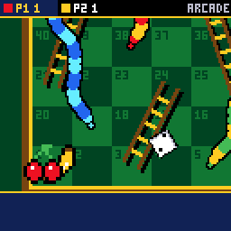
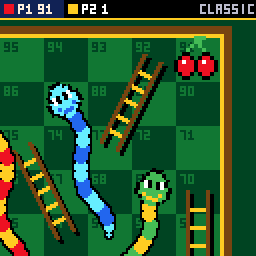
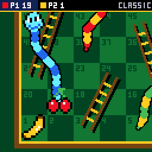
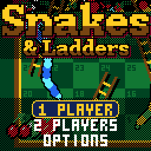

# SNAKES & LADDERS

> **Part of [CHGame](../../README.md)**: one of the casino games that are the platform's examples. This game lives in
> `games/CHSnakes`; the simulator, size report and serial helper it uses are shared in the
> repository's root [`tools/`](../../tools), and the board package and CHGfx are in
> [`platform/`](../../platform). Notes for developers: [NOTES.md](NOTES.md).

The childhood board game for the [CHGame](../../README.md)
handheld (CH32X035 RISC-V, 128x128 colour LCD, piezo), in the casino style
of [CHBlackjack](../CHBlackjack),
[CHChess](../CHChess) and
[CHBoardwalk](../CHBoardwalk): a felt board in a
wooden frame, dice that tumble in and knock the table, a fruit that hops
square to square with the camera after it, ladders whose rungs light as you
climb with the camera alongside, and eight wriggling snakes that see you coming, open their jaws,
swallow you whole - the camera rides down inside with you - and spit you
out at the tail.

*ARCADE against a CPU: the ladder at 3 taken over a plain 6, the snake at 26
seen (red) and dodged, the CPU bumped off 32 - and its doubles walking it
into the snake at 34.*

| A snake's meal | A ladder | Title |
|---|---|---|
|  |  |  |

(Captured from the PC simulator in `tools/chsim`, which runs the real game
and graphics code and renders what the device shows.)

**Status:** complete and played through in the simulator (rules tested over
100,000 games). Frame timing and the sound on the handheld itself are still
to be checked.

## Installing

You need the Arduino IDE (2.x) or `arduino-cli`, and:

1. **The CHGame board package, 0.2.4 or later**: see [Installing](../../README.md#installing)
   in the repository's README.
2. **The CHGfx library, 1.3.0**, in this repository at
   [`platform/libraries/CHGfx`](../../platform/libraries/CHGfx). Copy it into your
   sketchbook's `libraries/` folder.
3. **This game's folder**, `games/CHSnakes` of this repository (keep the name `CHSnakes`).

Pick *Tools > Optimize > Smallest + LTO* and *Tools > USB > Upload only*.
From the command line:

    arduino-cli compile -b CHGame:ch32v:CHGame:opt=oslto,rtlib=nano,periph=game,usb=uploadonly CHSnakes
    arduino-cli upload  -b CHGame:ch32v:CHGame -p COMx CHSnakes

(`python tools/device.py build` does the same.)

## Playing

1 PLAYER is you against a CPU; 2 PLAYERS is the two of you, passing the
handheld. Either way THE TABLE comes up set and A starts; it can seat up to
four, each a person or a CPU, and chooses the game. A CPU's turn goes by
quickly, seen from above: the show is for your own.

| Button | |
|---|---|
| A | roll; in ARCADE, take the die chosen |
| LEFT / RIGHT | ARCADE: choose a die (the bar says where each one takes you) |
| SELECT | the whole board, and back |
| START | pause: resume, options, save + quit |

Everyone starts on square 1. First to 100 wins.

**CLASSIC** is the game you know:

* One die. A **six rolls again** (two extra rolls at most).
* Land on the foot of a ladder and climb it; land on a snake's head and
  slide to its tail.
* 100 needs the **exact roll**: go past it and you bounce back by what is
  left over - possibly onto the snake at 99.
* Squares are shared.

**ARCADE** gives you something to decide:

* **Two dice, and you pick which one to move by.** The bar at the foot of
  the screen shows both and what each would do - TO 47, UP TO 59, DOWN TO
  5, BUMP P2, WIN! - and on the board an arc of dots marches from your
  token to the square, which flashes red if a snake is waiting there.
* **Doubles** move and roll again (two extra rolls at most).
* **Land on a rival and it is bumped** straight down a row (and takes
  whatever ladder or snake it drops onto). Square 1 is safe.
* The CPUs come in three kinds: EASY picks blind, FAIR takes the square
  further on, and the SHARK knows how many turns every square is from home,
  bumps the leader and keeps out of bumping range.

The top bar shows everyone's square. A roll from home, your heart beats and
the plate says what you need. When it is over, the result shows where
everyone finished, the ladders and snakes each took, and the story of the
game: everyone's square, turn by turn.

Options: sound, and the pace (FUN, or QUICK: faster turns, no close-ups).
Options, the house's records and a game in progress (SAVE + QUIT, then
CONTINUE, which picks the game up as that turn began) are saved to flash and
survive re-uploading.

## How it fits

* **The rules** (`src/game`) are plain logic with no graphics: a phase
  machine that reports events - dice, moves, ladders, snakes, bumps - and
  waits while the stage is busy showing them. The host tests play 100,000
  games through it.
* **The board** (`src/board`) is drawn from above in world space, and the
  view is a zoom about the camera: the whole board at the plain size, twice
  that close up, whipping between the two a step a frame. Each row of the
  screen is a copy of one of five 64-byte patterns.
* **Ladders** are two rails and a rung every four pixels, a span to each
  row they cross. **Snakes** are not sprites: each is a chain of round beads
  along the line from head to tail, pushed sideways by a sine wave that
  travels down the body, so they wriggle where they lie, thrash when they
  have eaten, and a bulge in your colour goes down inside. Only the head is
  art, turned the way the neck runs.
* **The title** is the game playing itself: four CPUs at ARCADE behind the
  lettering.
* The SHARK's knowledge is one table of 101 bytes, the turns still to go
  from each square with the best play, worked out by `tools/turns.py`.

## Development

The tools need Python 3 with `pip install -r ../../tools/requirements.txt`, and a
C++ compiler (zig, clang++ or g++ on the PATH, `pip install ziglang`, or
`CHSIM_CXX="path/to/zig c++"`).

* `python tools/check.py` - everything that can be checked without the
  board: the host tests, every script in `tools/scripts` run twice in the
  simulator (the same frames both times, and no drawing into a frame still
  being sent), and the device build's size.
* `python tools/tests/run_tests.py` - the board (a fair one: no chains, no
  wall of snakes), both games turn by turn, saved games, the CPUs against
  each other, and 100,000 seeded games that must all end.
* `python tools/chsim/chdrive.py --sim . tools/scripts/showcase.txt docs/` -
  runs the game from a script and writes the GIFs above. Scripts tap
  buttons, `waitturn` until the game wants you, `rec` a GIF, and `say`
  debug commands: `G` a new game, `D` the next dice, `M` to put a token on
  a square (the list is in `src/states/Screens.cpp`). `cal` and `perf`
  estimate the device's render time. `gameplay.txt` is the clip at the top.
* `python tools/device.py upload [--debug]` - build and upload (`--debug`
  adds the CHGame library's serial protocol, `chgame/Debug.h`, for
  screenshots, injected input and lockstep; it leaves out the options
  screen and saving).
* **Changing the board:** the ladders and snakes are one table in
  `src/game/Layout.cpp`. `python tools/lookdev.py` renders it at each size;
  `python tools/turns.py` prints the SHARK's table for it (into
  `src/game/Cpu.cpp`; the tests check the two agree).
* **Editing the art:** `python tools/sheet.py export` writes
  `tools/art/sheet.png`, an indexed PNG on the game's palette with every
  sprite in a labelled cell. Edit it, then `python tools/sheet.py import`
  writes what changed to `tools/art/` and rebuilds the assets.
* `python tools/assets.py` packs the art, `python ../../tools/audio/preview.py
  . out/audio` renders the sound effects to WAV.

## License

Apache License 2.0 (`LICENSE`). See `NOTICE`.
