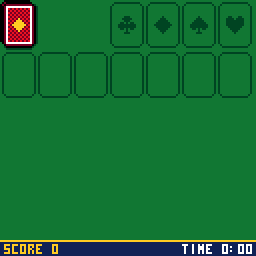
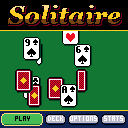
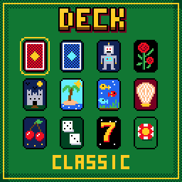
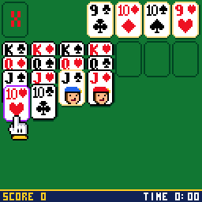

# CHSolitaire

> **Part of [CHGame](../../README.md)**: one of the casino games that are the platform's examples. This game lives in
> `games/CHSolitaire`; the simulator, size report and serial helper it uses are shared in the
> repository's root [`tools/`](../../tools), and the board package and CHGfx are in
> [`platform/`](../../platform). Notes for developers: [NOTES.md](NOTES.md).

Klondike for the [CHGame](../../README.md)
handheld (CH32X035 RISC-V, 128x128 colour LCD, piezo), in the style of
[CHBlackjack](../CHBlackjack),
[CHChess](../CHChess) and
[CHPoker](../CHPoker), and after the Solitaire that
came with Windows: draw one or draw three, Standard or Vegas scoring, a
timed game, a deck of twelve card backs to choose from (some of them move),
and when the last king goes up, the pack bounces off the foundations one
card at a time and leaves its trail across the screen. On the title, cards
drift down the felt and turn over, as the tiles do in CHMahjong.

What Windows did with a mouse the glove does here: it comes up from under
a card with a fingertip on its edge, lifts it (or a whole run) and carries
it, rainbow-edged, to where it should go. Legal places shimmer while you
carry. Cards fly out on the deal, turn over as they are uncovered, land on a
column in a puff of dust, spark as they land on a foundation, and a finished
suit gets its name called. Once everything is face up and the stock is done, the game
plays itself out.

| The title | The deck | The win |
|---|---|---|
|  |  |  |

(Captured from the PC simulator in `tools/chsim`, which runs the real game
and graphics code and renders what the device shows.
`tools/scripts/gameplay.txt` and `showcase.txt` make them: the reel is a
real deal played by the rules, then a cut to the end of a game. The game has
not been run on the board yet: its pace, frame rate and sound there are
unchecked.)

The card faces, suit glyphs and 3x5 lettering come from Press Play On Tape's
Arduboy Blackjack by **filmote** (Simon Holmes) and **vampirics** (Stephane
C), via CHBlackjack. Apache-2.0, like this game; see `LICENSE` and `NOTICE`.

## Installing

You need the Arduino IDE (2.x) or `arduino-cli`, and:

1. **The CHGame board package, 0.2.4 or later**: see [Installing](../../README.md#installing)
   in the repository's README.
2. **The CHGfx library, 1.3.0**, in this repository at
   [`platform/libraries/CHGfx`](../../platform/libraries/CHGfx). Copy it into your
   sketchbook's `libraries/` folder.
3. **This game's folder**, `games/CHSolitaire` of this repository (keep the name `CHSolitaire`).

Pick *Tools > Optimize > Smallest + LTO* and *Tools > USB > Upload only*
(the game has no use for USB Serial, and uploading works as before). Built
that way it takes about 31 KB of the 50.9 KB application region. From the
command line:

    arduino-cli compile -b CHGame:ch32v:CHGame:opt=oslto,rtlib=nano,periph=game,usb=uploadonly CHSolitaire
    arduino-cli upload  -b CHGame:ch32v:CHGame -p COMx CHSolitaire

(`python tools/device.py build` does the same.)

## Playing

| Button | At the table | Elsewhere |
|---|---|---|
| LEFT / RIGHT | move the glove from pile to pile | menus, change a setting |
| UP / DOWN | in a column: take more or fewer cards of the run; past the top of the run, UP goes to the stock, waste and foundations, DOWN comes back | menus |
| A | pick up; put down. On the stock: deal. Twice quickly on a card: send it to its foundation | select |
| B | put the cards back; with an empty hand, deal from the stock | back |
| SELECT | undo the last move | hold on Stats to reset them |
| START | pause: resume, new deal, deck, options, quit | |

A press never waits for an animation: cards still in the air land at once.

The stock deals to the waste three at a time (or one, in Options); only the
top card of the waste plays. Columns build down in alternating colours, a
king or a run that starts with one goes on an empty column, and the four
foundations build up by suit from the ace. Dropping a card on any foundation
sends it to its own. A card can come back down from a foundation.

### Scoring

As Windows scored it.

* **Standard**: 10 for a card to a foundation, 5 from the waste to a column,
  5 for turning a card up, -15 for taking a card back off a foundation.
  Turning the waste over costs 100 when dealing one card, and 20 from the
  fourth time through when dealing three. A timed game loses 2 points every
  ten seconds and ends with a bonus of 700,000 divided by the seconds it
  took (if it took at least 30). The score never goes below zero.
* **Vegas**: every deal costs $52 and every card on a foundation pays $5.
  You go through the stock three times dealing three, once dealing one, and
  then the stock shows a red X. The bank carries over from game to game.
* **None**.

Options also has the timed game on or off, sound, and a four-colour deck
(green clubs, blue diamonds). Draw, scoring and timing take effect with the
next deal. One level of undo, score included; the clock does not run back.

Pausing saves: the game on the table, the bank, your options, deck and
statistics go to flash and survive switching off and re-uploading. PLAY on
the title picks the game up where it was. A new deal walks away from the
one on the table, which ends a winning streak (a deal you never touched does
not count).

## How it fits

* **The trail is free.** CHGfx keeps one 16-colour framebuffer and nothing
  clears it but the game. During the cascade the table is simply not
  redrawn: each logic tick stamps the bouncing card where it is, up to three
  stamps a frame when the game is catching up, so the trail has no gaps.
  Kings leave first, round the four foundations, as Windows did it; each
  card takes a random sideways speed and loses a fifth of its bounce every
  time it hits the floor.
* **Seven columns in 128 pixels** leave 18 a column, so the card is 17x23:
  CHBlackjack's bold rank and Press Play On Tape's suit glyph side by side
  along the top, a pip or a court card's bust below. A covered card is
  drawn as its top strip only. A column squeezes its overlap as it grows,
  and the tallest there can be (six face down, king to ace on top) runs
  over the status line with the top of every rank still showing.
* **The whole game is 196 bytes** (the stock and the waste share one
  24-card array), so undo is a copy of it and a save is one flash page.
* **Flash and speed.** About 31 KB with LTO, some 20 KB to spare. A full
  table is estimated (from the simulator, calibrated against the board's
  CHGfx benchmark) at about 5 ms a frame; the cascade under 1 ms.

## Development

The tools need Python 3 with `pip install -r ../../tools/requirements.txt`, and a
C++ compiler (zig, clang++ or g++ on the PATH, `pip install ziglang`, or
`CHSIM_CXX="path/to/zig c++"`).

* `python tools/check.py` - everything below in one go: the host tests,
  every script twice (the two runs must draw identical frames), and the
  device build with its size check.
* `python tools/tests/run_tests.py` - the rules and both scorings, the
  stock and its passes, the clock and bonus, and thousands of games of
  random and of sensible play that must leave all 52 cards in place.
* `python tools/chsim/chdrive.py --sim . tools/scripts/play.txt out/play` -
  runs the game from a script and writes screenshots and GIFs. `expect`
  checks the table's numbers, `waitstate` runs until the table is in a
  state; `say G <seed>` deals a known game, `say W <n>` leaves n cards to
  play, `say O <i> <v>` sets an option, `say C <pile> <cards>` puts the
  glove on a pile.
* `python tools/device.py upload [--debug]` - build and upload (`--debug`
  adds the CHGame library's serial protocol, `chgame/Debug.h`, for screenshots, injected input and lockstep;
  `device.py run SCRIPT OUTDIR` runs a script on the board).
* `python tools/assets.py` packs the art in `tools/art/`: the cards, the
  glove, the title lettering (`logo.txt`, as `#` and `.`) and the card
  backs (`backs/*.txt`, 15x21 in palette letters; a PNG of the same name in
  the game's 16 colours overrides one).
  `python ../../tools/audio/preview.py . out/audio` renders the sound
  effects to WAV.

## Files

    CHSolitaire.ino        loop: logic ticks, then draw, then DMA flush
    config.h               build switches
    src/game/Klondike.*    the rules and the scoring (no graphics)
    src/stage/Stage.*      the glove, cards in motion, the table, the cascade
    src/render/*           the card and its backs, layout
    src/states/Screens.*   title, play, deck, options, stats
    src/fx/*               particles, banners, floating texts (palette,
                           primitives and lettering: the CHGame library)
    src/audio/*            the sound effects (the CHGame library plays them)
    src/save/Save.*        what a save holds (the CHGame library keeps it in flash)
    tools/                 simulator, tests, asset pipeline, device tools

## License

Apache License 2.0 (`LICENSE`). See `NOTICE`.
