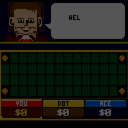
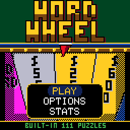
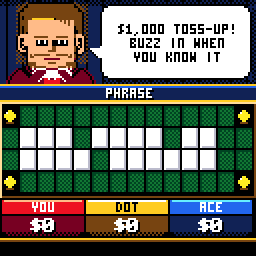
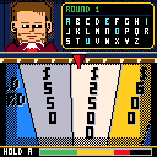
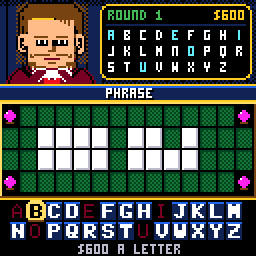
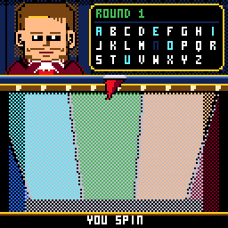
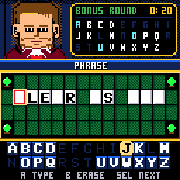

# CHWordWheel

> **Part of [CHGame](../../README.md)**: one of the casino games that are the platform's examples. This game lives in
> `games/CHWordWheel`; the simulator, size report and serial helper it uses are shared in the
> repository's root [`tools/`](../../tools), and the board package and CHGfx are in
> [`platform/`](../../platform). Notes for developers: [NOTES.md](NOTES.md).

**WORD WHEEL**: a word-puzzle game show for the
[CHGame](../../README.md) handheld, in the casino
style of [CHBlackjack](../CHBlackjack). Spin the
wheel, call a consonant, buy a vowel, solve the puzzle. 111 puzzles are built
in, and a microSD card with the file `PHRASES.BNK` on it brings that to 606.

Three podiums - you and two CPU contestants, or friends passing the
handheld - play a whole episode: a toss-up, three rounds at the wheel, a
final spin when the bell rings, and the bonus round for whoever is ahead. The
dealer from Blackjack's tables hosts, and has something to say about most of
it.

| Title | Toss-up | The wheel |
|---|---|---|
|  |  |  |
| **Three N's** | **Bankrupt** | **The bonus round** |
|  |  |  |

(Captured from the PC simulator in `tools/chsim`, which runs the real game
and graphics code and renders what the device shows. **The game has not yet
been run on a board**: see "Status" below.)

The host is Press Play On Tape's dealer from their Arduboy Blackjack
(**vampirics**, art; **filmote**, code), as recoloured for CHBlackjack, as is
the 3x5 font. Apache-2.0, like this game; see `LICENSE` and `NOTICE`.

## Status

Checked in the simulator and by host tests only (`python tools/check.py`).
Still to do on a board: the first run at all, render times, how the wheel
and the sounds feel, saving across a power cycle, and the SD card reader,
which has never run on hardware in this game or the ones it comes from.

## How to install

There are two parts: the **puzzle file**, which goes on a microSD card, and
the **game**, which goes onto the CHGame over USB. The card is optional:
without it the game plays with the 111 puzzles built into it. With it, it
draws from all 606.

### Step 1: put the puzzles on a microSD card

1. **Download [`PHRASES.BNK`](https://github.com/bateske/CHGame/raw/main/games/CHWordWheel/sdcard/PHRASES.BNK)**
   (39 KB). It is the file in this game's [`sdcard`](sdcard) folder.
2. **Use a microSD card formatted FAT32** (FAT16 works too). Cards of
   32 GB or less come formatted that way, so a new one is ready as it is.
   Cards of 64 GB and more come as exFAT, which the game cannot read: reformat
   such a card as FAT32 first (or use a smaller card).
3. **Copy `PHRASES.BNK` to the top level of the card**, not into a folder,
   and keep its name exactly `PHRASES.BNK`. The card should look like this:

       SD card
       └── PHRASES.BNK

4. **Put the card in the CHGame's slot and switch it on.** The bottom of the
   title screen says **CARD 606 PUZZLES** when it has found the file, and
   **BUILT-IN 111 PUZZLES** when it has not. (The game looks again each time
   the title screen comes up; a card pulled out mid-game falls back to the
   built-in puzzles.)

### Step 2: put the game on the CHGame

1. Install the **Arduino IDE 2.x** from <https://www.arduino.cc/en/software>.
2. Add the **CHGame board package** (0.2.4 or later). The Boards Manager URL
   to paste into *File > Preferences* is under [Installing](../../README.md#installing)
   in the repository's README. Then open *Tools > Board > Boards Manager*,
   search for **CHGame** and click *Install*.
3. **Download this repository.** On <https://github.com/bateske/CHGame> click
   *Code > Download ZIP* and unzip it. The game is the folder `games/CHWordWheel`,
   already named like its `.ino` file (the Arduino IDE only opens a sketch
   whose folder has the same name).
4. Add the **CHGfx library** (1.3.0). Copy the folder `platform/libraries/CHGfx`
   from the download into the `libraries/` folder of your sketchbook (its
   location is shown in *File > Preferences*).
5. Open `games/CHWordWheel/CHWordWheel.ino` in the IDE and set:
   - *Tools > Board*: **CHGame**
   - *Tools > Optimize*: **Smallest + LTO**. The game does not fit without it.
   - *Tools > USB*: **Upload only**
   - *Tools > Port*: the CHGame's port
6. Plug the CHGame in by USB and click **Upload** (the arrow button).

The same from the command line:

    arduino-cli compile -b CHGame:ch32v:CHGame:opt=oslto,rtlib=nano,periph=game,usb=uploadonly CHWordWheel
    arduino-cli upload  -b CHGame:ch32v:CHGame -p COMx CHWordWheel

That is 50.3 KB of the 50,944-byte program area. The last two flash pages are left for saving.

## Your own puzzles

To add your own puzzles, add `CATEGORY|PUZZLE` lines to `tools/phrases/phrases.txt`
and rebuild `sdcard/PHRASES.BNK` with `python tools/phrases/build_bank.py`: the script checks that each fits the board.

## Playing

| Button | Your turn | The wheel | Picking letters, solving | Toss-up |
|---|---|---|---|---|
| D-pad | left/right: SPIN, VOWEL $250, SOLVE | | move over the letters | buzz in (podium 1 of two or three humans) |
| A | choose | hold to wind up, let go to spin | pick the letter; when solving, type it, then confirm | buzz in |
| B | | | back out of buying a vowel; when solving, rub out | buzz in |
| SELECT | | | when solving: next blank panel | buzz in (podium 2 of three humans) |
| START | pause: resume, options, save & quit | | | |
| A, held | hurries the host and a CPU's spin | | | |

With one human at the podiums any button buzzes in.

## The show

- **Toss-up** ($1,000, and $2,000 before round 3): panels turn one at a
  time until someone buzzes in and solves. A wrong answer locks you out. The
  winner starts the next round.
- **A round**: on your turn, spin, buy a vowel ($250) or solve. A consonant
  that is there pays the wedge's value for each panel it turns, and you go
  again; one that is not passes the turn. Only the contestant who solves
  keeps their round's money, and the house makes a small win up to $1,000.
- **The wheel** has 24 wedges of three peg slots:
  - **BANKRUPT** takes your round money and any tokens; **LOSE A TURN**
    just the turn.
  - **FREE PLAY**: any letter - a vowel costs nothing, a miss costs nothing.
  - The **top-dollar wedge**: $2,500, then $3,500, then $5,000.
  - Round 1: the **WILD CARD** (play it after a hit to call a second
    consonant at the same value, or take it to the bonus round for an extra
    consonant) and the **trip** ($3,000 if you go on to win the round); each
    is yours only if the letter you call is there.
  - Round 2: two **mystery wedges** - $1,000 a letter, or flip it for
    $10,000 or a bankrupt.
  - Round 3: one wedge is split **bankrupt / $10,000 / bankrupt**.
- **The final spin**: in round 3, after six spins, the bell rings at the
  next change of turn. The host spins once; from then on each contestant
  calls one letter (consonants pay that wedge plus $1,000, vowels are free
  and worth nothing) and has five seconds to solve or pass.
- **The bonus round**: the leader spins for an envelope ($25,000 to
  $100,000), is given R S T L N E, picks three more consonants and a vowel,
  and has ten seconds to say "got it" and type the answer.
- **The CPU contestants**: ACE is sharp and solves early; DOT buys every
  vowel she can afford and never gambles; BUZZ guesses, solves late, flips
  anything and now and then calls a letter that has been called.

Options: FULL EPISODE or QUICK PLAY (a toss-up, round 3 and the bonus),
pace, the solve clocks (TV or twice as long), sound, and the host's jacket.
The episode is saved at the start of every toss-up and round; SAVE & QUIT
keeps your place, and CONTINUE starts that step again with a new puzzle.

## How it fits

- **Flash**: 50,408 of 50,432 bytes (the limit that keeps both save pages).
  Roughly: the rules 6 KB, screens and presentation 14 KB, drawing and
  effects 7 KB, sound 2.5 KB, the SD reader and bank 2.3 KB, the built-in
  puzzles 1.4 KB, the rest core, USB and CHGfx. The built-in bank's share is
  one number (`FLASH_BYTES` in `tools/phrases/build_bank.py`): every
  kilobyte freed elsewhere is about eighty more puzzles without a card.
- **Compiler settings**: every size-optimised file carries
  `#pragma GCC optimize("Os", "no-ipa-sra", "no-inline-functions-called-once",
  "no-jump-tables", "no-guess-branch-probability")`. Against plain `-Os` with
  LTO those four save about 1 KB on this game; each was measured on its own,
  and the ones that made it bigger were left out. The hot pixel loops run
  from SRAM (`RAMFUNC`), where these settings don't matter.
- **Puzzles in flash** are Huffman-coded text (about 12 bytes a puzzle at
  this size, 10 at 600), grouped by section and category, already wrapped
  onto the board's four rows by the build script; the category names are
  coded the same way, after the puzzles. **On the card** they are plain
  64-byte records, so a puzzle is one block read.
- **No repeats**: each section is dealt in a shuffled order fixed by a seed
  (a small Feistel permutation), so the save holds a seed and three
  counters, not a list.
- **Drawing**: the play screen redraws only what changed - the wall, the
  board panel by panel, the podiums, the prompt bar - and whatever a banner
  or confetti passed over. The wheel's wedges are spans between edges
  stepped in fixed point toward a hub below the screen. Estimated render
  times (simulator, scaled by the CHGfx benchmark) are 3 to 6 ms a frame at
  the busiest; not yet measured on a board.
- **Depth** comes from the palette's own shades and 50% dithers, lit from
  the top left throughout: raised letter tiles with a shadowed edge, empty
  slots sunk into the board, a gold bezel with corner bulbs in the cycling
  colour, podiums with a lit header, a groove and a shaded foot, keycap
  letters in the picker, drop shadows under the rack, the bubble and the
  printed lettering, and a wheel shaded like a drum - dark at both sides and
  toward the hub, metal dividers, brass pegs, the rim's shadow across the
  face.
- **The wheel never decides anything**: the rules draw the stop, and the
  spin is solved to end there.

## Development

- `python tools/check.py` - everything that can be checked without a
  board: the banks rebuilt, host tests, every simulator script twice, the
  redraw check, the device build and its size.
- `python tools/tests/run_tests.py` - host tests of the rules (thousands of
  CPU episodes), the flash bank's decoder and the SD bank's reader.
- `python ../../tools/chsim/chsim.py build .` then
  `python tools/chsim/chdrive.py --sim . tools/scripts/round.txt out/round` -
  run a script in the simulator; screenshots land in the output folder.
  `set CHWW_CARD=sdcard/PHRASES.BNK` puts the SD bank in the simulator's slot
  (on a pretend FAT16 card, so the FAT code runs too).
- `python tools/chsim/diffdrive.py tools/scripts/diff/diff_round.txt out/d 1` -
  compares the game against a build that redraws everything every frame.
- `python tools/phrases/build_bank.py [--bytes N] [--curve]` - the banks.
- `python tools/audio/preview.py out/audio` - every sound and the tune as
  WAV files.
- `python tools/mockup.py` - the layout mock-ups the screens were built from.
- `python tools/device.py build|upload [--debug]` - the device build. (A
  debug build carries the test protocol, and leaves out the Setup, Options
  and Stats screens to make room for it.)

## License

Apache-2.0 (`LICENSE`); the SD reader in `src/sd` is MIT. See `NOTICE` for
what came from where.
