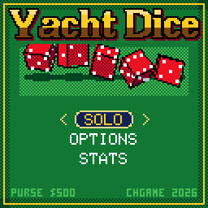
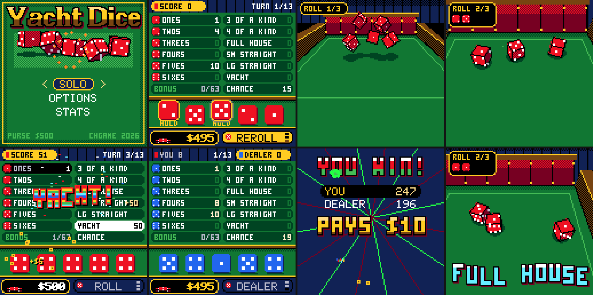

# CHYacht — Yacht Dice for CHGame

> **Part of [CHGame](../../README.md)**: one of the casino games that are the platform's examples. This game lives in
> `games/CHYacht`; the simulator, size report and serial helper it uses are shared in the
> repository's root [`tools/`](../../tools), and the board package and CHGfx are in
> [`platform/`](../../platform). Notes for developers: [NOTES.md](NOTES.md).

Five dice, three rolls a turn, thirteen boxes to fill: the classic five-dice
score-card game, for the CHGame handheld
(CH32X035, 128×128 colour LCD, piezo). It sits in the same casino as
[CHBlackjack](../CHBlackjack), [CHCraps](../CHCraps) and the rest: the same felt, chips and lettering, and
CHCraps's 3D dice — five of them now — thrown down a wooden tray.





## Playing

| | |
|---|---|
| **ROLL** | Hold **A** to shake the dice, let go to throw. **B** while shaking puts them back down; **B** in the air skips the tumble. |
| **The tray** | **LEFT / RIGHT** pick a die, **A** holds it (held dice sit the next roll out). **DOWN** goes to ROLL, **UP** (or **B**) to the card, onto the best-scoring box. |
| **The card** | The D-pad moves between boxes; open boxes show what the dice on the table would score. **A** scores. A box that would score 0 asks for **A** twice. |
| **SELECT** | Look at the next seat's card. |
| **START** | Pause: options, sound, SAVE & QUIT. |

Three ways to play, picked with **LEFT / RIGHT** on the title:

* **SOLO** — ante up and chase a score. The final score pays:

  | Score | 260+ | 300+ | 350+ | 400+ | 500+ |
  |---|---|---|---|---|---|
  | Pays (antes) | 1 | 2 | 3 | 5 | 10 |

* **VS DEALER** — you and the house take turns on a card each; the higher
  total takes the pot (a tie returns the ante).
* **PARTY 2P–4P** — pass the handheld round. No money, a colour of dice each.

In the staked games a **YACHT** (five of a kind in the yacht box, or a bonus
yacht) pays the ante again on the spot, and reaching the **upper bonus** pays
a fifth of it. The ante is $5, $25 or $100 (OPTIONS); the purse starts at
$500 and is saved with the game.

### The rules

| Box | Scores |
|---|---|
| Ones … Sixes | the sum of that face. 63 or more over the six boxes earns **35** |
| 3 of a kind, 4 of a kind | all five dice |
| Full house | 25 |
| Small straight (four in a row) | 30 |
| Large straight (five in a row) | 40 |
| Yacht (five of a kind) | 50 |
| Chance | all five dice |

A second yacht, with 50 already in the yacht box, earns **100** more and is
a joker: it must go in its own upper box if that is open, otherwise in any
open lower box (where it counts as a full house or either straight),
otherwise anywhere.

## How it works

* **The roll never comes from the physics.** `src/game/Yacht.cpp` rolls the
  dice; the dice cam (`src/cam`) then simulates the whole throw ahead, sees
  which face of each die will land on top, and repaints the pips at the back
  wall so the tumble ends on the rolled numbers. Held dice are out of the
  simulation and wait on a plate in the corner of the screen.
* **The house's player** (`ai::` in `Yacht.cpp`) looks one roll ahead over
  all 32 ways to hold, valuing each outcome by its best box against that
  box's par. It averages about 238 points, spread over a few frames while it
  "shakes". The solo paytable is set against its scores: it gets back about
  98% of its antes (`tools/tests/test_yacht.cpp` prints the figures).
* **Drawing** is CHBlackjack's band redraw: the seats and card, the tray and
  the bar are repainted only when what they show changes; the dice cam
  repaints the whole screen every frame.

## Building

Needs the CHGame board package 0.2.4+, the CHGfx 1.3 library and the CHGame
library (this repository carries all three in [`platform/`](../../platform)).

```
python tools/device.py build            # release image + size report
python tools/device.py upload           # ... and upload it
```

The release image is about 43.7 KB of the 50.9 KB application region, which
leaves both save pages free.

### Simulator and tests

```
python tools/tests/run_tests.py                      # rules, house player, dice physics
python tools/tests/sim_save.py                       # save mid-turn, reboot, continue
python tools/chsim/chdrive.py --sim . tools/scripts/look.txt out/look
```

The simulator needs a C++ compiler (`CHSIM_CXX`, zig, clang++ or g++).
Scripts in `tools/scripts` drive the game through its serial debug protocol
(see `src/debug/Debug.h` and the command list at the end of
`src/states/Screens.cpp`); the same scripts run on the board with `--device`.

## Credits

The dealer and the 3×5 font are from Press Play On Tape's Arduboy *Blackjack*
by Simon Holmes (filmote) and Stephane C (vampirics), Apache-2.0, by way of
CHBlackjack. See [NOTICE](NOTICE).
