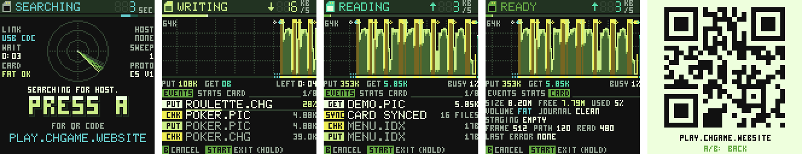
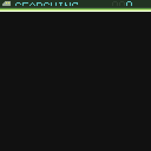

# CHSDtoSerial

> **Part of [CHGame](../../../../../../../../../README.md)**: a utility sketch, not a game. It is
> the helper the CHGame website uploads to manage the SD card over USB, so the card never has to
> leave the slot.

Upload it, plug the handheld in, and [play.chgame.website](https://play.chgame.website)
reads and writes the microSD card over the board's USB serial port: a browser
installs games and menus into `GAMES/`, backs the card up, reads files back,
and sends the board to the SD game menu, all without taking the card out.

It is [CHSDtoUSB](../CHSDtoUSB)'s cousin. CHSDtoUSB shows the card to a PC as
a USB drive; this one answers a framed request protocol
([PROTOCOL.md](PROTOCOL.md)) over the ordinary serial port, so the website
speaks to files directly. There are no mass-storage descriptors, no
formatting and no drive mount: the operating system never sees the card, and
the browser owns it while the helper runs. The same read-write SD driver
(CRC-checked, DMA) sits underneath.

The screen is CHSDtoUSB's instrument panel in the "secret agent" style the
apps share ([`Agent.h`](Agent.h), the spy-watch look that
[CHStlView](../CHStlView) carries too), in the website's own palette: dark
glass, lime, grey-greens, gold and coral. It only watches; nothing on it
changes an answer.

## Using it

| Button | Does |
|---|---|
| A | show the website's QR code (while no website is talking); any key puts it away |
| B | cancel the transfer: the command in progress finishes, the staging file is dropped and the card synced, then further transfers are refused (STOPPED) until the website's next HELLO |
| START held 3 s | back to the SD game menu, safely. An EXIT? box counts down; letting go before three seconds keeps the helper running. This is the platform's exit gesture, the same in every game |
| LEFT / RIGHT | the panel's page: EVENTS, STATS, CARD |
| UP / DOWN | scroll the event log |

Beeps mark files, the card, the website connecting, a cancel, the job's end
and the exit. Banners announce LINKED, RECOVERED, CRC ERROR and FAILED. There
are no particles: every millisecond the screen takes is one the card is not
serving the website, so it draws at most five frames a second while commands
stream, and not at all while nothing changes.

## The screen

From the top: a **status bar** with a small SD card in the state's colour and
the state (STANDBY, SCANNING, WRITING, READING, VERIFY, COMPLETE, READY,
STOPPING, STOPPED, ERROR, or the card's trouble: NO CARD, NOT FAT, RECOVERY),
beside a seven-segment readout of the link's data rate in KB/s. Under it a
**gauge**: the website's whole-job progress, else the file being received,
else how full the card is. Then the **graph**, one column per 125 ms of
traffic, auto-ranged: lime for data to the card, mint for data read back to
the website, gold where the card reads itself back to verify, coral for an
error or a replayed frame, with a mark for each event and a **strip** under
it colouring what every slice carried. The **totals** line gives bytes in and
out and the busy percentage, or the website's "LEFT m:ss" estimate.

While no website has called, or none has spoken for a minute, the graph's
place is taken by a **scope**: a sweep going round, contacts drifting through,
the time waited, and a large PRESS A FOR QR CODE. A then fills the screen with
the website's QR code for a phone.

The panel below has three pages (LEFT/RIGHT): **EVENTS** (the last eight by
file name, with live progress), **STATS** (bytes, files, peaks, commands,
duplicates replayed, frames dropped, failures, the stack's low-water mark)
and **CARD** (size, free space, journal state, staging, limits, the last
error).

## The protocol

[PROTOCOL.md](PROTOCOL.md) is the whole contract with the website: little
endian framed requests and answers, each with a CRC16, a stop-and-wait
request sequence with cached replay of duplicates, and whole-file CRC32
checks. File replacement is journaled, so a power cut during an install
leaves either the old file or the new one, never a torn one. Reads are
bounded. `CHSDtoSerial.ino` and `transfer.c` are that protocol; they are byte
for byte what the website was qualified against, so they change only together
with PROTOCOL.md and the browser side.

The card driver underneath avoids the pre-erase multi-block write path that
gave trouble on the qualification card: each sector is written with CMD24,
its CRC16 sent, the card's busy state waited out and its status checked.

## Building

It is one of the CHGame board package's examples (0.3.0 on): *File > Examples
> CHGame > Apps > CHSDtoSerial*, with CHGfx and the CHGame library in the
package.

The USB serial port **is** the protocol, so it builds with *Tools > USB*
**Serial (default)**, not the games' *Upload only*. Its `tools/game.py` pins
that (`usb=serial`) and the `GFX_CHUNK_ROWS=1` build define that keeps the
LCD's DMA scratch small, as the website's own build does. From the command
line, or the `chgame` tool from a clone:

    chgame --sketch CHSDtoSerial build
    chgame --sketch CHSDtoSerial upload

Release build: **46,700 B** of 50,944 (both save pages free, so a game's save
survives a trip through this helper) and **17,368 B** of 18,416 RAM, with
*Smallest + LTO*.

There is no debug build for the board: the serial port the library's debug
protocol would use is the website's protocol, so a `CHGAME_DEBUG` build stops
with a message that says so. The sketch was developed and driven on a PC in
the separate `SDtoSerial` project (a harness that plays the website against a
card image in RAM) and has run on the board as the website's helper; it is
not wired into this repository's simulator. See [NOTES.md](NOTES.md).

## Where it came from

`SDtoSerial` (`D:\LocalProjects\SDtoSerial`), a CDC-only variant of CHSDtoUSB
written for the website, with its screen in the apps' secret-agent style on
the CHGame library and its serial protocol kept exactly as the website
qualified it. It was brought into the board package beside CHSDtoUSB on
2026-10-06. [NOTES.md](NOTES.md) has what changed and what is open.

## Licence

`Sd2Card` derives from William Greiman's sdfatlib via the Arduino SD library
(GPL-3.0), and FatFs (its own permissive notice, `FatFs-LICENSE.txt`) reads
the card; this sketch as a whole is GPL-3.0 (see `LICENSE`).
