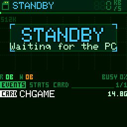

# CHSDtoUSB

> **Part of [CHGame](../../../../../../../../../README.md)**: a utility sketch, not a game. With it on the
> board, a PC sees the CHGame's microSD card as a USB drive, so files can be put on the
> card without taking it out (see the root `CLAUDE.md`).

Turns the CHGame into a USB microSD card reader. Upload it, plug the handheld
in, and the card shows up as a drive. The usual CHGame serial port stays
available next to the drive, so `arduino-cli upload` and the IDE's Upload
button keep working without any button presses.

While it works, the screen is an instrument panel for the card: a graph
with one column for every command the PC sends, the files the PC creates,
deletes, renames and moves (by name, as it happens), the speed, how full
the card is, and the session's numbers.

It is an ordinary sketch on the CHGame library: nothing in the core or the
serial bootloader was changed. The look is the "secret agent" one (a spy's
wristwatch) that [CHStlView](../CHStlView) shares with it through
`Agent.h`: green on black here, blue-teal there.

## Using it

| Button | Does |
|---|---|
| A | rescan the card: brings the drive back after it was ejected |
| START | toggle read-only (the PC is told the medium changed) |
| B held 1 s, or START held 3 s | detach and return to the SD game menu (a reset; with a bootloader older than the menu it just restarts this sketch). START held 3 s is the platform's exit gesture, the same in every game |
| B, held while powering on | **safe mode**: never take over USB, stay a plain CHGame serial device |
| LEFT / RIGHT | the panel's page: EVENTS, STATS, CARD |
| UP / DOWN | scroll the event log (the last 8) |

The LED lights while a command runs. Events beep: a soft tick for a file
created, deleted or renamed, a chirp for a card in or out, the PC
connecting or ejecting; read-only on and off, a format, new partitions, a
size milestone and a block given up on also pop up a banner over the graph.
Nothing else moves on the screen (no particles: the card's time is the PC's).

* **Swapping cards** works while it runs. The CHGame has no card-detect
  switch, so the sketch asks the card once a second whether it is still
  there; a pulled card makes the drive empty in Windows within about a
  second, and a new one is picked up and mounted without pressing anything.
* **Eject** in Explorer shows EJECTED; press A to bring the drive back
  without unplugging.
* **Read-only** takes effect at once for new writes; Windows picks up the
  change (either way) at its next media poll, a few seconds later.
* **Unplugging** is the same as with any USB stick: eject first if a copy
  was running. On battery the screen then says STANDBY.

## The screen

From the top:

* **Status bar.** A small SD card in the colour of the state, and the state:
  READY, READING, WRITING, EJECTED, NO CARD, STANDBY (no PC: not enumerated,
  or the PC is asleep) or SAFE MODE. A padlock when the card is read-only.
  On the right the speed over the last second in KB/s, in seven-segment
  digits, with an arrow: up, data going to the PC; down, to the card.
* **Fill gauge**, the 2-pixel line under it: the card's used space. Amber
  from 90 %, red from 97 %. It moves as files come and go.
* **The graph.** One column per READ or WRITE command, the newest on the
  right; its height is that command's speed (the top is 512 KB/s, about
  what full-speed USB allows, with rules every 128 KB/s). Green is a read,
  amber a write, red a block that needed a retry or failed. The graph moves
  only when the PC sends a command, so an idle reader keeps showing the last
  128. The vertical rules, every 16 commands, move with it. A command that
  changed a file carries a marker above it: **+** created, **x** deleted, a
  diamond renamed, moved, edited or formatted.
* **The strip** under the graph: what each command touched. Green or amber,
  file data; cyan, a directory; gold, the FAT; white, the boot sector,
  FSInfo or partition table. A PC mounting the card reads gold (the FAT);
  copying a file is amber with cyan and gold ticks (its directory entry
  and its clusters).
* **Totals**: bytes read (R) and written (W) since the reader started, and
  BUSY, the share of the last second spent in commands (Task Manager's
  "active time").
* **The panel**, three pages:
  * **EVENTS**: the last 8 events, newest on top, four at a time (see below).
    A file being written shows how far along it is, with a bar.
  * **STATS**: bytes, commands and the fastest command for each direction;
    BUSY, commands a second (IOPS) and the average command size; files and
    folders created and deleted, renames, edits; blocks that needed a CRC
    retry, and failures. Its tab row shows how long the reader has run.
  * **CARD**: the card's maker, product name, revision, serial number and
    date (its CID register); its type, size, file system and label; cluster
    size, where the partition starts, the size of the FATs; used and free.
* Over the graph, a box for the states with nothing to graph: STANDBY,
  NO CARD, EJECTED, SAFE MODE, each saying what to do.

The screen is only drawn between commands, never during one, and only
when something on it changed: an idle reader does not redraw at all. While
commands stream it draws at most 5 frames a second, and the bottom panel
only when what it shows changed (at most twice a second, at once for a new
event), so most frames send only the top 82 rows to the panel.

## What it can tell about your files

The PC only ever asks a card reader for blocks: "read 128 blocks at block
16076", "write these 8 blocks". The reader knows nothing of files. But a
FAT card describes itself, and the blocks going past say the rest:

* When a card goes in, the reader reads its partition table, boot sector
  and FSInfo. From then on it knows which blocks are the FAT, the root
  directory and the file data, and how much space is free.
* A directory is just blocks of 32-byte entries, one per file: name, size,
  first cluster, times. When the PC writes a directory block, the reader
  compares it with the last copy of that block that went past (the PC read
  it before changing it; the reader keeps the last 12 directory blocks it
  saw, as a few bytes of signature per entry). An entry that appeared is a
  file created; one marked deleted is a file deleted (its name is still in
  the deleted entry); one whose size or time changed was written to. A file
  that disappears in one place and appears in another with the same
  cluster and size within 3 seconds was renamed, or moved if the name is
  the same.
* Directory blocks in the data area are recognised by their shape (every
  entry well formed), which file data practically never has.
* File data written after a file is created counts towards that file. When
  the PC sets the file's size first, as Windows Explorer does, that is a
  percentage.
* The free space follows the files created and deleted, and is set exactly
  whenever the PC writes FSInfo (Windows does on eject). On FAT16 the
  reader counts the FAT when the card goes in.

None of this reads the card: it looks at blocks the PC moves anyway, a few
microseconds a block (a directory block: about 0.2 ms).

The events:

| Tag | Means |
|---|---|
| NEW / DIR+ | a file / a folder created (with the file's size) |
| DEL / DIR- | a file / a folder deleted |
| REN, MOVE | renamed; moved to another folder |
| EDIT | an existing file's size or time changed |
| CARD | a card went in (its label and size) or came out |
| USB | the PC enumerated the reader |
| EJCT | the PC ejected the card |
| LOCK, RW | read-only on, off (START) |
| FMT | the PC formatted the card (new boot sector: a new serial or layout) |
| PART | the PC rewrote the partition table |
| CRC | a block arrived with a bad CRC and was read or written again (fixed) |
| FAIL | a block failed every try; the PC got an error |
| GOAL | 100 MB, 250 MB, 500 MB, 1 GB, 2, 5, 10, 20, 50 GB read or written |

**Limits.** Names are long names when the long-name entries are in the same
512-byte block as the file's entry, else the short 8.3 name. Events need
the directory block's earlier copy: a directory the PC last read more than
12 directory blocks ago can change unnoticed (rare: the PC reads a folder
when it opens it). FAT12/16/32 only: on an exFAT card (most cards over
32 GB come that way) the graph, the strip and the numbers work, file events
do not. The PC's own cache decides what it sends: a file Windows already
has in memory is "read" without the card hearing of it.

### Serial status line

Sending any byte to its serial port returns one line:

    R 50477 W 16569 RETRY 0 FAIL 0 WRETRY 0 WFAIL 0 CARD 30547968 RW CONNECTED

Blocks read and written; block reads retried and given up on; block writes
retried and given up on; card size in 512-byte blocks (0 = no card); RW or
RO; and the state. Open the port at any rate except 1200, which is the
upload handshake.

`U` returns how long the screen takes to draw instead:

    UI FRAMES 1234 AVG 4950 MAX 7800 ROWS 85

Frames drawn, the average and longest drawing time in microseconds, and
the rows flushed to the panel per frame on average.

## Built to be trusted with your files

* **Every block read is CRC-checked.** The card sends a CRC16 with each
  block; it is checked while the block is still arriving by DMA. A
  mismatch, or a block that never arrives, restarts the read at that block
  (up to 4 tries) before the PC is told the read failed.
* **Every block written is CRC-checked by the card.** CRC checking is
  switched on in the card (CMD59), each block goes out with its CRC16, and a
  block the card rejects is sent again from a fresh write command, up to 4
  tries. A bit flipped on the wire is never stored.
* **Every command carries its CRC7**, so the card refuses a command whose
  block address was garbled instead of reading or writing the wrong block.
* **Nothing is left half-done.** A bus reset, a mass-storage reset, the PC
  going to sleep, or an upload request in the middle of a transfer closes
  the card's read stream or write run properly first.
* **The USB protocol never wedges.** Unknown commands, reads past the end,
  and data phases that do not match the command are refused with proper
  SCSI sense data, without ever stalling the pipe.
* **Slow cards are waited for.** One test card takes up to 0.8 s to start
  a block it has never been written to, well past the SD spec's 100 ms;
  reads wait up to 1.5 s per try, so imaging a whole card still works.
* **Block 0 is writable**, so the PC can partition and format the card.

## Measured on hardware

Windows 11, a 16 GB FAT32 card, release build:

| | |
|---|---|
| Raw read, 64 KB commands | 491 KB/s |
| Raw write, 64 KB commands | 406 KB/s |
| File write (then flushed) | 376 KB/s |
| File read, uncached | 447 KB/s |
| Upload while mounted (1200-baud touch, re-enumerate, flash, run) | 6.3 s |

Reads are close to what full-speed USB delivers to a device like this one:
it can only have one 64-byte packet ready at a time, and the PC comes back
for the next one about once per 125 us microframe, which caps a transfer
at about 512 KB/s. Writes also wait for the card to program each block.

These figures are from the first screen (a card icon and four numbers,
redrawn 8 times a second with a blocking 8.4 ms flush). The instrument
panel has not been measured on the board yet. What it should cost,
counted on an emulated RV32 core (its code compiled for RV32IMAC at -Os,
5 cycles an instruction from flash, 2 from SRAM):

| | |
|---|---|
| A frame while commands stream (top 82 rows) | ~5 ms to draw, then a 5.4 ms flush by DMA |
| A frame with the bottom panel too (at most 2 a second) | ~7.5 ms, then the full 8.4 ms flush |
| Frames while commands stream | at most 5 a second |
| Watching a block of file data go past | ~8 us (the block takes ~1 ms on the wire) |
| ... a directory block | ~0.2 ms |

A command that arrives while a frame is drawn or flushed waits for it (the
panel and the card share SPI1). Frames only fall between commands, so with
64 KB commands there is about one every other command. In the simulator,
with these costs in its timing, copying five photos took 2.4 % longer with
the screen on than with it off, and a PC's mount (reading the whole FAT)
1.8 % longer (measured with CHCasino's simulator, before the move onto the
library; `chgame run -D CHSIM_NOSCREEN tools/scripts/demo.txt out/off` is
the screen-off run in this one). The first screen, with its blocking flush
after nearly every command, cost about 6 % by the same arithmetic. `U` on
the serial port reports the real drawing times.

## Testing

`tools/chsd_test.py` checks all of the above against the attached board,
from Windows, without administrator rights (raw SCSI goes through the
drive's volume handle):

    python tools/chsd_test.py              # all tests
    python tools/chsd_test.py --list

It needs Python 3 with `pyserial`. Most of it wants the **test build**,
which adds serial commands that stand in for the buttons (A, START, pulling
the card) and inject faults (garbled blocks on the way in and out, blocks
that fail every try, at the start of a command and in the middle):

    arduino-cli compile -b CHGame:ch32v:rev0:opt=osstd --build-path build/test --build-property build.extra_flags=-DCHSD_TEST=1 .
    arduino-cli compile -b CHGame:ch32v:rev0:opt=osstd --build-path build/release .

The test build says TEST in its status bar and at the end of its status
line. What the tests cover:

* **scsi** - 27 protocol checks: INQUIRY, MODE SENSE, capacities, unknown
  opcodes with and without data, reads past the end and at LBA 0xFFFFFFFF,
  data phases of the wrong length and direction, the drive still answering
  after each.
* **raw** - raw writes from 1 to 128 blocks at odd offsets, 64 single-block
  writes in a row, and 1 MB in 64 KB commands, all read back and compared;
  block 0 written.
* **faults** - reads and writes with 1 block in 50 garbled come back
  correct via retries (and, as a control, the card does not reject bad
  CRCs once its checking is off); blocks that fail every try give MEDIUM
  ERROR and leave the drive working.
* **files** - a tree of 100+ files of awkward sizes, renames, deletes and an
  8 MB file, all read back uncached and compared.
* **readonly**, **eject**, **swap** - the button and card-swap paths, with
  Windows' side of each checked.
* **upload**, **upload_busy** - uploads while mounted, and in the middle of
  a long read and a long write; the card must work after.

What it touches on the card: files only inside `\CHSD_TEST` (deleted at the
end), and raw blocks only in the unpartitioned gap between the partition
table and the first partition (saved first, put back after; skipped on a
card without such a gap). Block 0 is rewritten with its own contents.

### The screen in the simulator

The screen and the event detection run on a PC too, in the repository's
simulator, against a pretend PC that formats a 16 GB card and uses it the
way Windows Explorer does (mount, browse, copy in with the size set first
and the data in 64 KB writes, copy out, rename, move, delete, format,
eject):

    chgame run tools/scripts/demo.txt out/demo     # the demo session's screens
    chgame run tools/scripts/edge.txt out/edge     # CRC retry, Linux's dirty flag, read-only, swap, format
    chgame gif                                     # docs/gameplay.gif, from tools/scripts/gameplay.txt
    python tools/screens.py                        # docs/screens.png, from demo.txt

`tools/chsim/pcsession.py` writes the PC's commands (the scenario named
like the script), `tools/chsim/host/pc_host.cpp` plays them as the USB
stack would and `card_host.cpp` is the card; `UsbMsc.cpp` and
`Sd2Card.cpp` are compiled out there. A frame lasts its period (40 ms) and
the PC works through it; a command waits for a panel flush in flight, so
the screen's cost shows in the throughput as on the board. In a script,
`pcto NAME` lets the PC run to the session's marker of that name and
`state` prints where it is. Runs are deterministic, and `chgame check`
runs each script twice and compares the frames.

## How it works

`UsbMsc.cpp` is a small USB device stack for the CH32X035's USBFS
peripheral:

* **Taking USB over from the core.** The core always links its own USB
  interrupt handler and runs a CDC serial port. The sketch disables that
  interrupt, tells the core's `Serial` it is no longer enumerated, pulls
  the D+ pull-up off (the pull-up is `AFIO->CTLR` UDP_PUE; clearing
  `USBFSD->BASE_CTRL` alone does *not* disconnect), waits 400 ms so the host
  sees an unplug, and reconnects as a new device.
* **Composite device**, VID:PID 16C0:27DD like the core and bootloader,
  serial number "CGM" + chip UID so Windows treats it as a new device:
  interface 0-1 CDC-ACM (with an IAD), interface 2 Mass Storage,
  Bulk-Only Transport, SCSI transparent command set.
* **Uploading still works** because the CDC function implements
  SET_LINE_CODING: 1200 baud with DTR low detaches and calls
  `chgame_enter_bootloader()`, exactly what the core does, so
  `chgame-upload` finds the bootloader on the usual port.
* **Polled, not interrupt-driven.** The loop services the USB flags; while an
  event is pending the hardware NAKs the host (`UC_INT_BUSY`), so a slow loop
  costs speed, never data. The LCD and the card share SPI1, so the screen is
  only redrawn between SCSI commands.
* **SCSI:** TEST UNIT READY, REQUEST SENSE, INQUIRY, MODE SENSE (6/10, with
  the write-protect bit), START STOP UNIT (eject and load), PREVENT/ALLOW
  MEDIUM REMOVAL, READ FORMAT CAPACITIES, READ CAPACITY (10), READ (10) as
  one CMD18 stream, WRITE (10) as one CMD25 run, VERIFY, SYNCHRONIZE CACHE.
  A command that fails ends its data phase with a short packet (or by
  swallowing what the host sends) and a failed CSW, so the host never needs
  its reset-recovery path; BOT reset, Get Max LUN and CLEAR_FEATURE(HALT)
  are handled anyway.

`Sd2Card` is the fast Sd2Card driver from CHStlView (register-level SPI with
DMA, CMD18 streaming), plus CRC7 on every command, CRC16 on data (checked
alongside the read DMA, computed alongside the write DMA), DMA block writes,
card-presence checks and a quick probe of an empty slot. `CHSDtoUSB.ino`
puts the retries on top.

`Monitor` watches the blocks go past (see "What it can tell about your
files"): every block read or written is handed to it after its CRC
checked out, and every command's start and end, for the graph's speed.
`Ui` draws the screen from what it gathered.

## Building

It is one of the CHGame board package's examples (0.3.0 on): *File >
Examples > CHGame > Apps > CHSDtoUSB*, with CHGfx and the CHGame library
in the package. With 0.2.4, add the CHGfx and CHGame libraries from this
repository's [`platform/board/arduino/CHGame/libraries`](../../../..).

Board **CHGame Rev0**, *Tools > Optimize* **Smallest (-Os)** (43.3 KB of
50.9 KB and 17,064 B of RAM; with *Smallest + LTO*, the package's default,
38.0 KB and 16,476 B). From the command line:

    arduino-cli compile -b CHGame:ch32v:rev0:opt=osstd CHSDtoUSB
    arduino-cli upload  -b CHGame:ch32v:rev0:opt=osstd -p COMx CHSDtoUSB

The first screen (before the instrument panel) was tested on the board
with *Smallest (-Os)*; this one, and the move onto the CHGame library,
have run only in the simulator so far. There is no debug build for the
board: the sketch takes USB over, so the library's debug protocol has no
port (a debug build stops with an error), and the simulator is where it
is driven.

Once it runs, the board appears on a new COM port (its serial number
changed); upload to that one next time.

Bring-up option: `--build-property build.extra_flags=-DCHSD_AUTOBOOT_MS=60000`
makes the sketch return to the bootloader after 60 s no matter what state
USB is in, so an experimental USB change can never lock you out.

If the board is ever unreachable: hold B while switching it on, then upload
something else. With the SD menu bootloader that keeps the board in the
bootloader's USB upload mode (it never starts this sketch); with an older
bootloader it starts this sketch in safe mode. The bootloader's BOOT-button
recovery is the last resort
([`platform/board/docs/recovery.md`](../../../../../../../../../platform/board/docs/recovery.md)).

On a card for the SD game menu ([`docs/sd-menu.md`](../../../../../../../../../docs/sd-menu.md))
this sketch is the "SD CARD READER" entry: pick it, copy games into `GAMES/`
from the PC, eject, then hold B (or switch off and on) to go back to the menu.

## Limits

* Tested with Windows 11 only. macOS and Linux speak the same standard
  protocol and should work, but have not been tried.
* Cards up to 2 TB (READ/WRITE (10), 32-bit block numbers), one at a time.
* Full-speed USB: about 0.5 MB/s, as above.
* An upload, B held, or a pulled cable in the middle of a copy interrupts
  that copy, as unplugging a USB stick would.
* File events on FAT12/16/32 only (see "What it can tell about your files").

## Licence

`Sd2Card` derives from William Greiman's sdfatlib via the Arduino SD library,
licensed under the GNU General Public License v3; this sketch as a whole is
therefore GPL-3.0 (see `LICENSE`).
