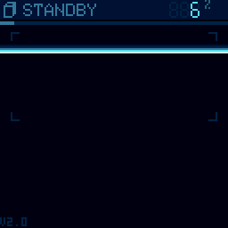

# CHStlView: STL Viewer

Pick a 3D model off the SD card and turn it in your hands: the same `.STL`
files you would send to a 3D printer, drawn as a depth-cued wireframe on a
48 MHz chip with 20 KB of RAM, on a secret agent's watch: CHSDtoUSB's
instrument panel, in the same blue-teal as the wires.

## Controls

| Where | Button | Action |
|---|---|---|
| Card list | UP / DOWN | Move (hold to repeat) |
| | LEFT / RIGHT | A page up / down |
| | A | Open the model or folder |
| | B | Up a folder |
| | START | Read the card again |
| Viewer | D-pad | Turn the model (stops the spin) |
| | A / B (hold) | Zoom in / out, x0.25 to x16 |
| | A + B | Reset the view |
| | SELECT | X-RAY (every edge) / FRONT (only the faces towards you) |
| | START | Spin on / off |
| | START (hold) | Back to the list |

## What it reads

- **Binary STL**, any size, in any folder of a FAT16 or FAT32 card. Most
  CAD tools and slicers write binary; an ASCII STL (OpenSCAD's) is refused
  with a message to re-export it.
- **8.3 names**: the card is read with CHSd, which sees short names, so
  `my_bracket.stl` is listed as `MY_BRA~1.STL`. Rename to 8 characters to
  keep them readable.
- **Fragmented files** are followed up to 16 pieces; past that, copy the
  file onto a freshly formatted card.

## How to use it

The HUD comes up for three seconds after any button: a status bar with the
name and, in seven-segment digits, the frame rate while it moves or how
long the full render took at rest; a gauge under it for how much of the
model is drawn; the size of the bounding box in file units (usually mm)
and the triangle count, or `OPEN` in red if the mesh is not closed;
brackets locked onto the model; an XYZ gizmo (X red, Y teal, Z white); and
along the bottom the modes as tabs and the zoom.

Small models open spinning. A model that takes more than 100 ms a frame
opens still and builds up on screen; while you turn it you see a **draft**,
its bounding box and 256 points sampled from the surface when it was
opened, drawn from RAM at full frame rate, and the full model streams in
again when you let go.

The models in `sdcard/MODELS` (a cube, an icosphere, a gear, a bowl, a
torus and a 12,800-triangle knot) are a good first card: copy the folder to
the card's root. Install the CHGame board package
([Installing](https://github.com/bateske/CHGame#installing)) and open
*File > Examples > CHGame > Apps > CHStlView*, or from a clone run
`chgame upload` in this folder; the release's SD card zip has it in its
menu as STL VIEWER.

## Developer notes

- **Nothing of the mesh is kept in RAM.** Every frame streams the file off
  the card with CHSd's `sd::stream()` (one CMD18 per piece, each block
  landing by DMA while the one before is drawn) and transforms each
  50-byte triangle as it goes past. [StlRender.h](StlRender.h) has the
  reasoning: integer-only maths from the float bits, each edge of a closed
  mesh drawn once with no adjacency data, and a 4-bit "nearest wins"
  z-buffer that comes free with the palette's order.
- **The card is CHSd's**, the platform's MIT SD library: `fat::list()`
  walks the folders, `fat::runs()` maps a file to its blocks
  ([Card.cpp](Card.cpp)).
- **The library does the rest**: `chgame` buttons and pacing, `pal::` with
  the app's own palette (the wires are slots 7-15 in brightness order),
  `audio::` beeps, the debug protocol (`H` reports the open model), and
  `chgame/Sizzle` with no particles, only its banners and shake
  ([Fx.h](Fx.h)).
- **The secret agent chrome** ([Agent.h](Agent.h)) is the same file as
  CHSDtoUSB's, taken from its instrument panel: the status bar and its
  seven-segment readout, gauges, tag and key chips, tabs, brackets and the
  alert box, all spans and the 3x5 font.
- **Only what changed goes to the panel**: at rest nothing is redrawn; a
  model turning without its HUD sends only its own box and where it was
  last frame ([Viewer.cpp](Viewer.cpp)).
- Sizes, the simulator's card, the accuracy test and open items:
  [NOTES.md](NOTES.md).

## Credits

By bateske, MIT ([LICENSE](LICENSE)). Built on the CHGame library, CHGfx
and CHSd.
