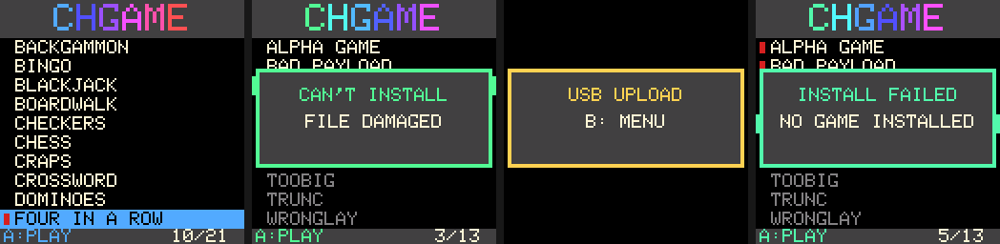
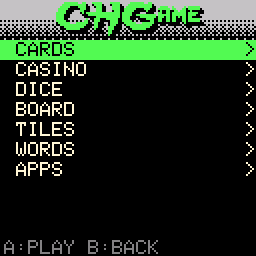
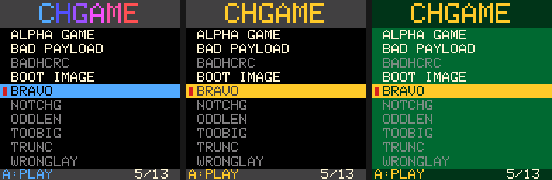

# CHGame bootloader with the SD game menu

The CHGame's permanent bootloader (flash 0x0000-0x2FFF, 12 KB), extended
with a game menu that installs games from a FAT microSD card. It keeps USB
uploading, the recovery paths and the memory map of the 0.2.4 bootloader.
The players' guide is [docs/sd-menu.md](../../docs/sd-menu.md). The
package format and what a game needs to know are in
[docs/chg-format.md](../../docs/chg-format.md).





## What it does

```
reset -> read and clear the boot request (16 B retained at 0x20000000)
 |- RUN "CHGR" and the installed program is valid -> jump to it (nothing else touched)
 |- USB "CHGB" (1200-baud touch, CHSDtoUSB, debug 'B') -> USB upload mode, panel says so
 |- B held at power-on                             -> USB upload mode, card and panel untouched
 '- otherwise (power-on, any other reset)
      pins to safe levels; panel reset; the card is read during the panel's 120 ms waits
      |- no card / no FAT volume / no packages: program valid -> RUN reset (no menu, as before)
      |                                         else          -> "NO GAMES FOUND" + USB mode
      '- the menu: /GAMES/*.CHG by title, the installed game marked and preselected
           A on the installed game -> RUN reset (no flash write)
           A on another game       -> install, then RUN reset
           USB upload starts       -> "USB UPLOAD", protocol only (HELLO/STATUS/READ don't count)
USB mode has no timeout; a fresh press of B returns to the menu.
```

**Leaving a game.** A game returns to the menu with a plain reset, so no
request is involved. The casino games do this when START is held for 3 s
(their shared `CHGame` core; [docs/sd-menu.md](../../docs/sd-menu.md)). The
reset flags show that the power did not go off, so a B still held then is
not taken for the power-on escape. The menu ignores keys that are already down when it appears, so the
START still held does not start anything.

**The install** (`src/install.c` over `src/update.c`, the same transaction a
USB upload uses):

1. **Pass 1, nothing erased.** Check the header (magic, header CRC, format,
   target and layout ids, payload size against the file size). Refuse a
   bootloader image (signature `CHBL`). Stream the whole payload along its
   FAT chain and check its CRC.
2. **Pass 2.**
   - Erase the metadata page: the installed program is invalid from this
     instant.
   - Write the payload page by page. Pages whose flash already holds the
     same bytes are skipped. Each page is read back. A card read error
     re-initialises the card and retries twice.
   - CRC what is now *in flash* against the header.
   - Program the metadata page last, without a second erase.
3. **Start it.** Wait for every key to be released, then RUN reset.

A power cut at any point leaves either the complete new program or no valid
program. Never a partial one, never the old one after the erase began. The
boot region is never written. The native suite cuts the power at every flash
operation of an SD install and of a USB upload and checks exactly this.

## Differences from the spec (`CH32SDBootloader.md`)

The spec was the baseline. These are the decisions taken with the owner, and
the measurements behind them.

| Spec | Here | Why |
|---|---|---|
| No LCD, font or menu in the bootloader; a `MENU.CHG` launcher installed into application flash | The menu is in the bootloader | Showing a flash-installed launcher would erase the game every time; the owner's goal is no flash wear. It fits: release build 12,032 B of 12,288 B. |
| Game first at power-on; the menu on request | The menu at every power-on, the installed game preselected | Arduboy FX behaviour, and free now: showing the menu writes nothing. |
| Launcher copies the game to `UPDATE.CHG`, the bootloader installs that fixed name | The bootloader reads `/GAMES/*.CHG` itself; no SD writes at all | No FAT write code, no card corruption on a power cut, no 50 KB copy. |
| Fall back to raw sectors if FAT does not fit | FAT16 + FAT32, MBR or superfloppy, any fragmentation | Fits (FAT 864 B + SD 770 B without LTO). |
| Petit FatFs vs custom reader | The custom reader: a C port of CHSd's `Fat.cpp` | CHSd is already in the repository, tested against FAT16/FAT32 images and smaller than Petit FatFs in its read-only configuration. |
| (keep USB recovery) | USB upload unchanged, plus RUN by reset, no double erase, the bootloader signature | See below. |

**The decision gates (spec section 41):**
- **A.** The 12 KB reservation is kept and `APP_START` stays at 0x3000; see
  [SIZES.md](SIZES.md).
- **C.** Retained request plus reset is the only way the bootloader starts a
  program.
- **D.** Fragmentation is always supported.
- **E.** CMD17 single-block reads.
- **F.** Polled SPI, no DMA.
- **G.** The proven 256 B erase/program is kept.

## Changes to the 0.2.4 code (all covered by the native tests)

- **`update.c`, the shared flash transaction.**
  - BEGIN no longer pre-erases the image: each page was erased twice per
    upload.
  - Identical pages are skipped.
  - The metadata page is programmed without a second erase. It is the page
    every install erases, so this halves its wear.
- **RUN resets with a RUN request** instead of jumping, so a program always
  starts from reset state. `jump_to_app()` runs only at the very top of the
  boot.
- **The bootloader signature.** The release image carries `CHBL` in a
  reserved vector slot (offset 8), and `appmeta_check()` refuses any image
  that carries it. A bootloader staged for self-update can then never be
  launched as a program, even if the host stops between staging and
  promoting it. The Python uploader (`host/py`) also unlocks before staging.
- **Trims.**
  - The Arduino core 0.2.4's direct-register `USB_init`.
  - No `atexit`/`__libc_init_array`.
  - No SPL GPIO/RCC calls.
  - A 2 Hz blink in USB mode instead of the LED pattern module.
  - No `memcpy`.
- **`fault.c`** writes the write-only GPIOB `CFGHR` whole.
- **`BOOT_VERSION` 2**, reported by HELLO.
- **Unchanged:** the protocol, the HELLO/STATUS/READ payloads, the USB
  identity, the memory map, the metadata format, the self-update commands,
  the retained-block address and the `CHGB` request. Core 0.2.4 sketches and
  both host uploaders work as before.

## Building

```
./build.sh [release|locked|nomenu|app] [--theme=rainbow|plain|casino] [--nolto]
```

The toolchain comes with the board package (`arduino-cli core install
CHGame:ch32v@0.2.4`) and is found in the usual Arduino folders, or set
`CHGAME_TOOLCHAIN`. On Windows, use Git Bash. Output goes to
`build/<mode>/chgame_boot.{bin,elf,map,lst}` (`build/<mode>-<theme>/` for
another theme), and a size report is printed.

| Mode | What | Size |
|---|---|---|
| `release` | menu + USB upload + developer self-update. **The one to install.** | 12,032 B |
| `locked` | `release` without self-update; later bootloader updates then need the factory ISP | 11,712 B |
| `nomenu` | USB upload + self-update, the old boot decision on the new code (hardware step HW2a) | 5,896 B |
| `app` | the menu as a program linked at 0x3000: a dry run of card, panel and keys under any bootloader, with no USB and no flash writes (HW1) | 7,100 B |

`tools/dist.sh` builds all four into [release/](release) with
`SHA256SUMS`. Two runs give identical files.

### Colour themes



The theme is chosen when the bootloader is built: `--theme=`, or
`MENU_THEME` at the top of `src/menu.c`.

| Theme | Looks | Release size |
|---|---|---|
| `rainbow` (default) | black list, dark grey header and footer. The title, the bar and the footer label run through the colour wheel, about 4 s a turn | 12,032 B |
| `plain` | the same, with a gold accent and no animation | 11,864 B |
| `casino` | the first look: the casino games' green felt and gold | 11,856 B |

- **No flicker.** In the animation each pixel is written once per step.
- **Boxes take the colour of the moment they appear.** This covers the
  messages and the install bar. The USB-notice screen comes straight after a
  reset, so it is gold.
- **If the bootloader ever needs bytes**, `plain` gives back 168 B.
- `python3 tools/screens.py` redraws the pictures in `docs/` after
  `test/native/run_tests.py -k boot`.

## Changes after the first hardware run (2026-10-01)

Found on a real board ([test/hil/RESULTS-2026-10-01.md](test/hil/RESULTS-2026-10-01.md)),
fixed and tried on that board again. Both cost no flash.
- **The B escape tests the power-on flag** (`hal_soft_reset()`, `hal.h`).
  It tested the software-reset flag, which the chip also sets at power-on,
  so B was never read and the menu always appeared.
- **The box is 8 pixels wider and the progress bar runs under the title.**
  A title is drawn 114 pixels wide and covered the inner border column of
  the 112-pixel box. The bar starts and ends where the title field does.
- **Run through the native tests on 2026-10-02.** The suite now also runs
  on Windows (see Testing). All of it passes; the twelve frames with a box
  were re-pinned in `frames.json`, and the pictures in `docs/` redrawn. The
  host model of the reset cause needed no change: `hal_soft_reset()` is
  modelled as a whole ("software reset and not power-on"), not flag by flag.

## Testing

```
python3 test/native/run_tests.py            # about 30 s; needs cc and Pillow
```

On Windows the harness cannot run natively (it forks a process per boot).
There `run_tests.py` cross-compiles the test programs for Linux with zig
(`pip install ziglang`) and runs them under WSL: any distribution, even
Docker Desktop's, since the programs are static. That mode has UBSan but
not ASan. `$CHBOOT_WSL` names the distribution, `$CC` forces a native
compiler.

The portable sources are compiled for the PC against `test/native`'s
hardware layer:
- **`host_hal.c`**: a fake flash that tears the operation at a chosen power
  cut, the retained block, the virtual clock, scripted keys and a fake USB.
- **`sd_model.c`**: an SPI-level SD card. It covers SDSC v1/v2 and SDHC,
  slow initialisation, access time, error tokens and timeouts, and cards an
  MCU reset left in the middle of a multi-block read or write.
- **`lcd_model.c`**: an ST7735 that turns the real SPI byte stream into the
  picture on the glass and flags timing violations.

Each boot runs in a fresh process, so statics start from zero as after a
real reset; flash, the card and the panel persist in shared memory.

| Suite | Covers |
|---|---|
| core_nomenu / core_menu / core_locked | the update path, the protocol (probes vs claims, resync after noise), self-update, the boot decision, a power cut at every flash operation of a USB upload |
| sd | the SD driver against the card model, the FAT reader against FAT16/FAT32 images (MBR, superfloppy, partition 4, fragmented files and folders, decoy labels, four kinds of broken chain, exFAT, blank), every package error |
| boot | no card, empty card, menu, install, switch, every bad package, USB notice, B escape, a probing host, upload at the menu, the card dying mid-install, a power cut at every flash operation of an SD install |
| boot_real | the real card from `tools/sdcard/mkcard.py`: all 21 packages installed in turn, each over the last, checked |
| frames | 26 menu screens pinned by hash in `test/native/frames.json`: 10 in the default theme, 8 each in `plain` and `casino` (the `boot_plain`/`boot_casino` runs). PNGs are in `test/native/build/frames/` |

The hardware steps are in [HARDWARE.md](HARDWARE.md).

## Installing it on a board

- **From the Arduino IDE, over USB** (any board that has a bootloader with
  self-update, the 0.2.4 one included): *Tools > Bootloader* **SD game
  menu**, *Tools > Programmer* **CHGame USB**, *Tools > Burn Bootloader*.
  No driver, no buttons. The installed sketch is erased. It needs a board
  package that carries this bootloader and `chgame-upload` 0.2.0 (the next
  release; [docs/roadmap.md](../../docs/roadmap.md)).
- **By hand, the same thing:** `chgame-upload selfupdate
  release/chgame_sdboot.bin` ([host/go](host/go/README.md)), or
  `chgame uploader selfupdate release/chgame_sdboot.bin --yes` (the Python
  uploader, `host/py`).
- **Factory ISP:** hold BOOT across power-on, then `wchisp flash
  release/chgame_sdboot.bin`.
- **The first time:** [HARDWARE.md](HARDWARE.md) has two routes. The direct
  route goes straight to `chgame_sdboot.bin`, with fallbacks. The staged
  route is HW1, HW2a, HW2b.
- **The Arduino IDE caveat.** The installed board package 0.2.4 offers only
  the factory ISP and writes its own 0.2.4 bootloader. The Bootloader menu
  and the USB programmer are in `platform/board` and come with the next
  release.

## Files

| Path | |
|---|---|
| `src/boot.c` | the boot decision, USB mode, `boot_reset()` |
| `src/menu.c`, `lcd.c`, `font5x7.h` | the menu and its themes, the panel, the font (capitals only) |
| `src/install.c`, `update.c` | the SD install and the flash transaction it shares with USB |
| `src/sd.c`, `fat.c` | SD card and FAT: a C fork of CHSd 1.0.0 (CLAUDE.md rule 4: changes found on hardware go back into CHSd too) |
| `src/chg.c`, `shared/chg_format.h` | the package header |
| `src/hal.h` | pins, SPI, keys, LED: `static inline` on the board, functions on the PC |
| `src/proto.c`, `usb.c`, `flash.c`, `appmeta.c`, `jump.c`, `startup_chgame_boot.S`, ... | CH32SerialBoot 0.2.4, changed as listed above |
| `shared/chgame_bootreq.h` | the boot request reasons |
| `vendor/` | WCH SPL and the USB CDC stack (`vendor/usbcdc/VENDORED.md` lists the changes) |
| `host/go/` | `chgame-upload`, the Go uploader the board package installs ([its README](host/go/README.md)); built by `python tools/release/build_uploader.py` |
| `host/py/` | `chgame_upload`, the same uploader in Python (every verb and flag of the Go one): what the repository's tools and the hardware tests use (`python -m chgame_upload`, `chgame uploader`). `test/protocol/vectors.json` keeps the two in step |
| `test/protocol/` | the uploaders' parity tests (`python -m unittest discover -s platform/bootloader/test/protocol`, `go test` in `host/go`) |
| `test/hil/` | CH32SerialBoot's hardware tests |
| `test/native/` | the PC suite |
| `tools/` | `size_report.py`, `dist.sh`, `screens.py` (the pictures in `docs/`), `bootcheck.py` (boot region read back over USB), `chgame_map.py`, `mkimage.py` |

## Where it came from

It began as the bootloader of CH32SerialBoot v0.2.4 (5de3006): that
repository's `bootloader/` flattened into this folder, plus `shared/`,
`host/py/`, `host/go/`, `test/` and two `tools/` scripts. CH32SerialBoot is frozen; this
folder is the bootloader's home, and the list of changes above is measured
against that starting point. MIT licence ([LICENSE](LICENSE)); third-party notices in
[THIRD-PARTY.md](THIRD-PARTY.md) and [NOTICE](NOTICE).
