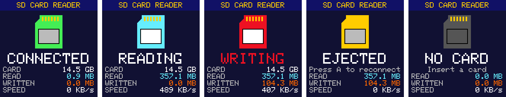

# CHSDtoUSB

> **Part of [CHGame](../../README.md)**: a utility sketch, not a game. With it on the
> board, a PC sees the CHGame's microSD card as a USB drive, so files can be put on the
> card without taking it out (see the root `CLAUDE.md`).

Turns the CHGame into a USB microSD card reader. Upload it, plug the handheld
in, and the card shows up as a drive. The usual CHGame serial port stays
available next to the drive, so `arduino-cli upload` and the IDE's Upload
button keep working without any button presses.

It is an ordinary sketch: nothing in the CHGame core or the serial
bootloader was changed.

## Using it

| Button | Does |
|---|---|
| A | rescan the card: brings the drive back after it was ejected |
| START | toggle read-only (the PC is told the medium changed) |
| B held 1 s, or START held 3 s | detach and return to the SD game menu (a reset; with a bootloader older than the menu it just restarts this sketch). START held 3 s is the platform's exit gesture, the same in every game |
| B, held while powering on | **safe mode**: never take over USB, stay a plain CHGame serial device |

The screen shows the card size, what the PC is doing (WAITING FOR PC,
CONNECTED, READING, WRITING, EJECTED), how much has been read and written,
and the transfer rate. The LED lights while a command runs. RETRY and FAIL
counters appear if a block ever had to be read or written again.

* **Swapping cards** works while it runs. The CHGame has no card-detect
  switch, so the sketch asks the card once a second whether it is still
  there; a pulled card makes the drive empty in Windows within about a
  second, and a new one is picked up and mounted without pressing anything.
* **Eject** in Explorer shows EJECTED; press A to bring the drive back
  without unplugging.
* **Read-only** takes effect at once for new writes; Windows picks up the
  change (either way) at its next media poll, a few seconds later.
* **Unplugging** is the same as with any USB stick: eject first if a copy
  was running. On battery the screen then says WAITING FOR PC.

### Serial status line

Sending any byte to its serial port returns one line:

    R 50477 W 16569 RETRY 0 FAIL 0 WRETRY 0 WFAIL 0 CARD 30547968 RW CONNECTED

Blocks read and written; block reads retried and given up on; block writes
retried and given up on; card size in 512-byte blocks (0 = no card); RW or
RO; and the state. Open the port at any rate except 1200, which is the
upload handshake.

## Built to be trusted with your files

* **Every block read is CRC-checked.** The card sends a CRC16 with each
  block; it is checked while the block is still arriving by DMA. A
  mismatch, or a block that never arrives, restarts the read at that block
  (up to 4 tries) before the PC is told the read failed.
* **Every block written is CRC-checked by the card.** CRC checking is
  switched on in the card (CMD59), each block goes out with its CRC16, and a
  block the card rejects is sent again from a fresh write command, up to 4
  tries. A bit flipped on the wire is never stored.
* **Every command carries its CRC7**, so the card refuses a command whose
  block address was garbled instead of reading or writing the wrong block.
* **Nothing is left half-done.** A bus reset, a mass-storage reset, the PC
  going to sleep, or an upload request in the middle of a transfer closes
  the card's read stream or write run properly first.
* **The USB protocol never wedges.** Unknown commands, reads past the end,
  and data phases that do not match the command are refused with proper
  SCSI sense data, without ever stalling the pipe.
* **Slow cards are waited for.** One test card takes up to 0.8 s to start
  a block it has never been written to, well past the SD spec's 100 ms;
  reads wait up to 1.5 s per try, so imaging a whole card still works.
* **Block 0 is writable**, so the PC can partition and format the card.

## Measured on hardware

Windows 11, a 16 GB FAT32 card, release build:

| | |
|---|---|
| Raw read, 64 KB commands | 491 KB/s |
| Raw write, 64 KB commands | 406 KB/s |
| File write (then flushed) | 376 KB/s |
| File read, uncached | 447 KB/s |
| Upload while mounted (1200-baud touch, re-enumerate, flash, run) | 6.3 s |

Reads are close to what full-speed USB delivers to a device like this one:
it can only have one 64-byte packet ready at a time, and the PC comes back
for the next one about once per 125 us microframe, which caps a transfer
at about 512 KB/s. Writes also wait for the card to program each block.

## Testing

`tools/chsd_test.py` checks all of the above against the attached board,
from Windows, without administrator rights (raw SCSI goes through the
drive's volume handle):

    python tools/chsd_test.py              # all tests
    python tools/chsd_test.py --list

It needs Python 3 with `pyserial`. Most of it wants the **test build**,
which adds serial commands that stand in for the buttons (A, START, pulling
the card) and inject faults (garbled blocks on the way in and out, blocks
that fail every try, at the start of a command and in the middle):

    arduino-cli compile -b CHGame:ch32v:CHGame --build-path build/test --build-property build.extra_flags=-DCHSD_TEST=1 .
    arduino-cli compile -b CHGame:ch32v:CHGame --build-path build/release .

The test build says TEST on its title bar and at the end of its status
line. What the tests cover:

* **scsi** - 27 protocol checks: INQUIRY, MODE SENSE, capacities, unknown
  opcodes with and without data, reads past the end and at LBA 0xFFFFFFFF,
  data phases of the wrong length and direction, the drive still answering
  after each.
* **raw** - raw writes from 1 to 128 blocks at odd offsets, 64 single-block
  writes in a row, and 1 MB in 64 KB commands, all read back and compared;
  block 0 written.
* **faults** - reads and writes with 1 block in 50 garbled come back
  correct via retries (and, as a control, the card does not reject bad
  CRCs once its checking is off); blocks that fail every try give MEDIUM
  ERROR and leave the drive working.
* **files** - a tree of 100+ files of awkward sizes, renames, deletes and an
  8 MB file, all read back uncached and compared.
* **readonly**, **eject**, **swap** - the button and card-swap paths, with
  Windows' side of each checked.
* **upload**, **upload_busy** - uploads while mounted, and in the middle of
  a long read and a long write; the card must work after.

What it touches on the card: files only inside `\CHSD_TEST` (deleted at the
end), and raw blocks only in the unpartitioned gap between the partition
table and the first partition (saved first, put back after; skipped on a
card without such a gap). Block 0 is rewritten with its own contents.

## How it works

`src/usb/UsbMsc.cpp` is a small USB device stack for the CH32X035's USBFS
peripheral:

* **Taking USB over from the core.** The core always links its own USB
  interrupt handler and runs a CDC serial port. The sketch disables that
  interrupt, tells the core's `Serial` it is no longer enumerated, pulls
  the D+ pull-up off (the pull-up is `AFIO->CTLR` UDP_PUE; clearing
  `USBFSD->BASE_CTRL` alone does *not* disconnect), waits 400 ms so the host
  sees an unplug, and reconnects as a new device.
* **Composite device**, VID:PID 16C0:27DD like the core and bootloader,
  serial number "CGM" + chip UID so Windows treats it as a new device:
  interface 0-1 CDC-ACM (with an IAD), interface 2 Mass Storage,
  Bulk-Only Transport, SCSI transparent command set.
* **Uploading still works** because the CDC function implements
  SET_LINE_CODING: 1200 baud with DTR low detaches and calls
  `chgame_enter_bootloader()`, exactly what the core does, so
  `chgame-upload` finds the bootloader on the usual port.
* **Polled, not interrupt-driven.** The loop services the USB flags; while an
  event is pending the hardware NAKs the host (`UC_INT_BUSY`), so a slow loop
  costs speed, never data. The LCD and the card share SPI1, so the screen is
  only redrawn between SCSI commands.
* **SCSI:** TEST UNIT READY, REQUEST SENSE, INQUIRY, MODE SENSE (6/10, with
  the write-protect bit), START STOP UNIT (eject and load), PREVENT/ALLOW
  MEDIUM REMOVAL, READ FORMAT CAPACITIES, READ CAPACITY (10), READ (10) as
  one CMD18 stream, WRITE (10) as one CMD25 run, VERIFY, SYNCHRONIZE CACHE.
  A command that fails ends its data phase with a short packet (or by
  swallowing what the host sends) and a failed CSW, so the host never needs
  its reset-recovery path; BOT reset, Get Max LUN and CLEAR_FEATURE(HALT)
  are handled anyway.

`src/sd` is the fast Sd2Card driver from CHStlView (register-level SPI with
DMA, CMD18 streaming), plus CRC7 on every command, CRC16 on data (checked
alongside the read DMA, computed alongside the write DMA), DMA block writes,
card-presence checks and a quick probe of an empty slot. `CHSDtoUSB.ino`
puts the retries on top and draws the screen.

## Building

You need the Arduino IDE (2.x) or `arduino-cli`, and:

1. **The CHGame board package, 0.2.2 or later** (it is built here with 0.2.4): see
   [Installing](../../README.md#installing) in the repository's README.

2. **The CHGfx library, 1.2.0 or later** (it is built here with the repository's 1.3.0 in
   [`platform/libraries/CHGfx`](../../platform/libraries/CHGfx)).

3. **This folder**, `utilities/CHSDtoUSB` of this repository (keep the name `CHSDtoUSB`).

Board **CHGame**, default settings (23.8 KB of 50.9 KB). From the command
line:

    arduino-cli compile -b CHGame:ch32v:CHGame CHSDtoUSB
    arduino-cli upload  -b CHGame:ch32v:CHGame -p COMx CHSDtoUSB

Once it runs, the board appears on a new COM port (its serial number
changed); upload to that one next time.

Bring-up option: `--build-property build.extra_flags=-DCHSD_AUTOBOOT_MS=60000`
makes the sketch return to the bootloader after 60 s no matter what state
USB is in, so an experimental USB change can never lock you out.

If the board is ever unreachable: hold B while switching it on, then upload
something else. With the SD menu bootloader that keeps the board in the
bootloader's USB upload mode (it never starts this sketch); with an older
bootloader it starts this sketch in safe mode. The bootloader's BOOT-button
recovery is the last resort
([`platform/board/docs/recovery.md`](../../platform/board/docs/recovery.md)).

On a card for the SD game menu ([`docs/sd-menu.md`](../../docs/sd-menu.md))
this sketch is the "SD CARD READER" entry: pick it, copy games into `GAMES/`
from the PC, eject, then hold B (or switch off and on) to go back to the menu.

## Limits

* Tested with Windows 11 only. macOS and Linux speak the same standard
  protocol and should work, but have not been tried.
* Cards up to 2 TB (READ/WRITE (10), 32-bit block numbers), one at a time.
* Full-speed USB: about 0.5 MB/s, as above.
* An upload, B held, or a pulled cable in the middle of a copy interrupts
  that copy, as unplugging a USB stick would.

## Licence

`src/sd` derives from William Greiman's sdfatlib via the Arduino SD library,
licensed under the GNU General Public License v3; this sketch as a whole is
therefore GPL-3.0 (see `LICENSE`).
